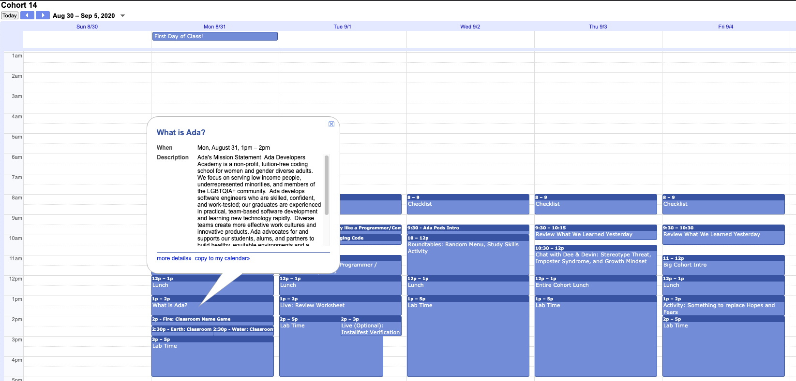
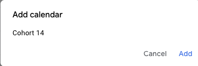

# Google Calendar

At Ada we use [Google calendar](https://calendar.google.com/calendar/embed?src=c_1coc81th07q7l9mm339687t54o%40group.calendar.google.com&ctz=America%2FLos_Angeles) to schedule lessons, meetings and homework.  

<iframe src="https://adaacademy.hosted.panopto.com/Panopto/Pages/Embed.aspx?id=e1469d77-e54e-414b-96a9-ac1800578b41&autoplay=false&offerviewer=true&showtitle=true&showbrand=false&start=0&interactivity=all" height="405" width="720" style="border: 1px solid #464646;" allowfullscreen allow="autoplay"></iframe>

## Subscribing to Google Calendar

You can subscribe to a Google calendar, if you have a Google account, by clicking on the `+ Google Calendar` image at the bottom right of the screen.

You can also sync the calendar with [Calendar on Mac](https://www.howtogeek.com/tips/how-to-add-your-gmail-calendar-to-the-calendar-on-mac-os-x/).