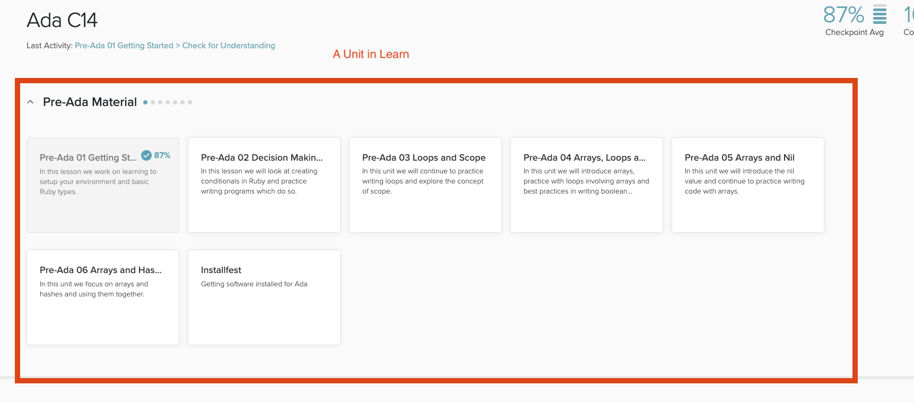
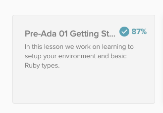
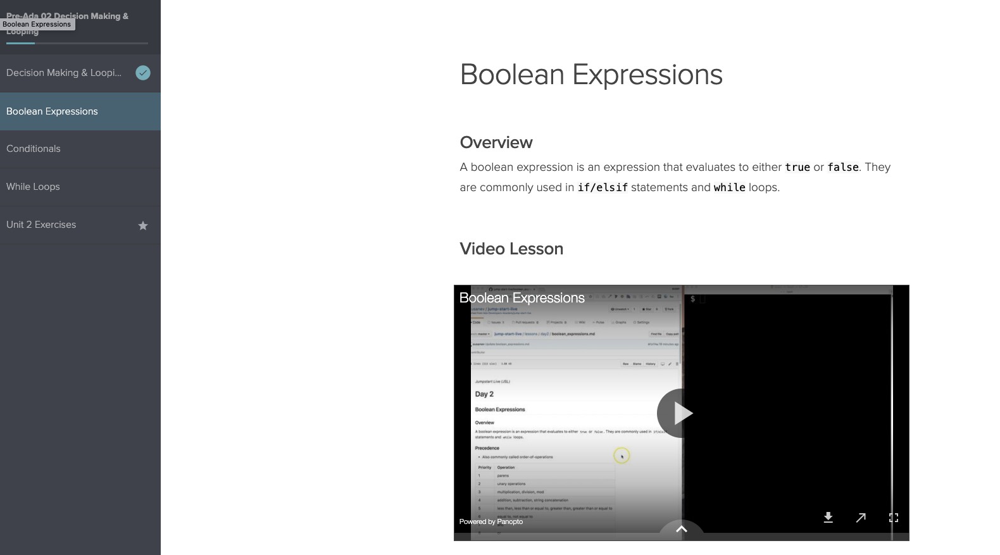
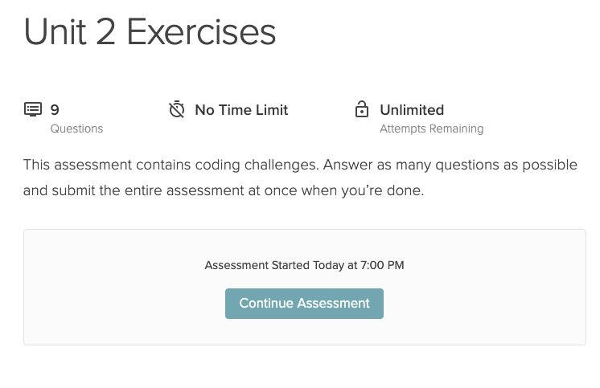
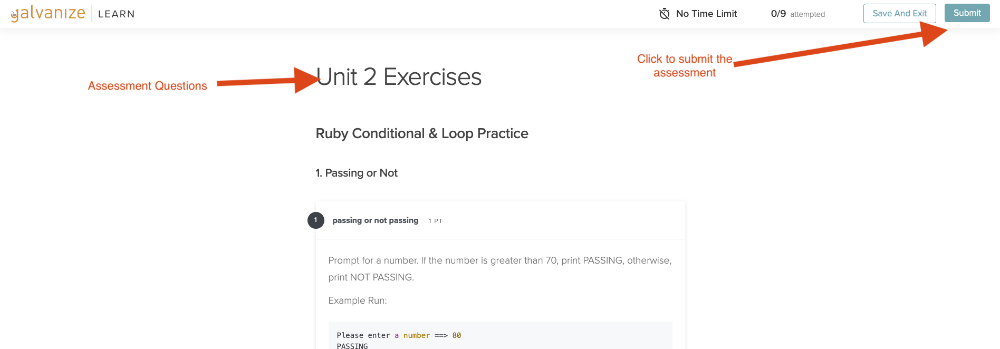
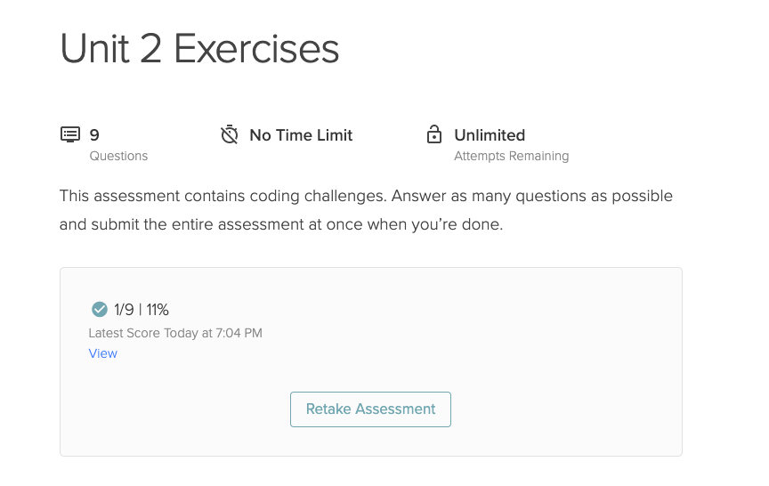

# Intro to Learn

[Learn](http://learn-2.galvanize.com/) is a Learning Management tool, developed by [Galvanize](https://www.galvanize.com/) designed specifically for the needs of bootcamp students.  Ada is excited to be using this tool for the first time in C14.  

<iframe src="https://adaacademy.hosted.panopto.com/Panopto/Pages/Embed.aspx?id=1659fe90-a80e-457c-a081-ac18004c9f13&autoplay=false&offerviewer=true&showtitle=true&showbrand=false&start=0&interactivity=all" height="405" width="720" style="border: 1px solid #464646;" allowfullscreen allow="autoplay"></iframe>

## What's in Learn?

In Learn you will find Ada's curriculum, written by instructors at Ada (current and past).  

You will also find assessments we have created to help identify areas of mastery and concepts we need to reinforce.  The assessments include multiple-choice, short-answer and long-answer questions as well as programming exercises.   You have already experienced these lessons and assessments in the Pre-Ada Material.

## Grades

Learn does track percentage scores.  We cannot turn that off, but we will not use overall percentage scores to assess students.

At Ada we assess students primarily through programming projects, exercises known as PSEs, and some CS Fun assignments. In most cases, the scale will be as such:

* Green
  * You have met or exceeded the major learning goals for this project; there is evidence that the produced code shows enough understanding
* Yellow
  * You approached meeting the major learning goals for this project; to the grader, there is evidence that the produced code shows some understanding, and shows evidence that not all major learning goals were met

* Red
  * You did not meet the major learning goals for this project; there is evidence that most major learning goals were not met, the progress on the project shows need for support on completion, quality, or both; the project is broken and not running

In general, you may resubmit work as many times as you like, however Ada moves at a fairly rapid pace and you are encouraged after submitting an assignment and getting feedback, to absorb the feedback and apply that learning on new projects, unless otherwise directed.

## Organization

Learn is organized into **Sections**.  Each section is a major area of study at Ada.  The Pre-Ada Material was such a area.

### Units

Each section has a number of **units** (those rectangles inside each section). 

### Lessons

Each unit will have a number of lessons, text-based lessons on different topics with code examples and often interactive questions and activities.

You will also often be able to find videos embedded in the lesson with an instructor delivering the material and walking through examples.

### Exercises/Assessments

Each unit will also often feature assessments which can contain multiple choice, short-answer and long-answer questions as well as programming exercises.  You will also often see programming projects assigned here.  

You can identify an assessment by the star next to the name in the menu.

We will discuss how to submit these programming projects soon.

**Before Taking An Assessment**

**While Taking An Assessment**

**After Taking An Assessment**

## Checking on your progress

You can see on each unit the percentage report from your checkpoint/exercise.  At Ada we do not grade students based on the percentages, but it can give you a general idea about how you did on the assessment. 

