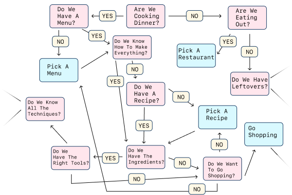

# Breaking Down a Problem

## Learning Goals

- Describe steps used for breaking down a problem
- Define timeboxing

## Introduction

Writing code is about using computers to solve problems. Often, this initial problem will be too complex for us to solve in one attempt. In order to begin solving these problems, we need to practice breaking down a problem.

## Vocabulary and Synonyms

| Vocab | Definition | Synonyms | How to Use in a Sentence |
| ----- | ---------- | -------- | ------------------------ |
Timeboxing | A time management technique where someone determines the maximum amount of time to spend on a task | - | "My code is working, but I want to make it better. I'll timebox refactoring to 2 hours," "I've been stuck on this and I need to do research. I'll timebox research to 30 minutes and then ask a classmate for help."

## Breaking Down a Problem

The steps to breaking down a programming problem can be identical to real-life problem-solving. To get used to thinking step-by-step, let's try breaking down a common situation.

### Real Example

Here's a problem that we might face often: **How do we prepare dinner for tonight?**

#### Ask Clarifying Questions

The first thing we should do is make sure we understand the problem. We can **clarify the problem with questions.** We should ask questions that help us constrain the problem, making the problem (and its solution) smaller and clearer.

Clarifying questions and their answers give us constraints. Clarifying questions:

1. Make a problem (and its solution) smaller and clearer
2. Confirm or reject any assumptions

For making dinner, we might want to ask:

- Do we already have a recipe for dinner tonight?
- Are we cooking dinner?
- How many people do we need to cook for?
- Do we already have our ingredients?

There are even more questions we can ask! From these questions, let's say that for tonight, the answers are:

- We don't have a recipe yet
- We have a kitchen and could cook dinner
- We are cooking just for ourselves tonight
- We might not have all the ingredients. We can go shopping for ingredients.

Did any of these questions and answers touch on things you would have otherwise assumed?

*Fig. Example of a possible question tree*

#### Create sub-problems

Now that we have more clarity about our situation, we can start to **break down this problem into sub-problems and steps.** We could start to solve our dinner dilemma with these steps:

Preparing dinner for tonight:
- Find a recipe
- Make a list of ingredients we need to buy
- Go shopping for the ingredients we need
- Cook dinner

### !callout-info

## Always Multiple Solutions
Keep in mind that **there are multiple ways to solve a problem.** We could have looked for a recipe that only has ingredients we already have. Or, we could have ordered pizza delivery!

### !end-callout

#### Come Up With Ideas

Once we have some sub-problems, we can start coming up with ideas for how to solve one of them. We should think through the solution from a variety of perspectives! This may include writing down ideas, notes, pseudocode, comments, and explanations. We should also make a list of tasks we need to do, topics to do more research on, or more questions we have.

For our example, we might start by thinking:

- Can we find a recipe in a recipe book? Or can we find one online? Or do we want to call a family member for a recipe?
- Can we make a list of ingredients we need to buy by comparing the recipe to our pantry?
- To get to the grocery store, can we take the train?
- We don't own a microwave. Can we use the oven instead?

#### Begin Solving One Sub-problem

  
[(source)](https://www.memedroid.com/memes/detail/728159)

Now that we have some ideas, we can pick one sub-problem and one strategy. Then, we begin working on one possible solution. We might begin to solve a sub-problem like so:

Go shopping for the ingredients we need:
  - Go to the train station
  - Take the train to the market
  - Browse every market stall for every ingredient
  - When we find an ingredient, buy it
  - Take the train home

#### Repeat As Necessary

We should **reflect** on our solution so far and determine if we're moving closer to a final solution. We can ask ourselves how to adjust if we need to.

Then, we should **repeat** these steps for different sub-problems until we have our final solution. We may find that our sub-problems have sub-problems! This process might continue until we are in a state that we comfortable with.

### Summarized Steps

1. Read the problem
2. Clarify the problem
3. Create sub-problems
4. Hypothesize ideas for the solution
5. Solve a sub-problem. When programming, this is where we write code!
6. Repeat steps necessary

*Fig. Problem solving cycle*

## Working First, Improve Second

Sometimes we're working on a solution. Then, suddenly, half-way through this solution, we think of a second solution! This second solution is so much better, cleaner, and more perfect! Do we begin to work on that solution now?

Instead of just abandoning our initial solution, we should try to get it working first.

When we fully work through finding a solution to a problem, it can help us think things through in more detail and with greater clarity. If we stop halfway through, we might miss important insights that could have helped us even more! It's easy to get lost in the details of writing elegant code and then lose sight of our true objective: solving a problem.

So let's write working code first, and then improve it afterwards!

## Timeboxing

Timeboxing is a time management technique where someone determines the _maximum_ amount of time to spend on a task.

When we are solving problems, we may come up with one solution, but then desire to work more on it. Or, sometimes, we might want to research alternative solutions. In these cases, it might be valuable to timebox these tasks.

Some examples might be:
- Timeboxing "Research alternatives to if/else conditionals" to 1 hour, and decide on one solution at that point
- Timeboxing "Refactor our project" to 2 hours, and call the project good enough at that point
- Timeboxing "Work through the binary problems solo" to 30 minutes, including using debugging strategies, then ask for help from the cohort if I'm stuck

## Check for Understanding

<!-- Question 1 -->

<!-- prettier-ignore-start -->
### !challenge

* type: multiple-choice
* id: 5ZzhNo
* title: Breaking Down a Problem

##### !question

Which of these breaks down a problem in the correct order?

##### !end-question

##### !options

* Clarify, create sub-problems, hypothesize solutions, solve a sub-problem, repeat

* Hypothesize solutions, clarify, create sub-problems, solve a sub-problem, repeat

* Hypothesize solutions, create sub-problems, solve a sub-problem, clarify, repeat

* Hypothesize solutions, create sub-problems, clarify, solve a sub-problem, repeat

##### !end-options

##### !answer

* Clarify, create sub-problems, hypothesize solutions, solve a sub-problem, repeat

##### !end-answer
### !end-challenge
<!-- prettier-ignore-end -->

<!-- Question 2 -->

<!-- prettier-ignore-start -->
### !challenge

* type: paragraph
* id: 52f6378d-4a54-46a7-a16b-e055a9b1d232
* title: Breaking Down a Problem

##### !question

Create a hypothetical situation where working first, improving second will be important and useful.

##### !end-question
### !end-challenge
<!-- prettier-ignore-end -->

<!-- MC: Which of these is the most accurate definition of "timeboxing"?

Answer: You work on the task during the fixed time period and stop working on it once the time is up - then, you assess whether you've reached your planned goals.

A time management method that uses a timer to break down work into 25 minute intervals, separated by short breaks.

Research and exploration to learn about a task or the possible solutions.
 -->

<!-- Question 2 -->

<!-- prettier-ignore-start -->
### !challenge

* type: multiple-choice
* id: 76pFSw
* title: Breaking Down a Problem

##### !question

Which of these is the most accurate definition of "timeboxing"?

##### !end-question

##### !options

* You work on the task during the fixed time period and stop working on it once the time is up - then, you assess whether you've reached your planned goals.
* A time management method that uses a timer to break down work into 25 minute intervals, separated by short breaks.
* Research and exploration to learn about a task or the possible solutions.

##### !end-options

##### !answer

* You work on the task during the fixed time period and stop working on it once the time is up - then, you assess whether you've reached your planned goals.

##### !end-answer
### !end-challenge
<!-- prettier-ignore-end -->
