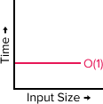
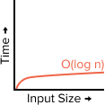
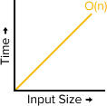
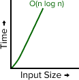
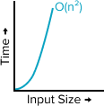
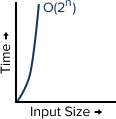
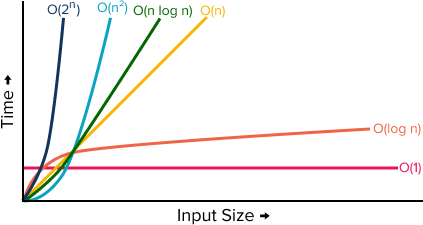

# Big O Notation

<iframe src="https://adaacademy.hosted.panopto.com/Panopto/Pages/Embed.aspx?pid=688b0923-c1f7-4a36-96cb-acd30143427a&autoplay=false&offerviewer=true&showtitle=true&showbrand=false&start=0&interactivity=all" height="405" width="720" style="border: 1px solid #464646;" allowfullscreen allow="autoplay"></iframe>

## Learning Goals

- Define Big O Notation
- Recognize Big O notation and the common complexity categories: constant, logarithmic, linear, loglinear, quadratic, exponential
- Compare and rank the common complexity categories between least and most complex

## Introduction

Imagine that we're developers working on a unique project: we are writing software not for a laptop, but something much smaller! Imagine we're coding for an Arduino microcontroller, which has very little RAM. It's entirely possible that our program would crash if it takes up too much memory.

  
[(source)](https://en.wikipedia.org/wiki/Arduino_Uno#/media/File:Arduino_Uno_-_R3.jpg)

Let's imagine that we could write our Arduino program with two different solutions. We know that we should compare the space complexity between the two algorithms. However, **_how_** do we compare space complexity?

Computer science uses concepts from mathematics to measure time and space complexity. By using Big O notation, we can concretely compare algorithms and evaluate which is more efficient. Then, our program will work better on the Arduino!

## Vocabulary and Synonyms

| Vocab | Definition                                                                                           | Synonyms | How to Use in a Sentence                                                                                                                                     |
| ----- | ---------------------------------------------------------------------------------------------------- | -------- | ------------------------------------------------------------------------------------------------------------------------------------------------------------ |
| Big O | A notation to describe **how** the run time or space requirements grow as the input size grows | -        | "The Big O of the linear search algorithm is O(n) ("O of n"), or linear," "The Big O of "n log n" is less complex than Big O of "n squared," so it's better" |

## Big O Describes How Complexity Grows

Big O Notation, pronounced "Big Oh notation," is a notation style that describes **how** the run time or space requirements grow as the input size grows.

The formal definition of Big O Notation is rooted in mathematics: Big O Notation "describes the limiting behavior of a function when the argument tends towards infinity." Let's parse this language:

- The "function" is the algorithm
- The "argument" is likely the input data set that the algorithm operates on
- "tends towards infinity" describes that we are considering all hypothetical situations... We consider the complexity when the argument (i.e. the input) is:
    - a million rows long
    - a million + 1 rows long
    - a million + 2 rows long
    - ... all the way towards infinity
- "Limiting behavior" describes the rate at which complexity grows. Sometimes, as the argument grows bigger and bigger, the complexity grows rapidly! Sometimes, as the argument grows, the complexity grows slowly.

This limiting behavior is the most important information; we are looking for a mathematical expression to describe the growth of complexity.

To quantitatively represent the worst case performance for speed and memory utilization of an algorithm, we use the Big O notation. Leveraging big O notation, we can:

- Make quantitative judgments about the efficiency of one algorithm over another
- Predict whether the software will meet any efficiency constraints that exist

## The Notation Itself

This is an example of Big O notation:

> O(n)

Details:

- `O(...)` is the recognizable form of Big O notation
- Inside the parentheses is some mathematical expression that describes the relationship between the size of the input vs. the complexity of the algorithm

Overall, the contents in between the parens is the information we care most about.

## The Common Curves

These are common Big O complexities to be familiar with.

These complexities are ordered! We can describe their order in all of these ways:

- going from least complex to most complex
- going from fastest to slowest in time complexity
- going from least operations to most operations in time complexity
- going from most space efficent to least space efficent in space complexity
- going from slower-growing to faster-growing

| Complexity       | Name        | 
Graph
|Definition                                                                                                                                                                                                                                                                                    |
| ---------------- | ----------- | --------------- | --------------------------------------------------------------------------------------------------------------------------------------------------------------------------------------------------------------------------------------------------------------------------------------------- |
| O(1)             | Constant    | | The algorithm will take the same amount of time to execute regardless of the size of the input.                                                                                                                                                                                         |
| O(log n)         | Logarithmic | | The algorithm will grow in complexity proportional to the base 2 **log** of the input size. Logarithmic algorithms increase **very** slowly as the size of the input increases. They usually involve an algorithm which excludes 1/2 of the input with each iteration of a loop. |
| O(n)             | Linear      | | The algorithm will grow in time or space directly proprotional to the input size. The complexity increases at the same rate that the input increases.                                                                                                                                         |
| O(n log n)       | Log Linear  | | A term used to describe an algorithm which will grow in time or space complexity proportional to the n log n of the input size. "n log n" means that the input size is multiplied by the base-2 log of the input size.                                                                                                                                                              |
| O(n2) | Quadratic   | | The algorithm will have a runtime or memory usage proportional to the size of the input squared. This often involves 2 nested loops.                                                                                                                                                    |
| O(2n) | Exponential | | The algorithm's complexity doubles each time the input size increases by one.                                                                                                                                      |

You can see a chart comparing these complexities below.  This chart illustrates for a given input size, how the output of the given expressions change.  Look at the curve of each line.  Which curve accelerates most quickly?  Which curve barely increases at all as the input size increases.

  
*Fig. Comparision chart of complexity types.*

### !callout-info

## How do we say it out loud?

Developers talk about Big O a lot, so it's useful to know how to talk about this out loud. Here are some example sentences to help start the pattern:

- "The Big O of linear search is O of n. It runs in linear time."
- "An algorithm with a Big O of log n is better than O of n log n."
- "O of n-squared is one of the slowest!"
- "The algorithm does a lot of work on each item in the input, but it's still order n!"

### !end-callout

<!-- available callout types: info, success, warning, danger, secondary  -->
### !callout-warning

## Big O Doesn't Give an Exact Number

The complexities listed above are **not** intended to calculate an exact runtime or memory usage for an algorithm.  Different types of computers and different input sets will perform differently.  

Instead the curve of the expression describes how the algorithm will perform as the input dataset increases.  A steeper curve means it will take longer and longer or consume more and more memory.

### !end-callout

## Examples

Let's consider and compare some "real-world" algorithms.

Consider this problem: You have an address book, and you want to find the contact information for your friend Taylor.

| Algorithm                                                                                                                                                                                                                                                                                                   | Big O    |
| ----------------------------------------------------------------------------------------------------------------------------------------------------------------------------------------------------------------------------------------------------------------------------------------------------------- | -------- |
| Start at the first page of the address book. Read through each page. If you see Taylor's name, you found their phone number                                                                                                                                                                                 | O(n)     |
| Assume your contacts are alphabetically sorted. Flip to the half-way point of the address book, then determine which half of the address book "Taylor" is in. Then look through that half of the address book, split that in half, and determine which half to look through. Do this until we find "Taylor" | O(log n) |
| Use a bookmark you inserted before that is labeled "Taylor", that leads straight to Taylor's phone number.                                                                                                                                                                                                  | O(1)     |

## Check for Understanding

<!-- Question about comparing Big Os for more efficient -->

<!-- >>>>>>>>>>>>>>>>>>>>>> BEGIN CHALLENGE >>>>>>>>>>>>>>>>>>>>>> -->
<!-- Replace everything in square brackets [] and remove brackets  -->

### !challenge

* type: ordering
* id: d2d156f6-aaab-4aba-9cf7-b9cdaceed013
* title: Time/Space Complexities Worst-to-best
* points: 1
* topics: big-o

##### !question

Arrange the following complexities from **worst** to **best**.

##### !end-question

##### !answer

1. O(2n)
1. O(n2)
1. O(n log n)
1. O(n)
1. O(log n)
1. O(1)

##### !end-answer

<!-- other optional sections -->
<!-- !hint - !end-hint (markdown, hidden, students click to view) -->
<!-- !rubric - !end-rubric (markdown, instructors can see while scoring a checkpoint) -->
<!-- !explanation - !end-explanation (markdown, students can see after answering correctly) -->

### !end-challenge

<!-- ======================= END CHALLENGE ======================= -->

<!-- >>>>>>>>>>>>>>>>>>>>>> BEGIN CHALLENGE >>>>>>>>>>>>>>>>>>>>>> -->
<!-- Replace everything in square brackets [] and remove brackets  -->

### !challenge

* type: multiple-choice
* id: db5bbef4-04da-4474-8aa1-5a86e7047e6a
* title: Purpose of Big-O Notation
* points: 1
* topics: Big-o

##### !question

Big O notation serves to:

##### !end-question

##### !options

* Calculate the exact run time or space usage of a given algorithm
* Describe how the algorithm performs in terms of both space and time as the input size increases
* Describe only how well an algorithm will perform in terms of **speed** as the input size increases
* Describe only how well an algorithm will perform in terms of **memory usage** as the input size increases
  
##### !end-options

##### !answer

* Describe how the algorithm performs in terms of both space and time as the input size increases

##### !end-answer

<!-- other optional sections -->
<!-- !hint - !end-hint (markdown, hidden, students click to view) -->
<!-- !rubric - !end-rubric (markdown, instructors can see while scoring a checkpoint) -->
<!-- !explanation - !end-explanation (markdown, students can see after answering correctly) -->

### !end-challenge

<!-- ======================= END CHALLENGE ======================= -->

<!-- Question about comparing Big Os for more efficient -->

<!-- >>>>>>>>>>>>>>>>>>>>>> BEGIN CHALLENGE >>>>>>>>>>>>>>>>>>>>>> -->
<!-- Replace everything in square brackets [] and remove brackets  -->

### !challenge

* type: multiple-choice
* id: 6b2620b0-f164-4722-8a55-a000a6b3690a
* title: Pick the best performing algorithm
* points: 1
* topics: Big-O

##### !question

Imagine creating an app that allows a user to store all of their contacts and contact information. There is a feature that allows users to search for a specific contact.

Given the following algorithms for this search feature, which is the best choice in terms of time and space complexity?

##### !end-question

##### !options

* Store all contacts in a list and seach for each contact, iterating from beginning until end until the contact is found or the list is completely searched.  O(n)
* Store all contacts in a dictionary with the contact name as a key and retrieve contacts using the name.  O(1)
* Store all contacts in a list sorted by names and search for a contact by looking at the middle contact.  If that is the desired contact return them.  If the desired contact comes later repeat the search in the 2nd half of the list, otherwise repeat the search in the 1st half of the remaining contacts.  Repeat until the contact is found or there are no more contacts left to search. O(log n).

##### !end-options

##### !answer

* Store all contacts in a dictionary with the contact name as a key and retrieve contacts using the name.  O(1)

##### !end-answer

<!-- other optional sections -->
<!-- !hint - !end-hint (markdown, hidden, students click to view) -->
<!-- !rubric - !end-rubric (markdown, instructors can see while scoring a checkpoint) -->
<!-- !explanation - !end-explanation (markdown, students can see after answering correctly) -->

### !end-challenge

<!-- ======================= END CHALLENGE ======================= -->

<!-- Question Takeaway -->
<!-- prettier-ignore-start -->
### !challenge
* type: paragraph
* id: RskXE0
* title: Big O Notation
##### !question

What was your biggest takeaway from this lesson? Feel free to answer in 1-2 sentences, draw a picture and describe it, or write a poem, an analogy, or a story.

##### !end-question
##### !placeholder

My biggest takeaway from this lesson is...

##### !end-placeholder
### !end-challenge
<!-- prettier-ignore-end -->
