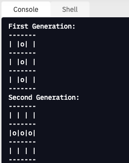
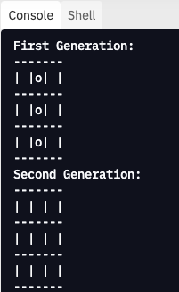

# Problem Set: Debugging Continued

<iframe src="https://adaacademy.hosted.panopto.com/Panopto/Pages/Embed.aspx?pid=465884e5-a350-4020-abb8-ad9101852567&autoplay=false&offerviewer=true&showtitle=true&showbrand=false&captions=true&interactivity=all" height="405" width="720" style="border: 1px solid #464646;" allowfullscreen allow="autoplay"></iframe>

Moira has been working on some code related to [Conway's Game of Life](https://en.wikipedia.org/wiki/Conway%27s_Game_of_Life), but has run into some bugs. Today's task is to fork Moira's Replit and help Moira debug her code.

Before getting started, here is some important information about the project that Moira is working on:

Conway's Game of Life is a classic [cellular automata](https://en.wikipedia.org/wiki/Cellular_automaton) simulation in computer science. In Conway's Game of Life, there is a stage or grid, and each point in the stage is a cell. Each generation, every cell on the stage lives or dies based on a few simple rules.

1. Any live cell with < 2 neighbors dies
1. Any live cell with 2-3 neighbors lives
1. Any live cell with > 3 neighbors dies
1. Any dead cell with 3 neighbors comes alive

A cell's neighbors are the 8 cells immediately around the cell.

Before going further, take a minute to play with this [Game of Life simulator](https://playgameoflife.com/).  Add a few points to the grid and press start to watch the simulation.

In today's project, Moira is testing her code using the Blinker pattern.  The Blinker is an oscillator that flips from 3 vertical cells to three horizontal cells each generation:

  
_Fig. The oscillating shape called a blinker_
[source](https://commons.wikimedia.org/wiki/File:Game_of_life_blinker.gif)

Take a minute to make a Blinker in the simulator linked above and run it to verify its behavior.

Moira's project is to compute one generation of the Game of Life.  She has been given functions that print the stage and calculate the number of neighbors of a cell.  These functions are:

```python
print_stage(stage)
count_neighbors(stage, x_pos, y_pos)
```

She has also been given the code that sets up the initial state of the stage with the 3 vertical cells of a Blinker (`init_stage(stage)`). Her task is to write the function `one_generation(stage)`. If her function works, this sequence of function calls:

```python
init_stage(stage)
print("First Generation:")
print_stage(stage)
one_generation(stage)
print("Second Generation:")
print_stage(stage)
```

will result in this output:

  
_Fig. A text representation of a blinker across two generations_

Before starting work, please fork Moira's Replit.  Follow the link: [https://replit.com/@adacore/DebuggingContdProblemSet](https://replit.com/@adacore/DebuggingContdProblemSet) and click the Fork button to create a copy that you can edit.

<!--BEGIN CHALLENGE-->

### !challenge
<!-- prettier-ignore-start -->

* type: paragraph
* id: a7981c89-552e-4587-9133-341aaa4752f3
* title: Debugging Continued

##### !question

Answer the following questions:

1. What happens when you run Moira's code?  
1. What line is the error on?
1. What type of error is it?
1. Why is the line throwing an error?

##### !end-question

<!--optional-->
##### !explanation

Moira's code raises an exception.  The line that causes the error is line 16, inside the `one_generation` function.  The error is a `TypeError`.  The line is throwing an error because `v_pos` is an integer and the `len` function requires an iterable argument, like a list or a dictionary.

##### !end-explanation

### !end-challenge

<!-- prettier-ignore-end -->
<!--END CHALLENGE-->

Moira now knows what is happening and why it's happening.  It's time to try to fix the error!  

Moira's goal with this nested for loop was to access each cell of the stage and then make the appropriate changes for this generation for each cell.

<!--BEGIN CHALLENGE-->
<!-- prettier-ignore-start -->

### !challenge

* type: paragraph
* id: 8c74e298-f8e7-4635-8990-b8cc5791be43
* title: Debugging Continued

##### !question

Before Moira can fix her nested loop, she needs to make sure that she understands the data structure that she's looping over. Read through the provided functions and use debugging tools like print statements to investigate the `stage` variable that she is working with.

What is `stage`?

##### !end-question

<!--optional-->
##### !explanation

`stage` is a list of lists.  After calling `init_stage()`, `stage` contains: `[[False, True, False], [False, True, False], [False, True, False]]`.  The inner lists are lists of `True` and `False`, where `True` indicates that the cell is alive and `False` indicates that the cell is dead.  When `stage` is printed out using `print_stage`, each inner lists is displayed as one horizontal row.

##### !end-explanation

### !end-challenge

<!-- prettier-ignore-end -->
<!--END CHALLENGE-->

Moira needs the inner `for` loop to iterate over each of the elements in each of the inner loops. She also needs the vertical position and horizontal position of each of the cells so that she can use those to call `count_neighbors` for each cell.

<!--BEGIN CHALLENGE-->
<!-- prettier-ignore-start -->

### !challenge

* type: paragraph
* id: 42cc6a3a-e111-4344-ba03-bc4b2730c0d3
* title: Debugging Continued

##### !question

How can Moira change her code to fix this bug?

##### !end-question


<!--optional-->
##### !hint

Moira needs to loop over the list at position `v_pos` inside of `stage`. She can access the list using the code `stage[v_pos]`. In her `for` loop, she needs `h_pos` to iterate over the length of the inner list. She can get the correct range for her `for` loop with the code `range(len(stage[v_pos]))`.

##### !end-hint


<!--optional-->
##### !explanation

Moira changes line 16 to `for h_pos in range(len(stage[v_pos])):`.  

The for loop is now iterating over each horizontal position in each inner list.  Let's break down this line section by section:

- `stage[v_pos]` accesses the element in stage at index `v_pos`.  This element is a list of True/False values that represents a horizontal row of the stage.
- `len(stage[v_pos])` gets the length of the list.
- `range(len(stage[v_pos]))` creates a range from 0 to the length of the array minus 1
- `for h_pos in range(len(stage[v_pos])):` iterates over the range, stores each value in `h_pos` for use inside the loop.

##### !end-explanation

### !end-challenge

<!-- prettier-ignore-end -->
<!--END CHALLENGE-->

Moira runs her code and discovers that the error is gone!  Unfortunately, the output does not match the expected output.

<!--BEGIN CHALLENGE-->
<!-- prettier-ignore-start -->

### !challenge

* type: paragraph
* id: 2404607e-9db0-48bd-9222-61a58913ffb4
* title: Debugging Continued
<!--Other optional fields (checkpoints only) -->
<!--`points: 1`: the number of points for scoring as a checkpoint-->
<!--`topics: python, pandas`: the topics for analyzing points-->

##### !question

Moira's code produces this output:

  
_Fig. Moira's code output._

What is the bug that Moira sees now?  What is the expected output?  What is the code doing?

##### !end-question

<!--optional-->
##### !explanation

The first generation has three living vertical cells.  The second generation should have three living horizontal cells.  Moira's code produces a second generation where all of the cells are dead.

##### !end-explanation

### !end-challenge

<!-- prettier-ignore-end -->
<!--END CHALLENGE-->

<!--BEGIN CHALLENGE-->
<!-- prettier-ignore-start -->

### !challenge

* type: paragraph
* id: f9f85ba0-3390-46c0-9244-38b1bffa6821
* title: Debugging Continued

##### !question

Moira wants to get her code working, but before she can do that she needs to understand why her code is doing what it's doing. 

Take a few minutes and use some debugging techniques to find out why her code is behaving the way it is.

List a few of the things you tried and what you discovered.

##### !end-question

<!--optional-->
##### !explanation

Some examples of things to try:

- Add print statements that print out `stage` at the beginning and the end of `one_generation`.

- Add print statements inside of the for loops that print out `stage`.

- Comment out sections of code and re-add it line by line.

- Grab the code and run it inside of VSCode with the debugger.

##### !end-explanation

### !end-challenge

<!-- prettier-ignore-end -->
<!--END CHALLENGE-->

<!--BEGIN CHALLENGE-->
<!-- prettier-ignore-start -->

### !challenge

* type: paragraph
* id: 882c916d-55ab-4c53-888b-8b8d68ea8021
* title: Debugging Continued

##### !question

Why doesn't Moira's `one_generation` function work? Why are all of the cells dead in the second generation in the test?

##### !end-question

<!--optional-->
##### !explanation

Conway's Game of Life calculates the alive or dead status of each cell based on the state of the previous generation. Moira's code is *changing* the state of the cells before the code finishes the calculations for each cell.

<br/>

That means that cells are being set to dead (`False`) in the first row, and when the neighbors for the second row are calculated, the `count_neighbors` function is receiving a partially modified `stage`. Since the `stage` is modified as the `for` loop is running, `count_neighbors` returns a different result than it would if the `stage` had _not_ been modified.

##### !end-explanation

### !end-challenge

<!-- prettier-ignore-end -->
<!--END CHALLENGE-->

<!--BEGIN CHALLENGE-->
<!-- prettier-ignore-start -->

### !challenge

* type: paragraph
* id: 4b1ba8ea-b9e5-4c37-b486-17fd865bc17b
* title: Debugging Continued

##### !question

Moira knows what's happening and why it's happening.  She's not quite sure yet how to fix her code, though!  What are some debugging steps she can take as she works on a solution?

##### !end-question

<!--optional-->
##### !explanation

Moira tries several things to debug her code.  
- Verify Library Functions: Moira starts by reading the count_neighbors function and makes sure she understands what it's doing.  
- Check for Logical Errors: Moira realizes that she's changing the stage and using it in count_neighbors to count the previous generation's neighbors at the same time.  She realizes she needs two versions of the stage.  
- Try Something: Moira tries several different things to come up with a solution that allows her to check the previous version of the stage and update the new version at the same time.

Take some time to try to debug Moira's code.  When you are ready, take a look at [Moira's solution here](https://replit.com/@adacore/DebuggingContdProblemSetSolution).

##### !end-explanation

### !end-challenge

<!-- prettier-ignore-end -->
<!--END CHALLENGE-->

