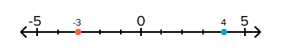

# Math Primer

## Goal

Problem-solving in programming is almost always centered on _data_. To work with that data effectively, it can be useful to be aware of the following math concepts. By knowing the definitions of these concepts, they become problem-solving tools for us to use in the future.

The goal of this document is to be a resource. We recommend spending your energy on this document reading through it and taking notes on it once, and then reviewing briefly every few months.

This document covers the following:

Thinking about numbers: 

1. Decimal Number System
1. Using _n_ as a Variable in Math
1. Coordinate Planes

Working with collections of numbers:

1. Maximum and Minimum
1. Sorting
1. Average or Mean
1. Floor and Ceiling Functions

## Decimal Number System

The _decimal number system_ or _base-ten number system_ is the numbering system most commonly used in everyday life.

This numbering system includes
* ten unique symbols known as **digits**: 0, 1, 2, 3, 4, 5, 6, 7, 8, 9
* the **decimal point** (floating point/dot) symbol to represent decimal fractions, such as 2.45
* the **minus sign** to indicate whether a number is positive or negative

<div style="max-width: 700px; margin: 0 auto -36px auto; text-align: center;">

</div>
*Fig. A number line. Every __real__ number appears somewhere on this line. The orange point (to the left) shows where -3 is, and the cyan point (to the right) shows where 4 is.*

### !callout-info

## Origin of Base 10

"Legend says" that most base-ten systems possibly originate from counting on ten fingers.

### !end-callout

## Using _`n`_ as a Variable in Math

When we describe problems, we might want to say, "any number of things."

For example, we might be building an email webapp, and we want to say, "An email can have any number of recipients... It can have 1 recipient, 3, 13, or 50 recipients."

It would be annoying if we always had to say that an email might have 1, 3, 13, etc., recipients. Instead, we can use a variable to talk about this unknown number.

We can imagine a variable _`n`_ as the name of a variable that holds any number. Then we could say that the email has _`n`_ recipients.

We could also use variable names _`x`_, _`y`_, _`tacocat`_, or whatever is most appropriate in the situation, but _`n`_ is a good default.

Examples of using _`n`_:

- "We have a bug with sending emails. If every email has one sender and _`n`_ recipients, let's check if one or _`n`_ emails were sent."
- "Our feature is good at sending emails to _`n`_ recipients when _`n`_ is 1-99, but have we checked if our feature works when _`n`_ is zero?

## Coordinate Planes

A coordinate plane is a representation of a two-dimensional space.

Coordinate planes help us solve problems where we need to consider points that have a location in a 2D space.

2D space means that we define locations with _**two**_ axes that cross each other. These two axes are typically named _`x`_ and _`y`_.

If you've seen certain kinds of bar graphs or line graphs, and there's a horizontal x-axis, and a vertical y-axis, this is the exact same concept.

  
*Fig. A coordinate plane. Essentially two number lines arranged at right angles. We can describe any location on the plane with 2 numbers. The cyan point (top-right) is at location (2, 3) and the fuchsia point (bottom-left) is at location (-4, 1).*

## Maximum and Minimum

The **maximum** value in a list of numbers is the largest value in the list.

The **minimum** value in a list of numbers is the smallest value in the list.

Consider the following list of numbers:

```
21, 4, 9, 20, 17, 42, 13, 8.
```

- The maximum value is 42
- The minimum value is 4

## Sorting

Sorting is the action of arranging a list of items following a certain logical pattern. We can sort a list of objects in **ascending** or **descending** order.

Consider the following list of numbers:

```
21, 4, 9, 20, 17, 42, 13, 8.
```

When the objects are _ordered from lowest value to highest value, the sorting order is said to be in ascending order_. In our example, that would be `4, 8, 9, 13, 17, 20, 21, 42`.

When the objects are _ordered from highest value to lowest value, the sorting order is said to be in descending order_. In our example, that would be `42, 21, 20, 17, 13, 9, 8, 4`.

Anything that we can give a numerical value to can be sorted, even words. The way to assign values to every word of every writing system is a very complex topic! As a smaller example, we can take the English alphabet, and say that A is 1, B is 2, and so on down the line, to Z being 26. This gives us enough information to think about sorting a list of words.

For example, the list

```
banana, strawberry, coconut, apple
```

sorted in **ascending** order is

```
apple, banana, coconut, strawberry
```

since A is 1, B is 2, C is 3, and S is 19. But what happens if our list has more than one word that starts with the same letter? Follow your curiosity!

## Average or Mean

The **average** or **mean** of a collection of numbers is the sum of the numbers divided by the total count of numbers.

"Average" and "mean" are synonymous.

For example, given the list

```
42, 14, 73, 5, 10
```

1. Sum of the numbers: 144
1. Total count of numbers: 5
1. Sum / Total count: 144 / 5
1. Average or mean: 28.8

## Floor and Ceiling Functions

Given any number _`n`_...

- The **floor** of _`n`_, written `⌊n⌋`, is the biggest integer less than or equal to _`n`_
- The **ceiling** of _`n`_, written `⌈n⌉`, is the smallest integer greater than or equal to _`n`_

| Example | Floor | Ceiling |
| ------- | ----- | ------- |
| 2.4     | 2     | 3       |
| 58.7    | 58    | 59      |
| 10.99   | 10    | 11      |
| 10.01   | 10    | 11      |
| -2.4    | -3    | -2      |
| 2       | 2     | 2       |

## Check for Understanding

<!-- Question 1 -->
<!-- prettier-ignore-start -->
### !challenge
* type: ordering
* id: EQ4kZ3
* title: Math Primer
##### !question

Order the definitions below so that they match this order of vocabulary words, from top-to-bottom:

1. Decimal Number System
1. _`n`_
1. Coordinate Planes
1. Floor
1. Ceiling

##### !end-question
##### !answer

1. A counting system based around ten and the digits 0, 1, 2, 3, 4, 5, 6, 7, 8, 9
1. A common generic variable name for a number
1. A 2D space where points can be placed using x and y coordinates
1. The biggest integer that's less than or equal to _`n`_
1. The smallest integer that's greater than or equal to _`n`_

##### !end-answer
### !end-challenge
<!-- prettier-ignore-end -->
