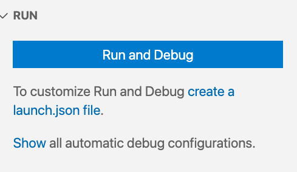
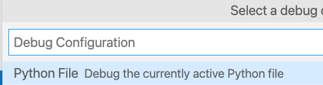
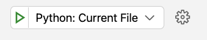
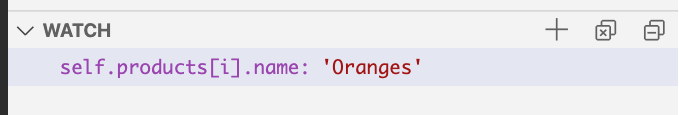
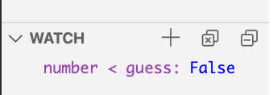
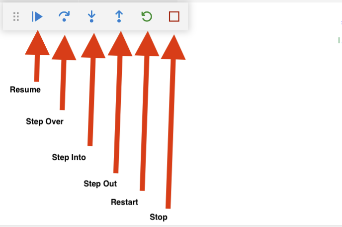

# Debugging With VS Code

Python is widely used with VS Code and so VS Code's developers have put the time in to integrate the Python debugger into the standard VS Code plugin for Python.

In this lesson we will learn to connect VS Code and the Python debugger to help us fix errors in our code.

## Goals

By the end of this lesson we should be able to...

- Set up VS Code to run the Python debugger
- Run the Python debugger in VS Code to step through a program
- Use breakpoints and watches to identify errors in code

## Before Starting

Create a new project folder and Python file.

```bash
$ mkdir testing-example # make a testing-example folder
$ cd testing-example    # change into that folder
$ touch guess_number.py # create an empty python fole
$ code .                # Open the folder as a project in VS Code
```

Fill `guess_number.py` with the following python code.

```python
from random import randrange

number = randrange(10)

guess = -1
while number != guess:
  guess = int(input('Please enter a guess between 0-10  ==>'))
  if guess < number:
    print(f"{guess} is too low")
  elif number > guess:
    print(f"{guess} is too high")
  else:
    print("You guessed it!")

```

## Setting Up

To get started with the VS Code debugger, first find the debugger button on the left sidebar.


You may then need to create a `launch.json` file by clicking on `Run and Debug`.



Then select `create a launch.json file` to make a configuration.  



Save the resulting `launch.json` file.

You are set up!  You can close `launch.json` now.

## Debugging

### Adding and Removing Breakpoints

You can add a breakpoint by clicking to the **left** of the line number.  You will see a red dot appear to indicate the breakpoint.  You can click again to make it dissapear.  


Add a breakpoint to lines 5 and 11.  See how you can toggle them on and off.


### Running the Debugger

You can then run the debugger at any time with the green triangle play button.


*Fig. The start debugging button*

Notice that the program will pause at the first breakpoint it encounters.

**What are the values of the variables?**  

### Watches

You can create a watch by clicking on the `+` icon and enter any expression.


*Fig. Creating a watch*


*Fig. A watch while the debugger is running*


**In the watch box, enter `number < guess`**.  What does it evaluate to?  Try a few more expressions.


*Fig. Watching an expression*

### Stepping Over & Stepping Into

Notice when the debugger is paused at a breakpoint you get the menu below.


*Fig. The debugger buttons*

This menu has the following buttons:

- **Resume** - Continues the debugger executing until it gets to the next breakpoint, or the program exits.
- **Step Over** - This button executes the current line and moves to the next line.  It will execute any function invoked on the current line, without pausing inside that function.
- **Step Into** - This button goes into any function invoked on the current line and pauses at the 1st line.
- **Step Out** - This button finishes the rest of the current function and pauses at the calling function.
- **Restart** - This button restarts the debugger from the start.
- **Stop** - This button stops the debugger.

These buttons let you deliberately navigate through the program's execution allowing you to examine the state of the application at any step in the process.

**Try using the buttons to navigate through the code.**  Do you see the values of the variables changing?

<!-- >>>>>>>>>>>>>>>>>>>>>> BEGIN CHALLENGE >>>>>>>>>>>>>>>>>>>>>> -->
<!-- Replace everything in square brackets [] and remove brackets  -->

### !challenge

* type: short-answer
* id: c3eb6210-5cbd-4507-b0a5-41db00b43fb5
* title: Step over and Step into why no difference?
* points: [1] (optional, the number of points for scoring as a checkpoint)
<!-- * topics: [python, pandas] (optional the topics for analyzing points) -->

##### !question

In the code try using the step over and step into buttons, do you notice a difference?  No, why not?
##### !end-question

##### !placeholder

Why don't we see a difference?

##### !end-placeholder

##### !answer

/.+/

##### !end-answer

<!-- other optional sections -->
<!-- !hint - !end-hint (markdown, hidden, students click to view) -->
<!-- !rubric - !end-rubric (markdown, instructors can see while scoring a checkpoint) -->
##### !explanation 

It's because we don't have any functions that we have written and used  The debugger is wisely deciding not to jump into the source code for the `input` function.

##### !end-explanation

### !end-challenge

<!-- ======================= END CHALLENGE ======================= -->

## Check for Understanding
<!-- >>>>>>>>>>>>>>>>>>>>>> BEGIN CHALLENGE >>>>>>>>>>>>>>>>>>>>>> -->
<!-- Replace everything in square brackets [] and remove brackets  -->

### !challenge

* type: paragraph
* id: 637ba598-f5db-4bb4-8730-a8595224a664
* title: Key Takeaway
* points: 1
* topics: Python, Debugging

##### !question

What is your key takeaway from this lesson?  

##### !end-question

##### !placeholder

##### !end-placeholder

<!-- other optional sections -->
<!-- !hint - !end-hint (markdown, hidden, students click to view) -->
<!-- !rubric - !end-rubric (markdown, instructors can see while scoring a checkpoint) -->
<!-- !explanation - !end-explanation (markdown, students can see after answering correctly) -->

### !end-challenge

<!-- ======================= END CHALLENGE ======================= -->
