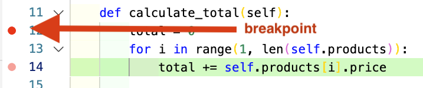

# Intro to Debuggers

<iframe src="https://adaacademy.hosted.panopto.com/Panopto/Pages/Embed.aspx?pid=e8b3ff4f-30e0-40cd-a8be-ace200624dca&autoplay=false&offerviewer=true&showtitle=true&showbrand=false&start=0&interactivity=all" height="405" width="720" style="border: 1px solid #464646;" allowfullscreen allow="autoplay"></iframe>

## Introduction

In the past we've used a few tools for debugging our Python code.  This has included:

- Asking the Questions
  - **What** is happening?
  - **Why** is it happening?
  - **How** do we fix it?
- Answering these questions by:
  - Using Rubber Ducking to explain the problem and walk through potential solutions
  - Reading the stack trace to identify the location of runtime and syntax errors
  - Writing `print` statements to output the values of variables and ensure our code "reached" specific points in the program
  - Using tests to ensure our functions and classes performed as we expected them to and using failures to identify malfunctioning code

These are very valuable techniques and will often be your 1st choice to debug your application.  However, VS Code and other editors have useful tools to inspect your code as it executes and identify problems.

## Goals

- Explain the concepts of 
  - debugger
  - breakpoint
  - watch
  - stepping over code
  - stepping into code

## Vocabulary and Synonyms

| Vocab     | Definition                                                                        | Synonyms           | How to Use in a Sentence                                                                                       |
| --------- | --------------------------------------------------------------------------------- | ------------------ | -------------------------------------------------------------------------------------------------------------- |
| Debugging | The process of identifying and removing errors from computer hardware or software | Fixing, inspecting | "I need to debug my view and figure out why it wasn't displaying right," "Have you tried to _debug_ your error?" |
| Debugger | A program that assists in detection and fixing of errors in code.  It is often integrated into an editor | Debugging Tool | "I have a bug I just can't seem to find!  Have you launched the _debugger_?" |
| Breakpoint | In programming a breakpoint is an intentional pausing place in a program usually for the purpose of debugging. | Pause | "I needed to see why my method failed, so I put in a _breakpoint_ to inspect the running code" |
| Watch | Any  item of data or expression a developer wants to observe when debugging. |  | "I created a _watch_ to see the value of `items[i]` as the loop executed." |
| Stepping Over | Executing a function call on the current line and pausing on the line _after_ the function call.  Essentially skipping over the called function in the debugger. | | "I know the `sum` function isn't the problem so I _stepped over_ that function." |
| Stepping Into | While running a debugger, entering a function call on the current line of execution and pausing execution on the 1st line of the function. | | "I needed to see what that `average_rating` function did, so I _stepped into_ it." |

## Debuggers in General

Sometimes it can be difficult to trace through a program's execution and understand which lines are being executing and the values of each variable as the program runs.  So developers created debugger programs.  A **debugger** is a program designed to help us identify errors in our code.  Debuggers are typically integrated into an editor like Visual Studio Code.  The Python library comes with a [debugger](https://docs.python.org/3/library/pdb.html) and the standard [Python extension for VS Code](https://marketplace.visualstudio.com/items?itemName=ms-python.python) integrates with it.

Most debuggers operate with the same general concepts. Debuggers allow us to pause program execution, examine the state of the program and either resume execution, or execute the application line-by-line.  This is amazing... you can tell the program to pause when it reaches a particular line and inspect any variable in scope!  No `print` statements!  Woo hoo!

### Breakpoints & Stepping Through Code

A **breakpoint** is a place (line of code) which indicates to the debugger to pause the program at this point of execution.  While the program is paused, the dev running the debugger can examine the state of variables currently in scope.  After that, the dev can resume execution or execute the program, line-by-line. 

Editors typically indicate breakpoints visually with a red-dot next to the line number.  This is a very common convention in many languages and editors, although some editors may use different visual clues.

*Fig. A breakpoint*

So in short, we can think of a breakpoint as a pause button for a program which allows devs to "snoop-around" in the state of the currently executing application.

When using a debugger, we can create multiple breakpoints. In that case, program will pause multiple times, because it will pause as it encounters each breakpoint.

Multiple breakpoints lets us jump between different points in a program, inspecting the state of the application at each breakpoint. Neat!

### Watches

Sometimes we need to track the value of an expression that is never stored in a variable. We can supply the debugger tool with expressions to _watch_. The debugger lists and shows the current value of each watched expression through the entire program execution.

For example, imagine debugging an app that manages grocery deliveries, and one of our order products seems to be glitchy. However, in our code, there's no variable that directly holds the product we need to see. Instead of using a variable, we could watch the value of the `i`th product in our order by watching the expression `order["products"][i]`.

*Fig. An example of a watch*

## Summary

In this lesson we introduced the concept of a debugger and some of the common features you will find in a debugger.  A debugger allows us to place breakpoints in our program to pause execution where we want to examine what's happening in our code at that particular point.  After the program is paused, we can use watches to examine the state of our application and continue execution line-by-line of our program, or resume our application until the next breakpoint.

These features are really language-independent as most languages will have debuggers which provide these services.
