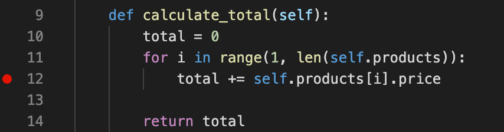

# Problem Set: Using the Debugger

## Directions

In this problem set we will use the debugger to identify two errors.  To run the activity clone the code at [AdaGold/python-debugging](https://github.com/AdaGold/python-debugging).  Then follow the directions in the README to set up the repo.

The code contains two bugs, one runtime error crashes the program on execution and the other is a logic error which calculates the incorrect sum for an Order.  

After following the setup instructions on the python-debugging repo, follow the instructions below.

## Practice

### First Bug: Debugging with Breakpoints

When you execute the program with:

`$ python3 app.py`

The program crashes with the following stack trace:

```
Traceback (most recent call last):
  File "/Users/username/ada/python/python-debugging/app.py", line 16, in <module>
    f"{calculate_total(kamala_order)}")
  File "/Users/username/ada/python/python-debugging/grocery_store/order.py", line 16, in calculate_total
    total += order["products"][i]["price"]
TypeError: unsupported operand type(s) for +=: 'int' and 'str'
```

Hmmmm... The program is crashing at line 16 of `grocery_store/order.py`.

Lets put a breakpoint at line 16 of `grocery_store/order.py`.


*Fig. A breakpoint*

Then go to the debugger icon.


*Fig. The VS Code debugging icon*

You **may** need to click on the select list, select `Add Configuration` and choose select `Python: Current File`.


*Fig. Select debug configuration*

Otherwise you can simply select "Python: Current File" from the drop down list.  

### Running Debugger

Then you can run the debugger by opening `app.py` and pressing the green triangle "Play" button.


*Fig. Start debugging button*

You will notice that the application stops in `order.py`.


*Fig. Pausing at a breakpoint.*

### Finding the Bug with Watches

Notice that the loop attempts to add up all the product prices.  In Watch add a watch for `order["products"][i]`


*Fig. A watch*

<details style="max-width: 700px; margin: auto;">
  <summary>
    Try to identify the cause of the problem.  Open this to see our answer.
  </summary>

The bug is in `product.py`, and it relates to the price of products.

Hypothesize a cause for the error, make changes to fix it, and then re-run the debugger.

Repeat this process until the program stops crashing, and the bug is fixed. During this debugger process, practice:

- Adding another breakpoint to `product.py` inside the `create_product` function
- Stepping through the program when re-running the debugger
</details>

  

### Second Bug: Debugging a Failing Test

One of the tests is failing, find the failing test in `tests/test_order.py`.  


*Fig. An example of a failing test in VS Code*

Create a breakpoint in the failing test `test_calculate_total_with_multiple_products` and use the step-into and step over commands to trace through the code and see why the test is failing.  You can click on the `Debug Test` link above the test function to run that one test in the debugger.

Once you identify the cause of the failure, adjust the code to make the test pass and then remove all the break points.  Make sure to run the test to verify that it passes.

### !callout-warning

## Discover Tests to Show the `Debug Test` Prompt

If you don't see the `Debug Test` prompts (VS Code calls this a *CodeLens*) in your test file, you may need to let VS Code _discover_ your tests! Expand the section below for a review of how to do this!

### !end-callout

<details style="max-width: 700px; margin: auto;">
    <summary>
      Click here for the steps to enable the Debug Test prompts.
    </summary>

#### Verify that VS Code is using your `venv`.

1. Locate the Python version displayed near the bottom-left corner of VS Code.


1. If it doesn't end with `('venv')`, click it to open the Python version picker.
    1. Locate the option ending in `('venv')` and click it.


#### Discover your tests.

1. Open the Command Palette (⇧⌘P).
1. Start typing `discover` until you see a choice for `Python: Discover Tests` appear.
1. Click the option for `Python: Discover Tests`.


#### Configure the test framework if we get a warning.

1. Click `Enable and configure a Test Framework`.

2. Select `pytest` as the test framework.

3. Select `tests` as the directory containing the tests.


</details>


## Summary

We have now successfully used the debugger with breakpoints, watches to trace through a program and identify both a runtime and a logical error.  When we have problems with our applications in the future the debugger should be one tool we use to identify and repair malfunctioning code.