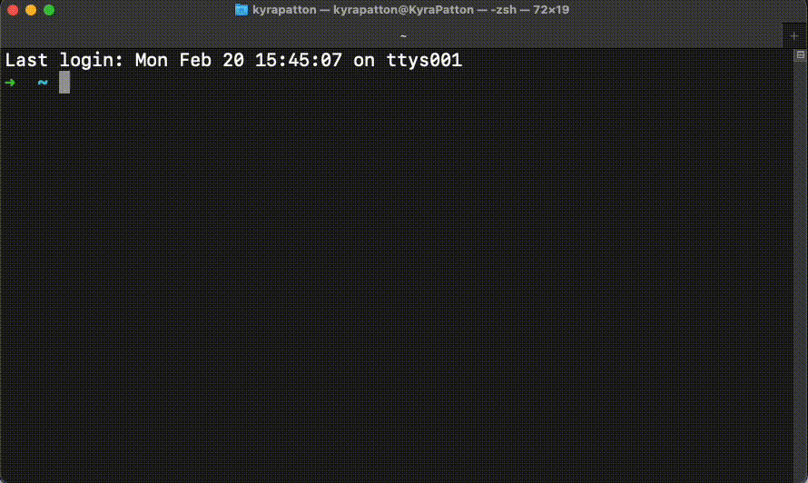

# Intro to Command Line

<iframe src="https://adaacademy.hosted.panopto.com/Panopto/Pages/Embed.aspx?pid=5d739e22-8056-42d3-96f0-accc003af3dc&autoplay=false&offerviewer=true&showtitle=true&showbrand=false&start=0&interactivity=all" height="405" width="720" style="border: 1px solid #464646;" allowfullscreen allow="autoplay"></iframe>

## Learning Goals

- Create commands to navigate the file system through the command line using cd, ls, and pwd.
- Apply commands to create files and directories in command line using touch and mkdir.
- Apply the python3 command in the command line to run a Python script.

## Introduction

As a programmer, the terminal is one of our most important tools, and we will run thousands of commands in the terminal over our career. Before we get there, we should spend time familiarizing ourselves with the command line.

## Vocabulary and Synonyms

| Vocab          | Definition                                                                                                                                                     | Synonyms  | How to Use in a Sentence                                                                                                                                                                                                         |
| -------------- | -------------------------------------------------------------------------------------------------------------------------------------------------------------- | --------- | -------------------------------------------------------------------------------------------------------------------------------------------------------------------------------------------------------------------------------- |
| interface      | A medium that takes information from one source, and passes it to another source.The interface usually makes a meaningful translation between the two sources. | -         | "The command line and the terminal is one interface for how we interact with the file system and run programs on our computer," "That program has a graphical user interface, and there are buttons and images to interact with" |
| folder         | A named container of files and other folders (normally named sub-folders). Can be inside another folder.                                                       | directory | "I'm going to make another folder in this folder to organize things better," "Check to see if you put that file in the home directory"                                                                                           |
| Root directory | The nickname of the top-most folder that exists on the machine                                                                                                 | root      | "That program gets installed and its files live somewhere in root," "I don't usually spend much time in the root directory"                                                                                                      |
<!-- Add Vocab terms: Interpreter, IDLE/IDE, OS? -->

## Terminal vs. Shell vs. Command Line

 Most people navigate the computer using a **GUI** or _Graphical User Interface_. This is the visual component of a computer or application that allows us to interact with the software by selecting icons and images. 

 

 Some of the components that make up the macOS GUI are highlighted above. We can, for example, open an application by clicking on the app's icon in the dock or check which wifi network we are connected to by clicking on the menu bar's wifi icon. 

 As software developers, we often use the **terminal** instead of the operating system's GUI to use our computer. In our curriculum, we will use "terminal" to refer to an application that allows us to give text commands directly to a computer's operating system. Entering commands into the terminal application allows us to interact with a computer in the same way that clicking on buttons or windows does. We can enter commands to navigate between folders, make files, run programs, and more. Often, developers use the phrases "terminal" and "console" interchangeably. In macOS, there is an application named Terminal, and we'll use that application to type in commands and use the command line.

The **command line** refers to the area in the terminal where where developers type in commands. Often, a tutorial may stylize a command line prompt (or, command to input) with a `$` or other symbol (ex. `➜` , `%`, etc.) in the front. This symbol is to indicate the start of the command line, and does not need to be typed in.

```bash
$ ls
```

In the example above, the user executes the `ls` command by typing in `ls`.

The terminal is not actually the program responsible for running the commands we enter into the command line. It turns out, the terminal itself is a GUI that accepts commands as text input and will print any text output of commands we run. There is a **shell** program used by our terminal that works between the command line and the computer's operating system to run our commands. When a command is entered into the command line, the terminal runs the shell. The shell interprets the entered command and executes it. 
Just as there are multiple operating systems, there are multiple shell programs. `zsh` or Z shell is the default shell installed on Macs since macOS Catalina. In this curriculum, we will go into shells only at this level of depth.


The terminal is the application where commands are typed in via the command line. In the example above, when the enter key is pressed, the terminal will ask the shell to execute the `cd Documents` command that was typed in.

### !callout-info

## Why use the Terminal?

Why use the terminal when we can use the macOS GUI to get the same result? While using the terminal takes time to learn, once we are familiar with common commands, using the terminal is more efficient. The terminal is also quite powerful - it is possible to write programs or _scripts_ that will execute multiple commands at once. 

### !end-callout

<!-- available callout types: info, success, warning, danger, secondary  -->

### !callout-info

## Text Editors

Our terminal can run several kinds of _text editors_, or programs that can read and modify text files. Over this curriculum, we will briefly cover some. However, programmers can have a lot of depth and excitement over text editors, and if you'd like to join, follow your curiosity and look it up!

### !end-callout

## Navigating The File System


_Finder Application_

You may be familiar with using Mac's Finder application to navigate, create, delete, and move different files in your computer's file system. We will use the command line (in the terminal) and learn several commands to help us navigate a computer's file system without the Finder app.

**Here's a Metaphor:** Imagine our computer's entire file system is a house. This house contains main rooms that connect with each other. Each room can contain many pieces of furniture. A computer's file system is like the house, folders are like the rooms, and files are like the pieces of furniture.

  
[(source)](https://en.wikipedia.org/wiki/File:Hills-DeCaro-House-First-Floor-Plan.jpg)

We can only be in one room (folder) at a time. We can move pieces of furniture (files) between the different rooms (folders). In this house, we can also make or remove as many rooms (folders) or pieces of furniture (files) as we want!

In our terminal, **there is only one current working directory (folder) at a time;** the command line is only working in one folder (room) at a time. Navigating the file system in the command line means learning the commands to go between folders (rooms) and manipulate files (furniture).

### Commands

| Command in the Command Line               | Description                                                                                                                | Notes                                                                                                                                                                                   |
| ----------------------------------------- | -------------------------------------------------------------------------------------------------------------------------- | --------------------------------------------------------------------------------------------------------------------------------------------------------------------------------------- |
| <div style="min-width:170px;">`pwd`</div> | Print the path of the current working directory                                                                            | Use this command when you're lost in the terminal or need to confirm where you are; you can read this path to understand the pathway to get to the current working directory from root. |
| `ls`                                      | List the visible files and folders that are inside of the current directory                                                | This command does not list hidden files or folders; there is a separate argument for that                                                                                               |
| `ls -A`                                   | List all the files and folders inside of the current directory                                                             | The `-A` is an _argument_ to the `ls` command                                                                                                                                           |
| `cd some_folder`                          | Change the working directory to the given path. This path is a relative path from the current location                     | In this example, `cd some_folder` will navigate to a sub-folder named `some_folder`                                                                                                     |
| `cd ..`                                   | Change the working directory to the given path... And `..` is a nickname for "the parent folder of the current directory." | Use this command to go "up" one folder level                                                                                                                                            |
| `cd ~`                                    | Change the working directory to the home directory                                                                         | Use this command to always go back home                                                                                                                                                 |

#### Feedback

The terminal tends to not give thorough feedback for when commands _work_. The terminal prefers to give feedback for when commands _don't work_. When commands don't work, the terminal will often print an error, such as:

```bash
cd: some-non-existing-folder: No such file or directory
```

### Home and Root

"Home directory" is the nickname of the user folder on a computer. This folder is important because it will contain:

- important system-wide configuration files for certain programs we will use like git or bash
- folders and sub-folders that contain our projects and code
- by default in macOS, has folders such as "Documents," "Pictures," "Application," "Desktop"

We can **always** navigate to the home directory with

```
$ cd ~
```

"Root directory" is the nickname of the top-most folder that exists on the computer. This folder can contain folders important to the whole system, including folders and files and programs needed to start, sleep, or run a computer. We can always navigate to the root directory with `$ cd /`.

Colloquially, a _project's_ root directory is the top-most _project_ folder.

## Working with Files and Folders in the File System

We can create and delete files and folders from the command line.

### Commands for Creating Files and Folders

| Command in the Command Line                                 | Description                                                                                                                                          | Notes                                                                                                                             |
| ----------------------------------------------------------- | ---------------------------------------------------------------------------------------------------------------------------------------------------- | --------------------------------------------------------------------------------------------------------------------------------- |
| <div style="min-width:220px;">`mkdir new-folder-name`</div> | Creates a new folder with the given path and folder name. By default, this will create a new folder as a sub-folder in the current working directory | In this example, `mkdir new-folder-name` makes a new folder named `new-folder-name` inside the current directory.                 |
| `touch new_file.py`                                         | Creates a new file with the given path and file name. By default, this creates a new file inside the current working directory                       | In this example, `touch new_file.py` makes a new file named `new_file.py`. We should include the file extension in this filename. |

### Commands for Deleting Files and Folders

Files and folders deleted with these commands are difficult to recover; use them often and wisely!

| <div style="min-width:220px;">Command in the Command Line</div> | Description                                                                                                                                                                 | Notes                                                                                                                                                                                                                                    |
| --------------------------------------------------------------- | --------------------------------------------------------------------------------------------------------------------------------------------------------------------------- | ---------------------------------------------------------------------------------------------------------------------------------------------------------------------------------------------------------------------------------------- |
| `rm -rf folder-name`                                            | Deletes the folder with the given path and folder name, and all of the files and folders inside of it. By default, this deletes the folder in the current working directory | In this example, `rm -rf folder-name` deletes the folder named `folder-name` inside the current directory.                                                                                                                               |
| `rm some_file.py`                                               | Deletes the file with the given path and file name.                                                | In this example, `rm some_file.py` deletes the file named `some_file.py` inside the current directory. |

## Recommended File System Structure

As developers, over time, we will make hundreds of files and folders.

If you've never organized that many files and folders, and don't have a preference for how to organize, then we recommend that following this folder structure:

### `~/Developer`

- This is a folder where you put all of your developer-y code stuff!
- Make this folder with `$ mkdir ~/Developer` for the first time
- Navigate to this folder from any location in Terminal with `$ cd ~/Developer`, or using your relative commands to change directories

### `~/Developer/projects`

- This is a folder where you put all of your Ada projects
- Make this folder with `$ mkdir ~/Developer/projects` for the first time
- Navigate from anywhere with `$ cd ~/Developer/projects`

### `~/Developer/classroom`

- This is a folder where you put all of your notes, exercises, scratch work, classroom activities, homework, etc
- Make this folder with `$ mkdir ~/Developer/classroom`
- Pick one of these two popular ways to organize your notes:
  - Organize notes by week. They will have sub-folders nested in here, such as `~/Developer/classroom/week-1`
  - Organize notes by topic. Recommended topic folder names are `git`, `cs-fun`, `python`, `flask`, `js`, `react`, so it is like `~/Developer/classroom/python`

Of course, feel free to not follow these recommendations if you have preferred ways of organizing files that will work for you better.


## Using the Command Line to Execute Code

Writing code is like writing an instruction manual. When we write a program, we are using the programming language of our choice to explain step by step _how_ to perform a specific task. Writing out this explanation is not the same as actually _doing_ the task. Carrying out the task is referred to **executing** or running the program. 

To run our program using the command line, we can use the `python3` command. Python is a programming language, but it is also a piece of software. When we install Python onto our machine, we are installing a Python **interpreter** which takes a program written in human-readable Python code, translates it into computer-readable machine code, and has our computer execute the program using the translated machine code.

Entering `python3` into the command line without adding any arguments will open the interpreter directly in the command line.

```bash
$ python3
```



Using the command line interpreter, we can write and execute Python code directly in the interpreter. We can type `quit()` to exit the command line interpreter. The command line interpreter can be useful for debugging and testing out small pieces of code.

To run a Python program stored within a file, we follow the `python3` command with an argument: (the path and) name of the Python script we want to run.

```bash
$ python3 some_file.py
```

### Always Run Code with `python3`

This curriculum teaches programming in Python 3. By default, many macOS systems come with Python 2 installed. However, the differences between Python 3 and Python 2 are significant! It will become **crucial** to always execute our Python scripts from the command line and specify Python 3.

If we forget to run our Python scripts with `python3`, there's a chance that the script runs as expected but also a chance that the script breaks or has bugs.

### !callout-warning
## python3 vs python

"A lot of tutorials just use the `python` command to run Python scripts! Why? I'm not convinced that we need to use the `python3` command." One way to check if you need to use the `python3` command is to run two commands: `$ python --version` and `$ python3 --version`. If the output of these two commands differs (namely, `python` points to version 2), then we need to **avoid** using the `python` command.

### !end-callout

### !callout-info

## python3 aliases

There are many methods to make shortcuts for the `python3` command, including terminal/bash aliases, and more. Follow your curiosity!

### !end-callout

## Continue Learning

It is crucial for our careers as developers to practice using the terminal, and to increase our skill in it. There are hundreds of more commands to learn.

We can make a commitment to ourselves to discover and learn more and more ways to use the command line, to help our development workflow become more and more robust.

Some commands to learn include:

| Command in the Command Line| Description | Notes |
|---                         |---          |---    |
|`man some_command`  |  Prints the manual for any Unix command | Use this command if you want more information about how to use another command and the command's arguments|
|`mv source destination`   | Moves the `source` file or directory to the `destination` file or directory. | We can move multiple items to the same destination simultaneously: for example `mv source1 source2 destination`.  `mv` can also be used to rename files. |
|`cat some_file`  | Reads the data in the given file and prints the content as output in the terminal  | Can print the contents of multiple files with `cat file1 file2`  |
|`echo some_string` | Prints the string passed in to the console  |  |
|`grep some_string some_file` | Prints out any lines in `some_file` containing `some_string`   | Use this command if you want to search for a term within a file. |                              

For a fun way to learn more command line tools [check out these Bite Size Command Line comics by Julia Evans!](https://wizardzines.com/comics/#bite-size-command-line)

## Exiting Weird Screens on Terminal

Terminal and some commands bring us to different text editors. If you're ever taken to a terminal screen where:

- arrow keys or key presses don't seem to work as expected
- there is a `:` on the bottom line
- `ctrl+c` does not exit this screen

Try using the up and down arrows to scroll, and tapping the `q` key to quit. If you're ever in this situation, one of macOS's default paging helpers, [less](<https://en.wikipedia.org/wiki/Less_(Unix)>) is at play here! See more `less` commands [with this cheat sheet](https://gist.github.com/glnds/8862214).

## Check for Understanding

<!-- Question 1 -->

<!-- prettier-ignore-start -->
### !challenge

* type: multiple-choice
* id: 0d18747d-94a0-4136-85b1-49a1308ef647
* title: The command line 

##### !question

What is the command line? 

##### !end-question

##### !options

* The interface where developers type in commands into a terminal
* The top-most folder that exists on a machine
* a program that runs commands

##### !end-options

##### !answer

* The interface where developers type in commands into a terminal

##### !end-answer


### !end-challenge
<!-- prettier-ignore-end -->

<!-- Question Takeaway -->
<!-- prettier-ignore-start -->
### !challenge
* type: paragraph
* id: OI1qIU
* title: Intro to Command Line
##### !question

What was your biggest takeaway from this lesson? Feel free to answer in 1-2 sentences, draw a picture and describe it, or write a poem, an analogy, or a story.

##### !end-question
##### !placeholder

My biggest takeaway from this lesson is...

##### !end-placeholder
### !end-challenge
<!-- prettier-ignore-end -->
