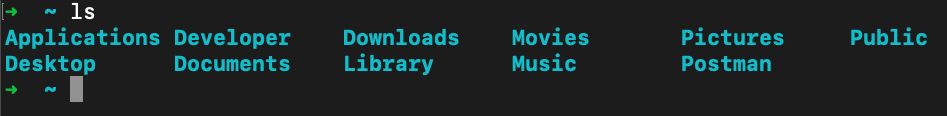

# Problem Set: Intro to Dev Environment

## Directions

Complete all questions below.

## Practice


<!-- Question 1 -->

### !challenge

* type: ordering
* id: 2f04b873-af65-4c45-9944-82a7be66d20b
* title: Intro to Dev Environment
<!-- * topics: [python, pandas] (Checkpoints only, optional the topics for analyzing points) -->

##### !question

Place the commands in the appropriate order to complete the following tasks:
- Make a new folder inside the current directory called `new-directory`
- Change from the current working directory to `new-directory`
- Make a new file inside `new-directory` called `new-file.txt`
- List all the visible files inside the current directory
- Change from the current directroy back to the home directory

##### !end-question

##### !answer

1. `mkdir new-directory`
1. `cd new-directory`
1. `touch new-file.txt`
2. `ls`
3. `cd ~`

##### !end-answer

<!-- other optional sections -->
<!-- !hint - !end-hint (markdown, hidden, students click to view) -->
<!-- !rubric - !end-rubric (markdown, instructors can see while scoring a checkpoint) -->
##### !explanation 
`mkdir` is the command to create a new directory.
`cd some_folder` allows us to move from our current folder to `some_folder`. In this case we want to move to `new-directory`.
`touch new_file` allows us to create a new file. In this case we want to create `new-file.txt`.
`ls` lists all visible files inside the current directory.
`cd ~` will bring us back to the home directory.
#### !end-explanation

### !end-challenge

<!--Question 2 -->

### !challenge

* type: short-answer
* id: be243244-7b46-4fb9-bd58-71d1c39674f2
* title: Intro to Dev Environment
<!-- * points: [1] (optional, the number of points for scoring as a checkpoint) -->
<!-- * topics: [python, pandas] (Checkpoints only, optional the topics for analyzing points) -->

##### !question

Imagine you have the following file structure:



Without changing directories, write a single command that will create a new file named `new_script.py` in the `Developer` directory.
##### !end-question

##### !placeholder

Enter your command here

##### !end-placeholder

##### !answer

/^\s*(touch (./)?Developer/new_script.py)\s*$/

##### !end-answer

<!-- other optional sections -->
##### !hint 
What is the file path from the current working directory to where we want `new_script.py`?
##### !end-hint
<!-- !rubric - !end-rubric (markdown, instructors can see while scoring a checkpoint) -->
##### !explanation 
The `touch` command allows us to create new files.

Since we want to create the new file in a different directory than the one we are currently in, we need to include the file path relative to our current directory in our argument which is `Developer/new_script.py`
##### !end-explanation

### !end-challenge

<!-- Question 3 -->

### !challenge

* type: multiple-choice
* id: e199a18d-973e-42ce-aee6-c85ecbfc1e75
* title: Intro to Dev Environment
<!-- * points: [1] (optional, the number of points for scoring as a checkpoint) -->
<!-- * topics: [python, pandas] (Checkpoints only. optional the topics for analyzing points) -->

##### !question

Which of the following will open the Python command line interpreter. 

##### !end-question

##### !options

a| `python3 --version`
b| `python3 command-line.py`
c| `cd python3`
d| `python3`

##### !end-options

##### !answer

d|

##### !end-answer
##### !explanation 

Just entering `python3` with no arguments into the command line will open up the command line interpreter, where you can type and execute python code directly in the terminal. 
`python3 --version` would tell us which version of python3 was installed on our machine.

`python3 command-line.py` would attempt to run a python script called `command-line.py`.

`cd python3` would attempt to navigate to a directory called `python3`. 
##### !end-explanation 

### !end-challenge

<!--Question 4-->

### !challenge

* type: multiple-choice
* id: e60869d5-e236-4989-bb8d-b2d1d67647d9
* title: Intro to Dev Environment
<!-- * points: [1] (optional, the number of points for scoring as a checkpoint) -->
<!-- * topics: [python, pandas] (Checkpoints only. optional the topics for analyzing points) -->

##### !question

Imagine we run the following program: 

```python
def hello_name(name):
    result_string = "Hello " + name + "!"
    print(result_string)

hello_name("Ada Lovelace")
```
In what type of memory would `result_string` be stored?

##### !end-question

##### !options

a| Hard Drive
b| RAM
c| CPU
d| Cloud

##### !end-options

##### !answer

b|

##### !end-answer
##### !explanation
RAM is used to read and write any temporary data a program needs when running, including values assigned to variables.
##### !end-explanation

### !end-challenge
