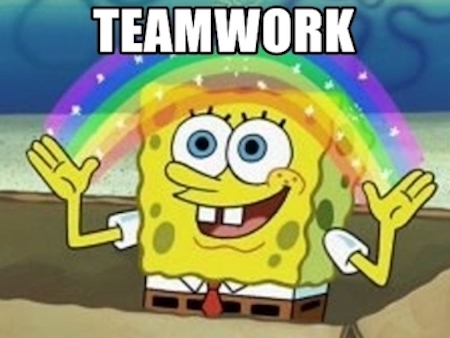
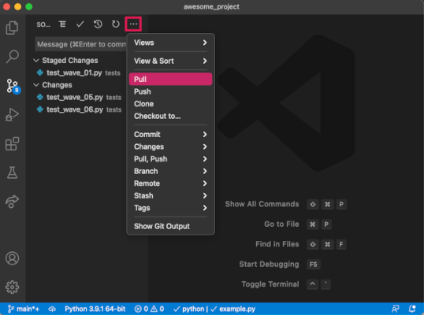
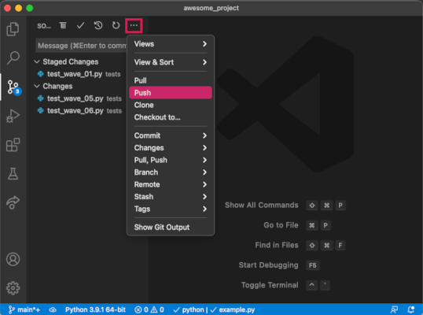

# Collaborating

<iframe src="https://adaacademy.hosted.panopto.com/Panopto/Pages/Embed.aspx?pid=ff9b0873-e36d-4af6-a4f7-ad28017ae447&autoplay=false&offerviewer=true&showtitle=true&showbrand=false&start=0&interactivity=all" height="405" width="720" style="border: 1px solid #464646;" allowfullscreen allow="autoplay"></iframe>

## Learning Goals

- Explain how Git is a version control system used to collaborate on code
- Compare the difference between code on a local machine versus code on a remote repository
- Explain how to get changes from a remote repository using git pull (or git fetch and git merge)
- Explain how to push changes to a remote repository using git push
- Explain why a local machine must merge in changes from the remote before pushing

## Introduction

Developers working on projects tracked by Git build their projects with commits. We can imagine a single developer, Nakita, working on her project named Hike Planner. By the end of the week, she's created twenty commits, and her Git history tells her the story of the code.

How would Nakita's workflow change if the Hike Planner team grows? Multiple developers can work on a project, and Git has even more tools to facilitate collaborating. The key to collaborating with Git is working to converge on a single, unified Git history together.

## Vocabulary and Synonyms

| <div style="min-width:100px;">Vocab</div> | <div style="min-width:150px;">Definition</div> | <div style="min-width:100px;">Synonyms</div> | <div style="min-width:250px;">How to Use in a Sentence</div> |
| ----------- | ----------- | ----------- | ----------- |
 Remote repository | A common repository that all team members use to exchange their changes | Remote, remote repo, `origin` | "I push my code to the remote `origin`, so my team members can pull those changes from it," "I pull changes from the remote `origin`, so I can get the shared code changes." |

## Collaboration Means Looking at the Same Source of Code

  
[(source)](https://memegenerator.net/instance/49040424/spongebob-teamwork)

Nakita's friends, Frida and Raul, want to join Nakita and help her build Hike Planner. How does Nakita share the current Git history that's already built? How do Frida and Raul get access to this Git history? Can Frida and Raul work at the same time as Nakita? Do Frida and Raul make commits too? How do all of these commits get received? How do they get shared?

Git is highly configurable, so most of these settings can change. However, in the vast majority of cases, Git enables collaboration with this setup:

- The project should be hosted somewhere all team members have access. We call this hosted project the project remote "repo."
- Each developer will download the repo onto their machine using the Git command `clone`. This "download" includes the entire Git history!
- All team members should contribute code changes by making commits on their own machines
- All team members will receive commits and updates from the main remote repo
- All team members will send commits and updates to the main remote repo
- All team members will follow and repeat this cycle, enabling a smooth team workflow

### Example of the Entire Process: The Hike Planner Team

  
[(source)](https://imgflip.com/memetemplate/71579342/Spongebob-Adventure)


For the Hike Planner team, we can imagine this story:

1. Nakita hosts the project codebase somewhere, and gives access to Frida and Raul.
1. Frida clones this repo onto her laptop. Raul clones this repo onto his laptop.
1. Nakita makes code changes and commits on her machine. Frida makes her own code changes and commits on her machine. Raul does, too.

After setup, during development...

-  When Nakita wants the new commits that are on the remote, she will ask for them. These updates and commits will be applied to the code she currently has on her laptop.
    - When Frida wants updates, she'll need to ask for them too. Then, these updates get applied to her current code.
    - When Raul wants updates, he'll also ask for them before they're applied to his current code.
- When Nakita wants to send commits that are on her laptop to the main hosted repo, she will push her commits. This process will use Git's merging tools, and the main remote repo will now have a new, updated Git history.
    - When Frida pushes her commits, the main hosted repo will also work to have a new, updated Git history.
    - Raul's commits and contributions work the same way, too.
- All three team members will contribute through making commits, pulling commits from the main repo, and pushing commits to the main repo.

## The Remote Repository and `origin`

A repo that holds a codebase and commit history that is accessible to multiple team members is called a **remote repository**. We call it remote because the repo is usually hosted somewhere that is _not_ a developer's personal computer. There are many providers of repo hosting services, but github.com is often a good place to start, and will be used throughout this curriculum.

What do we do with a remote repo? All team members will look to this one, shared remote repo. It will be the main repo that team members can use as a source of truth. Team members will get new commits and updates from the remote repo. Team members will push their new commits to the remote repo.

### !callout-secondary

## Example: The Hike Planner Team

The Hike Planner team will host their repo on github.com. Nakita, Frida, and Raul will all have access to this remote repo.

### !end-callout

#### The `origin` of All Things

When we clone a repo from a remote host, Git gives a default nickname of `origin` to the site from where the repo was downloaded. If our repo is hosted at github.com, then within our cloned repo Git will treat `origin` as an alias for github.com. We can use the `origin` alias in any Git command that works with remote repos. And most of those commands will assume `origin` as the remote repo unless told otherwise!

## Getting The Latest Version from `origin`

The remote repository stores all commits from each team member. While our own machine already has the changes we made ourselves on it, how do we get the changes that our team members have committed?

We need to "pull" our team members' commits from `origin`!

### Pulling Means Fetching and Merging

A remote repo has a Git history. Recall that so does each developer, on their own machines. Git recognizes that these are separate Git histories, even though they're the same project.

In order to "pull" commits from `origin`, Git must determine how to merge these separate histories. In fact, Git thinks about this process as two distinct steps:

1. The local machine needs to recognize that there are updates from another repo
2. The two Git histories need to merge together, and become one

To accomplish this, Git gives us these commands:

```
$ git fetch
$ git merge
```

Git also gives us a synonym, which will execute `fetch` and then `merge`:

```
$ git pull
```

### !callout-secondary

## Example: The Hike Planner Team

Nakita and Raul both contributed new commits to the remote repo yesterday. Frida knows that there are new commits on the `origin` repo, and her local machine doesn't have those commits in her Git history. She should either run `$ git fetch` then `$ git merge`, or run `$ git pull`.

### !end-callout

### More About Merging

What does it mean when two Git histories merge?

To merge two histories, Git will take all the commits from both histories, and try to make one history. Git uses information like the timestamp of the commit and the parent (and order) of the commit. Git will then attempt to **apply** these commits in this new order. The result will be a codebase that has all commits.

Git performs a merge by replaying and applying the commits one by one. During this process, Git may ask us for input if it is unable to determine how to merge multiple changes. We may need to step in to resolve conflicting code, skip a merge, or abort the merging process entirely.

When more than one team member has modified a single file, Git will often need to perform a follow-up commit to finalize the merge order. This commit is called a **merge commit**. Git generates a default message for merge commits, and it is usually sufficient to use that message unchanged.

### !callout-info

## So Much More About Pulling

There is much more to learn about Git pulling and merging. Due to the depth of these topics, much will be left uncovered in the formal curriculum, but we will have plenty of opportunity to learn through practice and curiosity!

### !end-callout

  
*Fig. VS Code lets us pull from within the editor. We can open the Source Control Panel, then click the three dots icon to open the extra actions menu. From here, we can click Pull to pull our changes from `origin`. While handy, you might still prefer to use the command line to pull, since the terminal output can be informative.*


## Pushing Commits to `origin`

As described in our discussion of pulling, the remote repository stores all commits from each team member. Our local machine has the changes we made ourselves on it, but how do we make our changes available to the rest of our team?

As we work on our own code, we need to _push_ our new commits _to_ `origin`. We can do that with this command:

```
$ git push
```

This command sends every commit in our local history to the remote repo. As with a pull, Git must merge these two Git histories! Unlike pulling, we as individual devs don't have a ready way to step in if Git encounters a problem during the merge. How might we try to prevent merge issues when we push? We'll revisit this shortly!

### !callout-info

## Configurations For Pushing

There are many, many arguments to configure the `$ git push` command. When we need more control over how and where we're pushing, we can look them up. As with other Git commands, the `--help` option is a great place to start!

By default, `$ git push` will push the current history to the `origin` repo.

### !end-callout

  
*Fig. VS Code lets us push from within the editor. We can open the Source Control Panel, then click the three dots icon to open the extra actions menu. From here, we can click Push to push our changes to `origin`. While convenient, you might still prefer to use the command line to push, since the terminal output can be informative.*

### Pull Before Pushing

As a rule, Git requires a local repo to `pull` changes and to be up-to-date with the remote repo, before `push`ing to the remote repo.

Pulling before pushing ensures that our local repo has all of the changes that the remote repo knows about. If there are any merge problems, they will occur in our local repo where we can interactively fix them. Once the local merge is complete, our repo will contain the full remote history plus whatever changes we were working on. This ensures that Git will easily be able to merge our commit history on the next push!

After we pull, but before we push, it's important to re-run our tests and ensure everything is still working correctly. If it's not, then we need to fix whatever has broken, making additional commits as needed to get the project back into a good state. Once things are working correctly, then we can push our commits!

### !callout-secondary

## Example: The Hike Planner Team

Nakita just finished a feature that analyzes weather data. She made three commits, and they are on her local machine. She wants to merge them into the remote repo, `origin`. First, Nakita should `pull`, in case Frida or Raul merged commits recently. Second, Nakita should check that her code still works well. She sees that two tests are failing now. Nakita makes one commit to fix these tests. Third, Nakita will `pull` again. She sees all tests are passing still. Finally, Nakita will `push` her four new commits from her machine to `origin`.

### !end-callout

## Proposed Workflow

To summarize these concepts and commands, here is a proposed development workflow:

1. Confirm that the project is in the state you expect with `$ git status`
1. Determine what your next task or goal is.
1. Start running tests, writing code, etc.
1. When you have a small, meaningful change, get ready to make a commit:
   1. Move the intended changes from local changes area to staging with `$ git add`
   1. Create a commit and a commit message from the changes in staging with `$ git commit -m ""`
   1. Review the commit with `$ git show`
1. Create at least one commit. Continue to write code and make commits.
1. Fetch and merge any new commits from `origin` with `$ git pull`
1. Review the code; check that the tests still pass, and the code still runs
   - If the code is broken, restart this process and make commits that will fix the problem
1. Send all of your commits to `origin` with `$ git push`
1. Review your work with `$ git status` and `$ git log`

## Check for Understanding
<!-- Definitions -->

<!-- Question Takeaway -->
<!-- prettier-ignore-start -->
### !challenge
* type: paragraph
* id: gK1g0y
* title: Collaborating
##### !question

What was your biggest takeaway from this lesson? Feel free to answer in 1-2 sentences, draw a picture and describe it, or write a poem, an analogy, or a story.

##### !end-question
##### !placeholder

My biggest takeaway from this lesson is...

##### !end-placeholder
### !end-challenge
<!-- prettier-ignore-end -->
