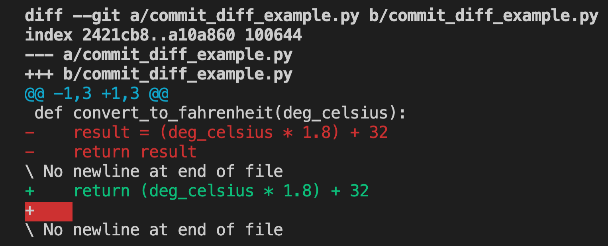
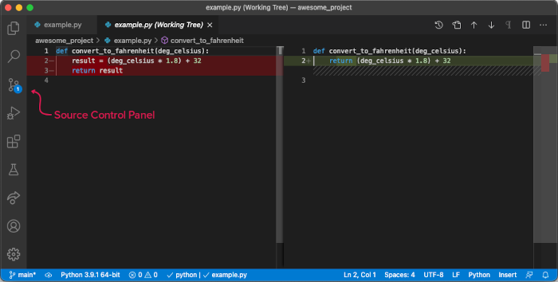
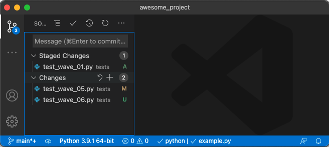
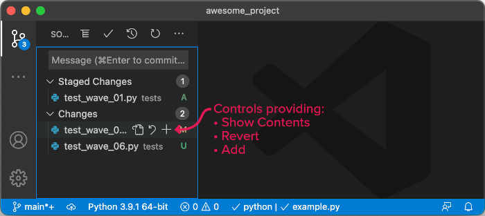
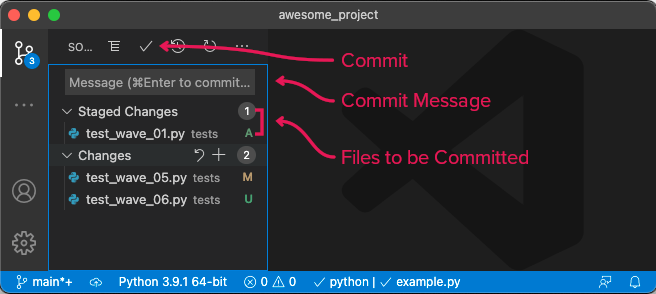

# Commits

<iframe src="https://adaacademy.hosted.panopto.com/Panopto/Pages/Embed.aspx?pid=d2750a5f-d4d5-4aab-a7da-ad28017abcfc&autoplay=false&offerviewer=true&showtitle=true&showbrand=false&start=0&interactivity=all" height="405" width="720" style="border: 1px solid #464646;" allowfullscreen allow="autoplay"></iframe>

## Learning Goals

- Explain how a commit in Git is made using the git add and git commit commands
- Practice versioning code by creating commits in Git
- Practice observing commit history using the commands git status, git log, git show, and git diff
- Explain different ways of "undoing" commits using git revert and git reset

## Introduction

We know that Git will help us do these two things:

- Version our software with commits and look at our commit history
- Collaborate with others

The foundation of Git is understanding commits. A solid understanding of commits allows programmers to see their project's progress.

Sometimes, we work on a project alone. Git is still an incredibly powerful and helpful tool, even without the collaboration!

## Vocabulary and Synonyms

<!-- | Vocab | Definition | Synonyms | How to Use in a Sentence |
| ----- | ---------- | -------- | ------------------------ | -->

- Code Change
- Diff
- Commit
- Local Changes Area
- Staging Area
- Untracked Area
- Tracking
- vim

## Format

The goal of this lesson is to learn how to make commits in Git. However, there is plenty of information to consider before that.

This lesson is organized into three sections: We'll learn about...

1. more details about what commits are
1. the overall process of making a commit
1. the steps to take to make a commit

## Displaying Differences in Code

Recall from the previous lesson that a commit records the differences in code between the commit version, and the previous version.

We can generalize that each change in software is a set of files and...

- The lines of code that were added
- The lines of code that were deleted
- The lines of code that were modified

Let's look at an example.

Nakita is working on a project named Hike Planner, which helps plan her hiking trips.

Nakita starts with this code...

```python
def convert_to_fahrenheit(deg_celsius):
    result = (deg_celsius * 1.8) + 32
    return result
```

And at the end of the day, she's refactored the function to this, which removes the variable `result`:

```python
def convert_to_fahrenheit(deg_celsius):
    return (deg_celsius * 1.8) + 32
```

We can describe the diff between these two like this:

- remove the line `result = (deg_celsius * 1.8) + 32`
- remove the line `return result`
- add the line `return (deg_celsius * 1.8) + 32`

The diff of these changes can be displayed like this:

```
 def convert_to_fahrenheit(deg_celsius):
-    result = (deg_celsius * 1.8) + 32
-    return result
+    return (deg_celsius * 1.8) + 32
```



Note the `+` and `-` symbols at the beginning of each line to describe lines added and removed.

We refer to the collection of differences between two resources, such as files or versions, as a **diff**.  A VCS can display a set of changes as a **diff**, allowing us to confirm our modifications before committing to our repo, or to review modifications made by others on our team.

  
*Fig. Diffs can also be viewed using VS Code. Use the Source Control Panel to view a list of changed files in your project. Clicking any file will compare its current contents to the last checked in version. This screenshot sows the same change as the text display above, which deleted lines showing in red, and added lines in green.*

## When to Make a Commit

Commits can come in different sizes; we can build a commit when the diff is 2 lines long or 2000 lines long. However, the best commits are:

- atomic; as small as possible
- focused on one meaningful change
- not a work in progress, leaving the code in a confusing, broken state

As a recommendation, good times to make a commit are...

- After implementing the code to make one test pass
- After writing one test and implementing the feature to make that test pass
- Before implementing a different feature
- After writing one or two functions
- After beginning to make a class
- After making function stubs, class stubs, or new files
- Before beginning to refactor code
- After refactoring one area of code

As a recommendation, bad times to make a commit are...

- In the middle of refactoring code
- In the middle of implementing a feature, and running the project produces an error
- After implementing multiple features (these should be smaller commits)

As we keep programming, we may see that large commits can make the git history more challenging to read.

## In Git, There Are Local and Staging Areas

It is valuable to intentionally construct small, concise commits. We can achieve such commits by being selective about the specific code changes (lines added and removed) that we include in a commit.

Git allows us to be selective about the changes that go into a commit. It does this by providing two areas we can use to categorize them: the _local changes area_ and the _staging area_.

The two areas give us visibility and control about what will go into a commit, before we apply it.

- The _local changes area_ is for new code changes that only exist on this local machine. It's the first area that code changes go to.
- The _staging area_ is for code changes that a developer indicates should go into the next commit.

Most of the changes that we make, such as adding or modifying code, or deleting code or files, automatically get categorized into the _local changes area_.

### Viewing Local and Staging Areas

In a Git project, we can view a summary of the changes in the local and staging areas by running this in the project root:

```bash
$ git status
```

Below is an example of what the `$ git status` command could print out.

Read this output. Then, read through the explanation below. Then re-read this output to check for understanding.

```
On branch main
Your branch is up to date with 'origin/main'.

Changes to be committed:
  (use "git restore --staged <file>..." to unstage)
	modified:   tests/test_wave_01.py

Changes not staged for commit:
  (use "git add <file>..." to update what will be committed)
  (use "git restore <file>..." to discard changes in working directory)
	modified:   tests/test_wave_05.py

Untracked files:
  (use "git add <file>..." to include in what will be committed)
	tests/test_wave_06.py
```

This `$ git status` output describes the code changes:

- "Changes to be committed:"

  - This section describes the **staging area**
  - These are the code changes have been moved from local to staging
  - There's a tip from Git for the command to unstage that change, `$ git restore --staged <file>...`
  - In this example, there are some modifications in the file `tests/test_wave_01.py`. We know that because it says `modified: tests/test_wave_01.py`

- "Changes not staged for commit:"

  - This section describes the **local changes area**
  - These are the new code changes from tracked files
  - There are tips from Git for how to stage or restore code changes
  - In this example, there are modifications in the file `tests/test_wave_05.py`

- "Untracked files:"
  - This section describes the untracked changes area
  - These are the files that Git understands are new and untracked, but the changes can't go into local changes until it's tracked
  - Git gives us a tip for how to track and stage that file
  - In this example, there is one new file: `tests/test_wave_06.py`

  
*Fig. Git status is available in VS Code! Use the Source Control Panel (shown previously) to view a list of changed files in your project. We see `test_wave_01.py` marked with __A__ in Staged Changes, indicating that it will be added. `test_wave_05.py` is marked with __M__ in Changes, indicating Git has detected the modification, but the user has not added it to the pending commit. And `test_wave_06.py` is also under Changes, but marked with __U__, indicating that it is currently untracked.*

### Moving Changes to the Staging Area

We move changes from local to staging with the command `$ git add`. This command has a variety of options and can be called many ways. We could further investigate its options with `$ git add --help`, but for now let's look at a few common ways to use it.

- `$ git add <relative-path-to-file-or-folder>`
  - We replace `<relative-path-to-file-or-folder>` with the file name or path of the code changes we would like to add
  - When given a folder, it adds all code changes in all files in it, including files in nested directories
  - A common way to use this is `$ git add .`, where `.` indicates the current directory
  - This method can add a large number of changes at once
- `$ git add -p`
  - This starts an interactive mode where local code changes will be presented on the screen one at a time.
  - At each chunk, we can decide whether the change should go into staging: `y` then enter for "yes," `n` then enter for "no."
  - This mode cycles through all chunks in the local changes area, then exits the interactive mode
  - This method encourages reviewing code changes

### Untracked Changes Area, and Tracking Changes

Besides the local changes and staging areas, Git additionally has a third area: the _untracked area_.

By default, Git doesn't assume that it should watch for changes in every file in our project. By default, Git wants the programmer to intentionally say, "Hey! This file will contain code that I want to version and put in a repo."

When a new file is created in a project, it is _untracked_. No matter how many times we change its contents, Git won't store the different versions of an untracked file. All Git will do is report that the file is untracked.

The command to begin tracking (watching for changes) a new file is the same command to bring it to staging:

```
$ git add <relative-path-to-untracked-file>
```

Where `<relative-path-to-untracked-file>` is replaced with a relative path to the file.

  
*Fig. We can add files to a commit using VS Code. Hovering over a file in the Source Control Panel gives us controls to view the file contents, revert the change, or add the change. Adding always moves the change to the Staged Changes. Reverting will unstage the change if staged, or restore to last committed version if unstaged.*

## Commits Are Made After Local and Staging

We create a commit _after our intended changes are in **staging**_.

Recall from the previous lesson that every commit contains certain pieces of information:

- The summary of lines of code that were added, deleted, or changed, compared to the last commit.
- A way to refer to the last commit, or its "parent" commit
- A unique ID for the commit, often called the commit hash. This gets generated automatically
- A commit message, a string describing the contents of the commit
- The date and time that the commit was made

We create a commit with the command `$ git commit`. For short, concise commits, it is very common to include the commit message as part of the commit command.

The command to make a commit and write a commit message is:

```
$ git commit -m "Some string that describes the changes, don't forget the quotes"
```

Where `"Some string that describes the changes, don't forget the quotes"` is replaced with an accurate message.

  
*Fig. We can commit our change using VS Code. After adding the files we wish to commit to the Staged Changes area, we can enter a commit message, then commit the change by clicking the check mark.*

## About Commit Messages

For each commit, the commit message should describe the changes found in the commit.

There are no rules about commit messages, but these are common qualities of good commit messages:

- short; can be a sentence fragment, a sentence, or two
- accurate
- specific
- starts with a verb
- finishes the sentence, "When we apply this commit, this commit will..."

Specificity in commit messages helps you and your teammates understand the Git history when reviewing it. Most importantly, this helps you in the future, when you need to debug something and find what commit contains the bug. Specific commit messages could be the difference between five hours or five minutes of debugging.

### Example Commit Messages

Some example commit messages include:

- `"Fix failing RouteFinder tests"`
- `"Reworks hikes and mountain searching logic"`
- `"Add tests for hike guide meta-data"`
- `"Update pytest dependency and generate test config"`
- `"Renames class HikeFinder to HikePlanner"`

Many software teams will designate a template to follow for commit messages.

### My Terminal Gets Funky With Commit Messages

If we don't supply a commit message as part of the commit command, Git will try to open a text editor where we can supply a message interactively. Git is usually set up to use a program called `vim` by default. vim is really great at displaying text! However, the way we work with files in vim is somewhat unique.

When a Git commit command opens up vim, we navigate by:

- Typing `:wq` and pressing enter to _write_ (save) and then _quit_ vim.
- Typing `i` to go into "insert mode," if we must write text. Insert mode will let us type characters, and use left and right arrows to navigate.
- Using the escape key to exit "insert mode"

In most situations, the best action is to exit with `:wq`

It is common to change the default editor for git from vim to something else, such as Nano or VS Code.

## Summary Of Building Commits

- Code changes are in one of three areas:
  - Local changes area, where most code changes begin
  - Staging area, where code changes that will be in the next commit are
  - Untracked changes area, where untracked files and changes are
- We view a summary of the local code changes and the staged code changes with `$ git status`
- We move code changes _from_ local or untracked _to_ the staging area with `$ git add`
- We move all changes we want in a commit into the staging area
- We create a commit and a commit message with `$ git commit -m "Message"`
- We may need to navigate some screens with alternative syntax

## Check for Understanding
<!-- Definitions -->

<!-- Question Takeaway -->
<!-- prettier-ignore-start -->
### !challenge
* type: paragraph
* id: BU1uRr
* title: Commits
##### !question

What was your biggest takeaway from this lesson? Feel free to answer in 1-2 sentences, draw a picture and describe it, or write a poem, an analogy, or a story.

##### !end-question
##### !placeholder

My biggest takeaway from this lesson is...

##### !end-placeholder
### !end-challenge
<!-- prettier-ignore-end -->
