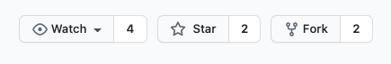
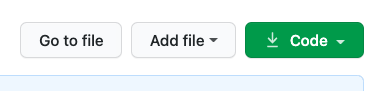

# Git Setup

<iframe src="https://adaacademy.hosted.panopto.com/Panopto/Pages/Embed.aspx?pid=d0d1a604-fdeb-4f89-b851-ad28017a90b1&autoplay=false&offerviewer=true&showtitle=true&showbrand=false&start=0&interactivity=all" height="405" width="720" style="border: 1px solid #464646;" allowfullscreen allow="autoplay"></iframe>

## Introduction

Git has so many concepts to learn! Creating commits, reviewing commits, and collaborating truly are the most important parts of Git.

However, it's important to recognize some actions needed to set up a Git repo. The following topics will probably not affect a developer's daily workflow, and will happen infrequently.

This document is written more like a resource. These topics are necessary to understand, but are less frequently used than concepts for commits and collaboration. Use this lesson as a reference guide, and to inspire you to read more.

### !callout-info

## Our Goal

The goal of this lesson is to help us understand how to setup our Git workflow, so we can start!

Setup happens pretty infrequently. The energy of this lesson may be best used to focus on learning how to recognize different setup steps, rather than committing commands to memory.

Additionally, these setup steps are useful for beginning independent projects outside of this curriculum, too!

### !end-callout

## Vocabulary and Synonyms

| Vocab          | Definition                                                                                                                                                                                                                                   | Synonyms | How to Use in a Sentence                                                                                                                                                                                                                   |
| -------------- | -------------------------------------------------------------------------------------------------------------------------------------------------------------------------------------------------------------------------------------------- | -------- | ------------------------------------------------------------------------------------------------------------------------------------------------------------------------------------------------------------------------------------------ |
| Fork           | A repo that is based on another repo. These two repos share a Git history up until a certain point.                                                                                                                                          | -        | "I want to remix a project and manage it myself, I should make a fork of it," "On this project, I want to push code changes to my own fork," "That package is actually a fork of another package, but developed in a different direction." |
| Forking a Repo | The act of making a forked repo from a base repo. This creates a repo of the same name, but under ownership of a different user or organization. The forked repo shares the same Git history as the base repo up until the point of forking. | -        | "I forked the project repo yesterday, so that's why I have all of the project code that was added until yesterday."                                                                                                                        |
| Clone          | A directory that contains a repo's code and Git history, and can keep track of the remote repo it's a clone of. We usually clone a repo onto a local machine.                                                                                | -        | "When I wanted to start working on this repo's code, I put a clone of it onto my computer."                                                                                                                                                |
| Cloning a Repo | The act of cloning a remote repo into another directory, usually performed on a local machine.                                                                                                                                               | -        | "I can clone a single repo on my computer as I want, and they'll all make different folders on my computer."                                                                                                                               |

## Navigating GitHub.com

GitHub.com is a massive platform. There are a ton of features, but right from the start, it's worth getting to know how to locate and use the following:

- Going to your own profile page
- Going to the page that lists your own repositories
- Going to the settings page
- Looking at an individual repo, such as
  - Looking at the list of folders and files in this repo
  - Identifying the README, whose contents are shown below

### Repos Have Names and Owners

Every repo has a name.

Every repo either belongs to a user or to an organization.

For example, the [`pallets/flask` repo](https://github.com/pallets/flask) is named `flask` and belongs to the organization `pallets`.

## Initializing a New Git Project

Projects are not tracked with Git (and therefore don't use Git) until it is initialized as a Git project.

To turn any folder into a Git project, run this command in the project root:

```bash
$ git init
```

### !callout-info

## The Hidden Truth About Git

On a technical level, this creates a hidden folder named `.git` in the project root. This hidden folder contains a lot of Git settings for this project (including the Git history!)

### !end-callout

## Forking an Existing Git Project for Yourself

The community model for GitHub encourages forking repos.

When developers see a repo that would be a good _base_ for a project, and the developer wants to remix this project for themselves, they can **fork** it.

Forking creates a copy of the repo (including its code _and_ its Git history up to that point). This copy of the repo will belong to your own user account.

To fork a repo, use GitHub.com:

- Navigate to the repo's page on Github.com
- Locate the button to fork this repo. This button is likely towards the top right corner.
- Click on this "Fork" button
    - 
- Confirm that there is a new repo with the same name, but owned by your account
  - You can check the page that lists your repositories, too

### When to Fork

A developer forks a repo when they need these things:

1. A repo with a copy of this Git history so far (and the code with it)
1. More ownership, control, and access over the repo, such as permissions to add collaborators or push commits
1. Separation from the original repo

## Cloning a Repo onto Your Computer

When developers see a repo on GitHub.com, and want a copy of this repo on their own computer, they can **clone** the repo.

Cloning creates a new folder on the local computer. This folder has the same name as the remote repo. Also, this folder contains all of the remote repo's current folders, files, and Git history.

To clone a repo, we need a Clone URL that can be obtained from the GitHub site for the project. Once we have this Clone URL, the command to clone is:

```bash
$ git clone <clone url>
```

To clone a repo, the full process is:

1. Go to the repo's page on GitHub.com
1. Locate the button that opens details on downloading the code or cloning the project. This button is labeled "Code" and located towards the top right corner.
    - 
1. Click the "Code" button. This will open a pop-up where we can set a few cloning options.
1. Select "HTTPS".
1. Locate the clone URL inside the same pop-up and copy it.
    - 
1. Switch back to your terminal
1. Run the `$ git clone <clone URL>` command, where `<clone URL>` is replaced with the URL copied previously.
1. Confirm there's a new project folder and `cd` into it

### Clone with HTTPS

In the process above, we specified choosing HTTPS for cloning the project. This setting determines the protocol used for Git commands and operations. HTTPS is a little more straightforward to use, so we will be using it throughout the curriculum.

### !callout-info

## No Really, Clone with HTTPS

The ability to clone with SSH is welcome, and is a great and wonderful way to clone! However, it requires additional setup not covered in this curriculum. This curriculum officially recommends cloning with HTTPS for now, but follow your curiosity!

### !end-callout

### When to Clone

A developer clones a repo when they need these things a repo's code and Git history to be downloaded onto their computer.

Cloning allows us to start actively performing development on our own machines!

## Configuring Defaults

<!-- Add in details about configuring details if not covered in precourse or it becomes higher priority -->

### Configuring the Default Text Editor

It is common to change the default editor for git from `vim` to something else, such as Nano or VS Code. If you have set up your computer to enable launching VS Code from the command line, you can configure Git to use it instead of vim with the following command:

```bash
$ git config --global core.editor "code --wait"
```

Instead of using vim, Git will open VS Code, and _it will wait until the window in VS Code is saved and closed._
