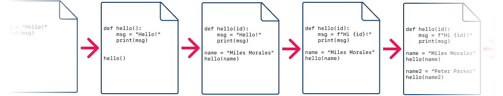

# Intro to Git: Vocab and Concepts

<iframe src="https://adaacademy.hosted.panopto.com/Panopto/Pages/Embed.aspx?pid=1c85dff4-64bc-4c52-a38b-ad28017a626e&autoplay=false&offerviewer=true&showtitle=true&showbrand=false&start=0&interactivity=all" height="405" width="720" style="border: 1px solid #464646;" allowfullscreen allow="autoplay"></iframe>

## Learning Goals

- Explain the role of Git as a version control system used to version code
- Define a repository in Git
- Compare a Git repository to a project
- Define a commit in Git

## Introduction

When we refer to _versions_ in software, we are describing a set of changes to a codebase as it has been modified over time.

Consider how the version of you from 10 years ago is different from the version of you from 10 minutes ago (which is different from the you of right now). Are those three versions of you very different from each other?

Comparing the you from 10 minutes ago and the present you, have you gained, dropped, or changed anything? The difference between those two versions of you could be huge, or they could be small, incremental, barely noticeable changes.
  
[(source)](https://knowyourmeme.com/memes/spider-man-pointing-at-spider-man)

What a codebase looked like at one point in time could be very different from how it looks now. If we used to have three tests, and later added a fourth, then we can say that there is a version of the codebase that passes three tests, and a version of the same codebase that passes four tests.

How can the idea of versioning help us build software?

## Vocabulary and Synonyms

| Vocab                  | Definition                                                                                                                                | Synonyms                | How to Use in a Sentence                                                                                                                                                                            |
| ---------------------- | ----------------------------------------------------------------------------------------------------------------------------------------- | ----------------------- | --------------------------------------------------------------------------------------------------------------------------------------------------------------------------------------------------- |
| Version                | Code at a specific point in time labeled with a number based identifier                                                                   | copy                    | "I created a separate version of this file that updated previous version."                                                                                                                          |
| Version Control System | A tool that records changes to a file or set of files over time as versions                                                               | VCS                     | "As a project grows, it's wise to use a VCS to keep track of all its changes and progressions.","Good thing the VCS kept track of my previous commits, otherwise, I would have lost all that work!" |
| Git                    | A distributed version control system that makes snapshots of files or multiple files in a repository to be later referenced as a version. | -                       | "The problem with _git_ jokes is, everyone has their own version"                                                                                                                                   |
| Repository             | A directory that stores project files                                                                                                     | Repo, folder, directory | "The project is in a local repository on my machine."                                                                                                                                               |
| Commit                 | An individual change to file(s), identified with a hash                                                                                   | -                       | "The recent commit fixed the bug in our project"                                                                                                                                                    |

## Version Control Systems Let Us Version Our Code

Version Control Systems (VCSs) are tools that allow programmers to create, view, and understand different versions of code.

There are plenty of different Version Control Systems, each with their own set of vocabulary and concepts. **Git** is a version control system that has widespread use and acceptance.

Git gives us tools to:

- create different versions of our codebases
- give names and ids to different versions
- record additional details between versions
- follow a specific history of versions
- collaborate on the same codebase at the same time with many people
- configure codebases and developer workflows to help programmers

### !callout-info

## Git vs. GitHub

Git is the name of the version control system we will use. Git is a tool, and we'll primarily use this tool in the command line or using an IDE. GitHub is a service that can host our codebases. GitHub's hosting service is made for programmers who use Git in their projects. The primary way we interact with GitHub is through github.com.

### !end-callout

### VCS Will Affect Our Developer Workflow

Our developer workflow is the process that starts from a programmer reading the requirements, running the tests, writing code, and submitting the code.

Being able to get all the benefits of a version control system will require us to adapt our developer workflow, and use the version control system constantly while coding!

## Each Repository is a Distinct "Project" Code Base

Git operations are organized around the concept of a **repository**, or repo. A **repo** represents a project codebase that is being versioned with Git.

Often, a repo will directly correlate to a folder on your machine that contains all of a project's files.

When we say to look at someone else's repo, it likely means that they have their own project and codebase that is being versioned with Git.

## Software is Built as a History

When we compare different versions of code to each other, we see how the code shrinks, grows, and changes between them.

In a sense, version control systems let us understand that software is built over time.

In order to use Git to compare versions, sometimes we will need to tell Git to _track_ different files in a project. This is Git's way of saying that it needs to watch for changes in certain files. Of course we will want Git to watch for changes; that's how we get all the benefits!

### Commits are a Snapshot of History

  
*Fig. Snapshots of code changing over time.*

**A commit** is a representation of a version of code at one point of time.

We will build commits as we build software; we will create commits, and over time, these commits will represent different versions of code and build a history.

Commits are able to capture more than just a snapshot of our code. They can also contain lots of extra information, including:

- A summary of lines of code that were added, deleted, or changed, compared to the last commit
- A way to refer to the last commit, or its "parent" commit
- A unique ID for the commit, often called the commit hash
- A commit message, a string describing the contents of the commit
- The date and time that the commit was made

Large projects often have hundreds or thousands of commits.

## Teams Collaborate by Merging Histories

  
[(source)](https://comicdomwrecks.wordpress.com/2019/03/09/saturday-morning-cartoons/)

Over the course of a work day, a team of programmers writes code, contributes commits, and builds software. In order to work together effectively, we need to contribute our own changes, as well as review changes made by other team members.

We need to collaborate! But how can we do this while we are each working on our own code?

We can enable team collaboration by using Git! Let's examine how.

Every codebase that a team collaborates on will have a **repository**, or a project folder that contains the files, versioned with Git. This repository is often stored on a hosting site such as github.com.

Every developer who wants to contribute code will need access to the code and files, the repo's commit history, and a way to reference the team's repo. In order to get these three things, every developer will **clone** that repo onto their own machine.

When a developer clones the repo onto their machine, it will create a project folder on their computer, with all of the files inside of it. Then, each developer will write code, run tests, build features, **get updates from the team**, and **make commits.**

Each dev who makes commits eventually will send the commits to the team's repository.

Recall that each commit includes this information:

- A summary of lines of code that were added, deleted, or changed, compared to the last commit
- A way to refer to the last commit, its "parent" commit

Using that information, Git must go through a series of merging steps to create a unified history of commits. As each commit is merged in, the repo's history grows. Software development with Git is a cycle of this process.

### !callout-info

## Comparing Different Ways to Collaborate

Different versioning tools have different collaboration strategies. Some older VCSs used a process of _checking out a file for a period of time_, much like checking out a book from a library. Such VCSs said that other team members couldn't work on, or sometimes even **_open_** that file until the first dev checked it back in!

### !end-callout

## Check for Understanding

<!-- Question 1 -->
<!-- prettier-ignore-start -->
### !challenge

* type: multiple-choice
* id: 6ceb3b61-a46f-41a4-b649-5b7a1826b632
* title: Git Vocab I

##### !question
What is Git?
##### !end-question

##### !options
* Version Control System
* Distributed Version Control System
* Repository Control System
##### !end-options

##### !answer
* Distributed Version Control System
##### !end-answer

### !end-challenge

<!-- prettier-ignore-end -->

<!-- Question 2 -->
<!-- prettier-ignore-start -->
### !challenge

* type: multiple-choice
* id: fb75bb2b-258c-403c-a3ba-6f5923777cbe
* title: Git Vocab II

##### !question
What is an example of a repository?
##### !end-question

##### !options
* a folder with 1 or more files
* a single file
* a file version
##### !end-options

##### !answer
* a folder with 1 or more files
##### !end-answer

### !end-challenge
<!-- prettier-ignore-end -->

<!-- Question 3 -->
<!-- prettier-ignore-start -->
### !challenge

* type: multiple-choice
* id: b0961893-7591-4c5a-9430-0b0c4c0958ae
* title: Git vocab III

##### !question
What is a commit?
##### !end-question

##### !options
* Clones of file(s)
* Version(s) of file(s)
* Folder with multiple files
##### !end-options

##### !answer
* Version(s) of file(s)
##### !end-answer

### !end-challenge
<!-- prettier-ignore-end -->

<!-- Question Takeaway -->
<!-- prettier-ignore-start -->
### !challenge
* type: paragraph
* id: JLxZAD
* title: "Intro to Git: Vocab and Concepts"
##### !question

What was your biggest takeaway from this lesson? Feel free to answer in 1-2 sentences, draw a picture and describe it, or write a poem, an analogy, or a story.

##### !end-question
##### !placeholder

My biggest takeaway from this lesson is...

##### !end-placeholder
### !end-challenge
<!-- prettier-ignore-end -->
