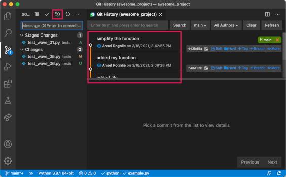
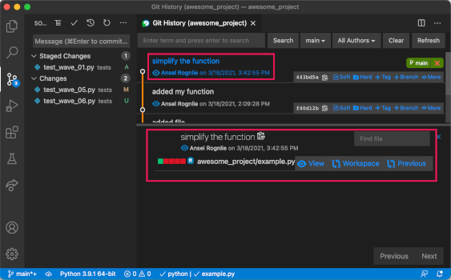

# Reviewing Git Histories

<iframe src="https://adaacademy.hosted.panopto.com/Panopto/Pages/Embed.aspx?pid=c8dba268-808a-4c4f-8e9d-ad28017afeef&autoplay=false&offerviewer=true&showtitle=true&showbrand=false&start=0&interactivity=all" height="405" width="720" style="border: 1px solid #464646;" allowfullscreen allow="autoplay"></iframe>

## Learning Goals

- Practice observing commit history using the commands git status, git log, git show, and git diff
- Explain different ways of "undoing" commits using git revert and git reset

## Introduction

As we make more commits, it will become crucial for us to be able to review and understand Git histories. There are several commands that give us useful information about the Git history.

This resource will focus on:

- `$ git status`
- `$ git diff`
- `$ git diff --staged`
- `$ git log`
- `$ git show`

Each of these commands has many optional parameters that can be used to tailor the information it displays to be more to your liking. To explore these options, look them up by adding the `--help` parameter to any of these commands, or break out your best web search techniques and follow your curiosity!

### !callout-info

## Navigating with `less`

Git commands that need to present more than a screensworth of data often show their results using a program called `less`. When this occurs, we say that the output is _paging_. Like `vim`, which we met in the previous lesson, less is really great at displaying text. Again like vim, navigating the results displayed by less can take some getting used to!

When a Git command brings us to a `less` screen, we can navigate like so:

- up or down arrows to scroll up or down
- `k` or `j` keys to scroll up or down
- spacebar to scroll down by one page
- `b` to scroll up by one page
- `q` to exit the screen

### !end-callout

### `git status` Summarizes Untracked, Local, and Staging

The command `$ git status` outputs a summary of the changes in the local and staging areas. It also contains a lot of other information about the current state of our project as Git sees it!

Use this command all the time:

- To verify what changes are untracked, in local, and in staging
- Before moving changes from local area to staging area
- Before moving changes from the staging area to a commit
- After making a commit to witness the changes in the staging area disappearing

### !callout-warning

## `$ git status` Gives Us Clues to Debug Git

Sometimes, Git can seem like its in a weird "state". `$ git status` will often give clues about how to debug this state. `$ git status` will tell us if we're in the middle of a process, such as merging, or in an unexpected Git "location," such as the wrong repo or branch.  Both of these situations are discussed in later lessons.

### !end-callout

### `git diff` Reveals All Local Changes

The command `$ git diff` outputs a summary of all changes in the _local changes area._

By default, it displays chunks of the diff. It names the file that the change is in, some of the surrounding lines, and a summary of lines of code that were added, removed, or modified.

If there are a lot of local changes, Git will start paging, and we'll need to navigate using `less` commands.

Use this command all the time:

- Before moving changes from local area to staging area
- Reminding yourself what your most recent work has been
- Seeing what changes you've written and deleted since the last commit

### `git diff --staged` Reveals All Staged Changes

The command `$ git diff --staged` shows a summary of all changes in the _staging area_.

It follows the same rules as `$ git diff`. If there are a lot of staged changes, we'll need to navigate the output using `less` commands.

Use this command all the time:

- Before moving changes from the staging area to a commit
- Checking to see what's in the staging area

### `git log` Reveals The Commit History

The command `$ git log` shows all of the commits made on this Git branch. Branches are covered in more detail in later lessons. For now, we can think of a branch as a sequence of commits within a repository. We will assume there is a single `main` branch, a single sequence of commits.

The log will clearly show the order of commits, and highlight their commit messages.

Each commit is listed with the following details:

- The commit hash, which is a unique ID for the commit
- The details on the branch that this commit is on
- The author(s) of the commit
- The date and time that the commit was made
- The commit message

If there are a lot of commits, we'll need to navigate the output using `less` commands.

Use this command frequently:

- When starting a new task and you need to review the most recent work
- To understand and recall the current history of commits
- For checking a lot of commit information quickly, such as timestamps, authors, etc.

  
*Fig. With the Git History VS Code Extension installed, we can explore the commit history of our repository. In the Source Control Panel, click the history icon (highlighted) to show the history of commits.*

### `git show` Summarizes a Commit

The command `$ git show` will show the details of a single commit.

By default, `$ git show` prints this information:

- The commit hash (ID)
- The author(s)
- The date and time that the commit was made
- The commit message
- The entire diff of that commit

Without any arguments, `$ git show` will show the details of the most recent commit.

Optionally, we can give this command a commit hash, and it will show the details of that commit.

```bash
$ git show <commit hash, such as 26fb46ca8...>
```

Where `<commit hash, such as 26fb46ca8...>` is replaced with a commit hash.

  
*Fig. With the Git History VS Code Extension installed, we can view the contents of individual commits. First, we go to the commit history, as described above. Then by clicking any commit, we will get the details of that commit, including the commit message, user, time, and summary information for all affected files. By clicking the Previous link for any file, we can open a diff view showing how that file changed from the previous commit.*

### !callout-info

## Commit Hashes Can Be Shortened

The commit IDs of Git are special. In general, each commit ID is very unique. They're so unique, that using even the first several characters of it is enough to identify a commit. For example, anywhere that requires a commit hash, we can either use `06cde018c082dc4d936af278ba3b43ae5a3b9492`, or `06cde01`, and they would both work.

Being able to recognize this notation is important, as commit hashes are often shortened.

### !end-callout

If the commit has a big diff, we'll need to navigate the output using `less` commands.

Use this command often:

- When you want to review a commit
- To recall the contents of the most previous commit

## All of These Should Be in the Project Root

We should use all of these git commands when located in the project root.

There aren't rules about this, but these commands are most effective, straightforward, and consistent from that location.

## About "Undoing" Commits...

Sometimes, as we work on code, we'll make a commit... and then realize that the code changes in that commit were terrible! And those code changes need to be deleted, erased, and undone!

A natural instinct may be to try to "undo this commit."

However, considering the mindset that Git encourages, the best way to "undo a commit" might be to create another commit that reverts those changes. This is a different perspective than trying to "undo" or "get rid of" changes.

It is natural for code to constantly evolve and for learning and exploration to teach us lessons. Often, we learn that to move forward, we need to reverse our work.

### !callout-info

## No really, I just made a commit and I need to undo it

Git has many ways to modify, uncommit, or revert commits. Some search terms to use to look up these commands may be, "git reset," "git commit amend," "git revert," and "git squash." As a goal, **we should not change shared Git history**, unless it is an emergency.

For convenience, this command will "uncommit" the most recent commit, and put all of the commit's changes into the staging area:

```bash
$ git reset --soft HEAD^
```

With great power comes great responsibility, so be sure to use with caution.
### !end-callout

## Check for Understanding
<!-- Definitions -->

<!-- Question Takeaway -->
<!-- prettier-ignore-start -->
### !challenge
* type: paragraph
* id: yEbKx5
* title: Reviewing Git History
##### !question

What was your biggest takeaway from this lesson? Feel free to answer in 1-2 sentences, draw a picture and describe it, or write a poem, an analogy, or a story.

##### !end-question
##### !placeholder

My biggest takeaway from this lesson is...

##### !end-placeholder
### !end-challenge
<!-- prettier-ignore-end -->
