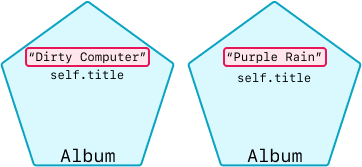
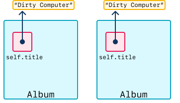
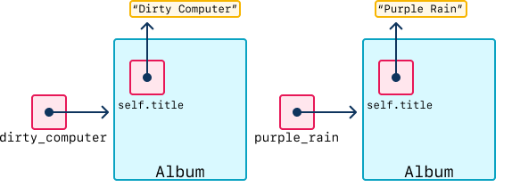
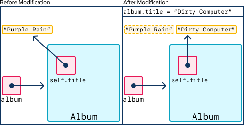
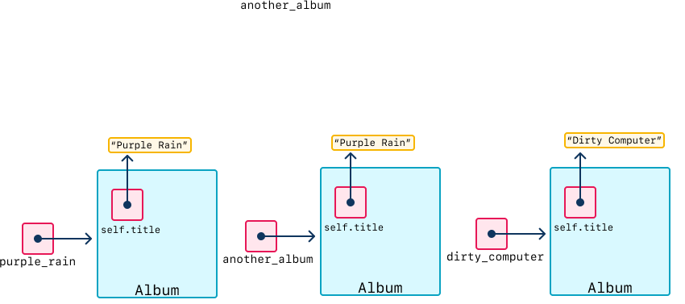
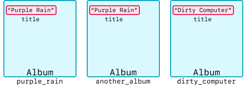

# Creating Instances

<iframe src="https://adaacademy.hosted.panopto.com/Panopto/Pages/Embed.aspx?id=d5661a02-9d6c-4ebe-93ed-acda01309072&autoplay=false&offerviewer=true&showtitle=true&showbrand=false&start=0&interactivity=all" height="405" width="720" style="border: 1px solid #464646;" allowfullscreen allow="autoplay"></iframe>

## Learning Goals

- Define instances in Object-Oriented Programming
- Practice creating instances of classes in Python

## Creating Instances

An instance is a concrete example of a class.  Each instance has its own state, stored in its attributes.

The following expression creates an instance of a class:

```python
ExampleClassName()
```

We take the exact class name and attach `()` to the right of it, as if invoking it like a function.

This tells Python to start the sequence of steps it must perform to create a new instance. This includes running the `__init__` method of the class referred to in the expression. The expression evaluates to a reference to the new instance.

We can create multiple, different instances with the same syntax. The code below will make three different instances:

```python
ExampleClassName()
ExampleClassName()
ExampleClassName()
```

The following code will instantiate two different `Album`s, as long as the class `Album` is defined before it:

```python
Album()
Album()
```

### Pass in Required Params

The syntax above assumed that there were no required arguments to pass in.

The _constructor_ inside of the class determines what arguments are needed whenever we instantiate the class. During instantiation, we pass in arguments with the same syntax as calling a function.

Assuming that the `Album` class is defined like this...

```python
class Album:

    def __init__(self, title):
        self.title = title
```

We can make two separate instances of `Album` with the following code:

```python
Album("Dirty Computer")
Album("Purple Rain")
```

  
*Fig. Two instances of 'Album'.*

### !callout-info

## Don't Pass in `self`

**We do not need to pass in a value for the first argument, `self`.** When we instantiate a class, Python will automatically pass in the correct value for `self`.

### !end-callout

It's worth it to recognize that, even if the arguments are the same, calling `Album(...)` will _always_ make another instance. The following code still makes _two_ instances of `Album`, each of which happens to have its title set to "Dirty Computer."

```python
Album("Dirty Computer")
Album("Dirty Computer")
```

  
*Fig. Two instances of 'Album' with the same title.*

### Storing in Variables

Just like with strings, lists, dictionaries, numbers, and other kinds of data, if we want to keep a reference to data, we should assign it to a variable.

```python
dirty_computer = Album("Dirty Computer")
purple_rain = Album("Purple Rain")
```

  
*Fig. Two instances of 'Album' assigned to variables.*

In the above example...

1. First, we make an instance of `Album` with the title `"Dirty Computer"` with `Album("Dirty Computer")`
1. Then, we store that instance in the variable `dirty_computer`
1. In the next line, we make a different instance of `Album` with `Album("Purple Rain")`
1. ... and we store it in the variable `purple_rain`

<!-- Question 1 -->

<!-- prettier-ignore-start -->
### !challenge

* type: code-snippet
* language: python3.6
* id: taH7s5
* title: Creating Instances

##### !question

Do not modify the `Driver` class.

Inside of the `get_specific_driver_instance` function:

- Make an instance of `Driver`. This instance should have an ID of `"DR0002"`.
- Return this instance

##### !end-question

##### !placeholder

```py
class Driver:
    
    def __init__(self, id):
        self.id = id

def get_specific_driver_instance():
    pass
```

##### !end-placeholder

##### !tests

```py
import unittest
from main import *

class TestDriverClass(unittest.TestCase):
  def test_get_specific_driver_instance(self):
    driver_DR0002 = get_specific_driver_instance()
    self.assertIs(driver_DR0002.id, "DR0002")
```

##### !end-tests

##### !explanation

An implementation that works is this:

```python
class Driver:

    def __init__(self, id):
        self.id = id


def get_specific_driver_instance():
    specific_driver_instance = Driver("DR0002")
    return specific_driver_instance
```

##### !end-explanation

### !end-challenge
<!-- prettier-ignore-end -->

### Reading Instances

We can read and use an instance of a class just like any other variable.

```python
name_of_instance  # assume contains an instance of <class name here>
```

We can use this variable in a lot of different ways, such as printing it, or passing it into a function:

```python
class Album:

    def __init__(self, title):
        self.title = title

# After the class definition...

purple_rain = Album("Purple Rain")
print(type(purple_rain))
```

When we run the above code, we get output similar to this:

```
<class '__main__.Album'>
```

We can call `type()` and pass in `purple_rain` in order to see what data type `purple_rain` is. It prints out `<class '__main__.Album'>`, which indicates that it's of class `Album` (located inside a namespace named `__main__`. This detail is less relevant).

### !callout-info

We use `type()` mostly for debugging purposes. We usually won't write code that uses `type()` as part of our program logic.

### !end-callout

### Reading Attributes

We can read an attribute from an instance using the dot operator:

```python
example_instance.name_of_attribute
```

... where `example_instance` is an instance of a class, and `name_of_attribute` is the name of an attribute defined in that class.

To get the value of the `title` attribute from the album "Purple Rain," we need to...

1. Make an instance of Album with a title attribute
1. Read it

```python
purple_rain = Album("Purple Rain")
print(purple_rain.title)
```

This example outputs `Purple Rain`.

Of course, we can assign this value to yet another local variable:

```python
purple_rain = Album("Purple Rain")
album_title = purple_rain.title
print(album_title)
```

  
*Fig. Local variable `album_title` points to the same string in memory as the self.title variable inside the `purple_rain` instance of Album.*

<!-- Question 2 -->

<!-- prettier-ignore-start -->
### !challenge

* type: code-snippet
* language: python3.6
* id: 2P7iOr
* title: Reading Attributes

##### !question

Do not modify the `Driver` class.

Inside of the `get_specific_second_trip` function:

- Make an instance of `Driver`. This instance should have an list of trips with this value: `["trip 1", "trip 2", "trip 3"]`.
- Return the second trip of this instance
    - Practice the syntax of accessing items from the attribute `trips`

##### !end-question

##### !placeholder

```py
class Driver:
    def __init__(self, trips):
        self.trips = trips

def get_specific_second_trip():
    pass
```

##### !end-placeholder

##### !tests

```py
import unittest
from main import *

class TestDriverClass(unittest.TestCase):
  def test_get_specific_driver_instance(self):
    second_trip = get_specific_second_trip()
    self.assertEqual(second_trip, "trip 2")
```

##### !end-tests

##### !explanation

An implementation that works is this:

```python
class Driver:
    def __init__(self, trips):
        self.trips = trips


def get_specific_second_trip():
    driver = Driver(["trip 1", "trip 2", "trip 3"])
    return driver.trips[1]
```

##### !end-explanation

### !end-challenge
<!-- prettier-ignore-end -->

### Re-assigning Attributes on Instances

We can re-assign the values of attributes on instances. We do so with the assignment operator:

```python
example_instance.attribute_name = new_attribute_value
```

When looking at our `Album` example:

```python
class Album:
    def __init__(self, title):
        self.title = title

album = Album("Purple Rain")
print(album.title)

album.title = "Dirty Computer"
print(album.title)
```

  
*Fig. Reassigning the attribute 'title' of an instance of Album.*

What will the output be?

First we create an album with a title of "Purple Rain" and print that title. Then we re-assign the title to be "Dirty Computer" and print the title again. So we get the following output:

```
Purple Rain
Dirty Computer
```

## Multiple Instances in One Program

For larger programs, making only one or two `Album`s or `Driver`s may not be enough. We might need to make hundreds of them or more, all within the same program. Think of an application that tracks your music library, or a ride-share service with hundreds of drivers, and even more passengers!

To use multiple instances effectively, we must remember that each instance keeps track of its own values for the attributes defined by the class. The values of these attributes for each instance makes up that instance's state. The state of each instance occupies its own place in memory, separate from any other instance.

### Experiment: Printing Objects and Seeing Different IDs

Let's run a small experiment to prove this to ourselves:

Python gives each object a unique ID. Sometimes, this unique ID is the memory address for this object. Regardless, we can use this unique ID to differentiate objects from each other, because they will have different IDs.

Let's see what happens when we print (the ID of) one instance of `Album`...

```python
class Album:

    def __init__(self, title):
        self.title = title

purple_rain = Album("Purple Rain")
print(f"This is what happens when we print purple_rain: {purple_rain}")
```

The output `<__main__.Album object at 0x1020fcaf0>` is Python's default behavior for how to print and represent an `Album` object. The `0x1020fcaf0` is a unique identifier. If you run this code yourself, you will likely get a different unique identifier.

Now, observe this code. When looking at the output, we can count how many unique instances there are, how many unique IDs there are, and we can see whether any of these IDs change over the duration of the program.

```python
class Album:
    def __init__(self, title):
        self.title = title


purple_rain = Album("Purple Rain")
dirty_computer = Album("Dirty Computer")

another_album = Album("Purple Rain")

print(f"Purple Rain: {purple_rain}")
print(f"Another album named Purple Rain: {another_album}")
print(f"Dirty Computer: {dirty_computer}")
```

We should get output similar to this:

```
Purple Rain: <__main__.Album object at 0x10b28caf0>
Another album named Purple Rain: <__main__.Album object at 0x10b31c0a0>
Dirty Computer: <__main__.Album object at 0x10b28c850>
```

  
*Fig. Three Album instances.*

  
*Fig. This diagram presents the same three albums as the previous diagram, but using a slightly more compact representation. As we gain experience, we will tend to simplify details such as the distinction between variables and where their values live. We will be more likely to say that purple_rain is an Album that has a string, "Purple Rain" , called title. We should remember that this is a shorthand description, and that the full diagrams capture the actual relationships more accurately!*

Note that even though two instances of `Album` both have the same title, `"Purple Rain"`, they are separate instances that have different IDs. Again, when you run this yourself, the ID values will most likely differ from the values shown here, but each will be distinct from the other `Album` IDs.

<!-- No CFU; this lesson has several questions throughout the lesson -->
