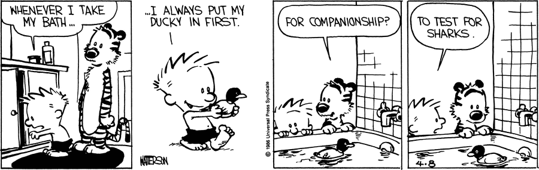

# Testing Objects

<iframe src="https://adaacademy.hosted.panopto.com/Panopto/Pages/Embed.aspx?pid=8f9c2398-05e0-4beb-99c3-acfb0142b7cc&autoplay=false&offerviewer=true&showtitle=true&showbrand=false&start=0&interactivity=all" height="405" width="720" style="border: 1px solid #464646;" allowfullscreen allow="autoplay"></iframe>

## Learning Goals

- Practice reading automated unit tests that test OOP concepts
- Practice running automated unit tests that test OOP concepts

## Introduction

Along with all the rest of our code, we need to write and maintain unit tests for all of our classes to keep our programs high-quality.

However, so far, we've only used unit tests for functions. How do unit tests change when verifying classes?

## Vocabulary and Synonyms

| Vocab     | Definition                                                                                                  | How to Use in a Sentence                                                                      |
| --------- | ----------------------------------------------------------------------------------------------------------- | --------------------------------------------------------------------------------------------- |
| Unit Test | Scripts designed to test the performance of a single function                                               | "As the program scales, unit tests, will ensure classes will continue to behave as expected." |
| Arrange   | Top section of a test designed to include things to arrange or set up like creating variables or instances. | "I should think about the data I need to arrange to construct a test."                        |
| Act       | A statement that is true or calls the method that we are testing                                            | "How do I want this test to act? What function will trigger the test and provide inputs?"     |
| Assert    | Statements that verify whether the method being tested behaves as expected                                  | "This test will assert that the data returned should be an integer."                          |
| Import    | A keyword that makes code in one module accessible in another                                               | "I'm getting a NameError because I forgot to import the class."                               |

## Unit Tests Verify State and Behavior

  
[(source)](https://www.gocomics.com/calvinandhobbes/1986/04/08)

Recall that classes and objects are responsible for tracking state and behavior. Therefore, our class unit tests should focus on two questions:

- For all relevant cases, are the attributes of an instance correct?
- For all relevant cases, do the methods on an instance work as expected?

We can expand on these questions and come up with many generic test cases:

- When we create an instance of this class, are the initial attributes set to what's expected?
  - Can we read the attributes and get back the expected value?
- Can we call an instance method on an instance of this class, and do we observe the expected behavior?
  - Can we call an instance method with specific parameters?
    - Do we get back the return value we expect?
    - Do any of the instance's attributes change?
    - Do any of the instance's attributes explicitly stay the same?
    - Are any expected errors thrown?

As always, the actual test cases depend on the context of the particular class and feature. Some classes won't have much in the way of state or behavior. Other classes will have very complex logic which will need to be thoroughly tested.

### Example

Scarlet is making a ride share app, which has three classes, `Driver`, `Passenger`, and `Trip`. Every driver has a name, VIN, and list of trips they've driven. Every driver can calculate their average rating and add a new trip.

Scarlet will likely test the `Driver` class's initial state by checking:

- Initial value of `name`
- Initial value of `vin`
- Initial value of `trips`

She can test an instance method named `calculate_avg_rating` by checking:

- Return value of `calculate_avg_rating` for a `Driver` instance with 2+ trips
- Return value of `calculate_avg_rating` for a `Driver` instance with 1 trip
- Return value of `calculate_avg_rating` for a `Driver` instance with 0 trips

She can test an instance method named `add_trip` by checking:

- When passing a valid `new_trip` into the method...
  - Return value of `add_trip`
  - The state of the `trips` attribute should change
    - The length is increased
    - The `trips` list contains the `new_trip`
- When passing an invalid `new_trip` into the method...
  - Return value of `add_trip`
  - The state of the `trips` attribute should **not** change
    - The length is the same
    - The `trips` list does not contain the `new_trip`

### Exercise: Test Cases

Read through this project description. Then, make a list of all relevant test cases. This list should mirror Scarlet's list of tests for her ride share app.

Imagine an app that manages the customers and orders of a grocery store. There are two classes, `Customer` and `Order`.

Each `Customer` has:

- `name`
- `email_address`

Each `Order` has:

- `products`
- `customer`
- `add_product` method
- `remove_product` method

Imagine and make up assumptions about the logic of `add_product` and `remove_product`, particularly around the **edge cases**.

<!-- Question 1 -->
<!-- prettier-ignore-start -->
### !challenge
* type: paragraph
* id: 993d92bb-2c3d-43cd-b6cc-7268c0b63b71
* title: Testing Objects
##### !question

From the given project description, make a list of all relevant test cases. Make up reasonable assumptions about the logic of `add_product` and `remove_product`, particularly around the **edge cases**.

##### !end-question

##### !hint

Some test cases could include:

* You can create an instance of Customer with `Customer()` and verify the valid `name` and `email_address` initial values.
* You can create an `Order` and verify the initial values of:
  * `products`
  * `customer`
* You can test `add_product` by adding a product and
  * verifying that the length increases
  * verifying that the added product shows up in `products`
* You can test `remove_product` by
  * adding a product and removing it and verifying that the length decreases and the product no longer appears in `products`.
  * trying to remove a product which is not in the list and verifying that the method performs as you expect (raising an error for example).

##### !end-hint
### !end-challenge

<!-- >>>>>>>>>>>>>>>>>>>>>> BEGIN CHALLENGE >>>>>>>>>>>>>>>>>>>>>> -->
<!-- Replace everything in square brackets [] and remove brackets  -->

### !challenge

* type: checkbox
* id: a9d13159-6af9-4568-a9e8-fe44c12ca66d
* title: Testing Instances
* points: 1
* topics: oop, oop-testing

##### !question

What should you look for when testing instances of this Order class?

```python
class Order:
    def __init__(self, products, customer):
        self.products = products
        self.customer = customer
    
    def add_product(self, product):
      ...
```

##### !end-question

##### !options

* That you can create an order with correct values for products and a customer.
* That `add_product` will increase the length of the `products` list by one.
* That `add_product` will **remove** an element from the `products` list.
* That `add_product` will **add** the argument into the `products` list.

##### !end-options

##### !answer

* That you can create an order with correct values for products and a customer.
* That `add_product` will increase the length of the `products` list by one.
* That `add_product` will **add** the argument into the `products` list.

##### !end-answer

<!-- other optional sections -->
##### !hint

Do you really think `add_product` would remove an element?
##### !end-hint
<!-- !rubric - !end-rubric (markdown, instructors can see while scoring a checkpoint) -->
<!-- !explanation - !end-explanation (markdown, students can see after answering correctly) -->

### !end-challenge

<!-- ======================= END CHALLENGE ======================= -->

<!-- prettier-ignore-end -->

## Revisit pytest Syntax

Our pytest unit tests will test a class's state and behavior. However, overall, our syntax will not change very much.

```python
def test_some_example_test_case():
    # Arrange
    # Create an instance of the class
    # and set up any other necessary test variables

    # Act
    # Call the method that we are testing

    # Assert
    # Verify all relevant return values and state changes
```

When testing the initial state of an instance, the "Act" step is likely the instantiation step, instead of "Arrange".

### Example

Let's dive immediately back into Scarlet's ride share app, and her tests for `Driver`. In Scarlet's app, imagine there is a `Trip` class that has an optional `rating` attribute.

We can test the driver's initial state with the following test:

```python
def test_new_valid_driver():
    name = "Batman"
    vin = "NAN4NAN4NA"
    trip_a = Trip()
    trip_b = Trip()
    trips = [trip_a, trip_b]

    batman = Driver(name=name, vin=vin, trips=trips)

    assert batman.name == name
    assert batman.vin == vin
    assert len(batman.trips) == 2
    assert trip_a in batman.trips
    assert trip_b in batman.trips
```

We should notice:

- In our Arrange step, we set up the `name`, `vin`, `trip_a`, `trip_b`, and `trips` variables
- In our Act step, we instantiate `batman`
- In our Assert step, we check:
  - `batman`'s `name` attr
  - `batman`'s `vin` attr
  - The length of `batman`'s `trips`
  - The contents of `batman`'s `trips`

### !callout-info

## Many Ways to Test

In the above test, when we checked if `batman.trips` was correct, we checked the length and the contents of the trip. In this case, we could have used `assert batman.trips = [trip_a, trip_b]`. Keep recalling and noticing different ways to test the same behavior!

### !end-callout

We can test the `calculate_avg_rating` instance method with the following test:

```python
def test_driver_calculate_avg_rating():
    good_trip = Trip(rating=4)
    bad_trip = Trip(rating=2)
    batman = Driver(trips=[good_trip, bad_trip])

    avg_rating = batman.calculate_avg_rating()

    assert avg_rating == 3

def test_driver_calculate_avg_rating_is_zero_with_no_trips():
    batman = Driver(trips=[])

    avg_rating = batman.calculate_avg_rating()

    assert avg_rating == 0
```

We should notice:

- There are two tests for this one instance method
  - The first checks the average rating between two trips
  - The second checks what happens if there are zero trips
- In our Arrange step, we must make an instance of `Driver`
  - The tests did not pass in a `name` or `vin` because they are optional and not relevant to the test
- In our Act step, we call the instance method we're testing

For this example, imagine that a `Trip` instance is invalid if it has an attribute of `invalid` set to `True`.

```python
def test_driver_add_trip():
    batman = Driver()
    original_trip_length = len(batman.trips)
    valid_trip = Trip()

    result = batman.add_trip(valid_trip)

    assert result
    assert len(batman.trips) is original_trip_length + 1
    assert valid_trip in batman.trips

def test_driver_add_invalid_trip():
    batman = Driver()
    original_trip_length = len(batman.trips)
    invalid_trip = Trip(invalid=True)

    result = batman.add_trip(invalid_trip)

    assert not result
    assert len(batman.trips) is original_trip_length
    assert invalid_trip not in batman.trips
```

We should notice:

- Variable names in tests can give context to the test
- The tests did not pass a `name` or `vin` into `Driver()` because they are optional and not relevant to the test
- Instead of making a variable `original_trip_length`, we could safely assume it is `0` if we'd like

## Don't Forget to Import

Our test files need to import all of the classes they depend on, too!

We should place any required imports at the top of our test files. Take care to specify a package if needed. Remember that tests that live in a `tests` folder are likely not in the same place as our class modules.

### Example

Consider Scarlet's project structure:

```
.
├── README.md
├── requirements.txt
├── ride_share_app
│   ├── __init__.py
│   ├── driver.py
│   ├── passenger.py
│   └── trip.py
└── tests
    ├── __init__.py
    ├── test_driver.py
    ├── test_passenger.py
    └── test_trip.py
```

If Scarlet runs `$ pytest test_driver.py` without importing the `Driver` class _and_ the `Trip` class, she will get a `NameError`, saying that `Driver` and `Trip` aren't defined.

The top of her `test_driver.py` file can import those classes from the `ride_share_app` package with:

```
from ride_share_app.driver import Driver
from ride_share_app.trip import Trip
```

Here, we import a class named `Driver` from the `driver` module inside of the `ride_share_app` package. Then, we import a class named `Trip` from `ride_share_app.trip`.


## Check for Understanding

<!-- >>>>>>>>>>>>>>>>>>>>>> BEGIN CHALLENGE >>>>>>>>>>>>>>>>>>>>>> -->
<!-- Replace everything in square brackets [] and remove brackets  -->

### !challenge

* type: multiple-choice
* id: 4534544e-ab34-4ba7-bb0f-b28dfc0d2912
* title: Importing a class
<!-- * points: [1] (optional, the number of points for scoring as a checkpoint) -->
<!-- * topics: [python, pandas] (optional the topics for analyzing points) -->

##### !question

Given this project structure, inside of `test_customer.py` file, which is the correct import statement? 

```
.
├── README.md
├── requirements.txt
├── store_app
│   ├── __init__.py
│   ├── customer.py
└── tests
    ├── __init__.py
    ├── test_customer.py
```

##### !end-question

##### !options

* import customer
* from store_app import Customer
* from store_app.customer import Customer
* from tests import test_customer

##### !end-options

##### !answer

* from store_app.customer import Customer

##### !end-answer

<!-- other optional sections -->
<!-- !hint - !end-hint (markdown, hidden, students click to view) -->
<!-- !rubric - !end-rubric (markdown, instructors can see while scoring a checkpoint) -->
##### !explanation

Since we run the tests from the root directory of the project to find the Customer class we need to use the `store_app` folder and the `customer.py` file inside that folder so `from store_app.customer` and we want to import the `Customer` class so the full line should read `from store_app.customer import Customer`.

##### !end-explanation

### !end-challenge

<!-- ======================= END CHALLENGE ======================= -->

<!-- >>>>>>>>>>>>>>>>>>>>>> BEGIN CHALLENGE >>>>>>>>>>>>>>>>>>>>>> -->
<!-- Replace everything in square brackets [] and remove brackets  -->

### !challenge

* type: ordering
* id: 33713c9e-4a1e-45f6-afea-6f67723ce2b9
* title: Writing a test
* points: 1
* topics: oop, oop-testing

##### !question

Re-arrange the following lines of code for a test of this `Order` class

```python
class Order:
    def __init__(self, products, customer):
        self.products = products
        self.customer = customer
```

##### !end-question

##### !answer

1. def test_create_order():
1.     may = Customer("May", "may@may.com")
1.     order = Order(["Hair Spray", "Orange Juice"], may)
1.     assert len(order.products) == 2
1.     assert order.customer == may

##### !end-answer

<!-- other optional sections -->
<!-- !hint - !end-hint (markdown, hidden, students click to view) -->
<!-- !rubric - !end-rubric (markdown, instructors can see while scoring a checkpoint) -->
<!-- !explanation - !end-explanation (markdown, students can see after answering correctly) -->

### !end-challenge

<!-- ======================= END CHALLENGE ======================= -->
