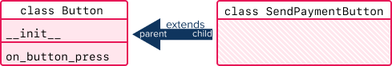
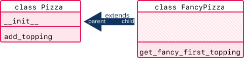
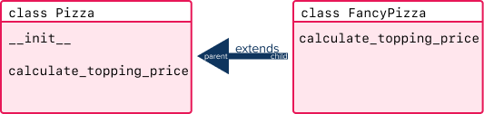

# Inheritance

<iframe src="https://adaacademy.hosted.panopto.com/Panopto/Pages/Embed.aspx?pid=e792f6c6-1d57-490f-970f-ace0005a3829&autoplay=false&offerviewer=true&showtitle=true&showbrand=false&start=0&interactivity=all" height="405" width="720" style="border: 1px solid #464646;" allowfullscreen allow="autoplay"></iframe>

## Learning Goals

- Use Python syntax to create inheritance between two classes
- Recall that all objects inherit from Object
- Define overriding

## Vocabulary and Synonyms

| Vocab        | Definition                                                                                                          | Synonyms                 | How to Use in a Sentence                                                                                                                 |
| ------------ | ------------------------------------------------------------------------------------------------------------------- | ------------------------ | ---------------------------------------------------------------------------------------------------------------------------------------- |
| Inheritance  | A programming mechanism that allows classes to inherit attributes from another class.                               | ---                      | "I'll use inheritance so the `Chocolate` class can inherit the `sugar serving` and `eat_in_one_sitting()` method from the `Candy` class. |
| Parent class | A class that contains variables and methods that can be inherited to other classes                                  | base class, super class  | "`Candy` class is the parent class to `Chocolate` class."                                                                                |
| Child class  | A class that contains its own variables and methods but also inherits the variables and methods from a parent class | derived class, sub class | "`Chocolate` class is the child class to `Candy` class."                                                                                |

## Syntax for Inheritance

To implement inheritance between two classes, we include the parent class in the definition of the child class:

```python
class ExampleChildClass(ExampleParentClass):
    pass
```

Compared to classes without explicit inheritance, this syntax:

- Adds `()`s to the right of the class name
- Puts the name of the parent class in the `()`s

Depending on how the project is organized, we may need to import the parent class so that Python is able to find the name. Like this:

```python
import ExampleParentClass

class ExampleChildClass(ExampleParentClass):
    pass
```

Recall that, unless the child class overrides it, the child class inherits the same implementation that the parent has for all methods and attributes, _including the `__init__` method_.

### Example: Button

Imagine that we have a `Button` class, which can be pressed. Also, we have a `SendPaymentButton` class, which is a `Button`. Our code could look like this:

```python
class Button:

    def __init__(self, label_text):
        print("I'm inside of Button's constructor!")
        self.label_text = label_text

    def on_button_press(self):
        print("I'm inside of Button's on_button_press method!")
```

```python
import Button

class SendPaymentButton(Button):
    pass
```

  
*Fig. Inheritance diagram for __`Button`__ and __`SendPaymentButton`__*

Imagine running this code in a file `main.py`:

```python
submit_btn = SendPaymentButton("Hello, World!")

print("This is submit_btn, our instance of SendPaymentButton:", submit_btn)

submit_btn.on_button_press()
```

Read through these observations, and then predict what the console output is from the above `main.py`.

- When we instantiate `SendPaymentButton`, we _must_ pass in `label_text`
  - `SendPaymentButton` did not define its own `__init__` method
  - Therefore, it looks to its parent class to see if it implements `__init__`
  - Because `Button` _does_ implement `__init__`, the child class will inherit it
- When we print `submit_btn`, our instance of `SendPaymentButton`, Python recognizes that it is type `SendPaymentButton`, not `Button`
- We can successfully invoke the instance method `on_button_press`
  - `SendPaymentButton` did not define `on_button_press`
  - `Button` _does_ define `on_button_press`
  - `SendPaymentButton` inherits `on_button_press` from the `Button` class

Let's look at some possible console output from the `main.py` above. Check to see if your predictions are in the right direction:

```
I'm inside of Button's constructor!
This is submit_btn, our instance of SendPaymentButton: <SendPaymentButton object at 0x10b8908e0>
I'm inside of Button's on_button_press method!
```

Take another minute to read through `main.py`. For each line, practice tracing the flow of code. Determine when each line gets printed to the console.

Tracing through this code should take us from `main.py`, then to the `SendPaymentButton` class, then to the `Button` class.

### Exercise: Pizza and FancyPizza

<!-- Question 1 -->
<!-- prettier-ignore-start -->
### !challenge
* type: code-snippet
* language: python3.6
* id: 93fb7c47-129e-4bdd-8aee-4759eb0aaef4
* title: Inheritance
##### !question
Create two classes, `Pizza` and `FancyPizza`.

- The `Pizza` class should...
    - define a constructor:
        - takes in `toppings` as a parameter
        - assigns an attribute named `toppings`
    - define an instance method `add_topping`:
        - takes in a `new_topping` parameter
        - appends `new_topping` to `toppings`

- The `FancyPizza` class should...
    - inherit the exact same constructor from `Pizza`, which includes the `toppings` attribute
    - inherit the exact same `add_topping` method
    - define an additional instance method `get_fancy_first_topping`:
        - takes in no parameters
        - returns the string `f"Fancy {self.toppings[0]}"`
        - Example: if `toppings` is `["onions"]`, then this method returns `"Fancy onions"`

  
*Fig. Inheritance diagram for __`Pizza`__ and __`FancyPizza`__.*

##### !end-question

##### !placeholder
```python
class Pizza:
    pass
```
##### !end-placeholder

##### !tests
```python
import unittest
from main import *

class TestChallenge(unittest.TestCase):
    def test_pizza(self):
        p = Pizza(["green peppers", "red peppers", "banana peppers"])
        self.assertEqual(len(p.toppings), 3)

        p.add_topping("mushrooms")

        self.assertEqual(len(p.toppings), 4)
        self.assertTrue("mushrooms" in p.toppings)

    def test_fancy_pizza(self):
        fp = FancyPizza(["green onions", "red onions", "banana onions"])
        self.assertEqual(len(fp.toppings), 3)

        fp.add_topping("mushrooms")

        self.assertEqual(len(fp.toppings), 4)
        self.assertTrue("mushrooms" in fp.toppings)

        fancy_topping = fp.get_fancy_first_topping()

        self.assertEqual(fancy_topping, "Fancy green onions")
```
##### !end-tests
### !explanation

An example of a working implementation:

```python
class Pizza:

    def __init__(self, toppings):
        self.toppings = toppings

    def add_topping(self, new_topping):
        self.toppings.append(new_topping)
        return new_topping


class FancyPizza(Pizza):

    def get_fancy_first_topping(self):
        return f"Fancy {self.toppings[0]}"
```

If you are curious, here are the tests:

```python
def test_pizza():
    p = Pizza(["green peppers", "red peppers", "banana peppers"])
    assert len(p.toppings) == 3

    p.add_topping("mushrooms")

    assert len(p.toppings) == 4
    assert "mushrooms" in p.toppings


def test_fancy_pizza():
    fp = FancyPizza(["green onions", "red onions", "banana onions"])
    assert len(fp.toppings) == 3

    fp.add_topping("mushrooms")

    assert len(fp.toppings) == 4
    assert "mushrooms" in fp.toppings

    fancy_topping = fp.get_fancy_first_topping()

    assert fancy_topping == "Fancy green onions"
```
### !end-explanation
### !end-challenge

## Overriding Lets Us Replace Our Inheritance

If a child class needs to _replace_ the implementation of an inherited method, the child class can _override_ the method by redefining it with the same name.

```python
class ExampleParentClass:
    def example_instance_method(self):
        print("I'm inside of ExampleParentClass!")

class ExampleChildClass(ExampleParentClass):
    def example_instance_method(self):
        print("I'm inside of ExampleChildClass!")
```

  
*Fig. Inheritance diagram for __`ExampleParentClass`__ and __`ExampleChildClass`__.*


Running this code...

```python
apple = ExampleParentClass()
apple.example_instance_method()

orange = ExampleChildClass()
orange.example_instance_method()
```

Produces this output:

```
I'm inside of ExampleParentClass!
I'm inside of ExampleChildClass!
```

Even though the child class inherits the parent class, the child and parent have different behaviors for `example_instance_method`. This is because the child class _overrode_ `example_instance_method` by redefining it.

### Exercise: Pizza Overriding

Continue the `Pizza` and `FancyPizza` classes.

- The `Pizza` class should implement the instance method `calculate_toppings_price`
    - takes no parameters
    - returns `0.75 * len(self.toppings)`

- The `FancyPizza` class should override that instance method
    - takes no parameters
    - returns `(2.50 * len(self.toppings)) + 5`

  
*Fig. Inheritance diagram for __`Pizza`__ and __`FancyPizza`__ with __`FancyPizza`__ overriding the method __`calculate_toppings_price`__.*

<!-- Question 2 -->
<!-- prettier-ignore-start -->
### !challenge
* type: code-snippet
* language: python3.6
* id: 30ae1c3c-c5ec-4480-bff7-10603b086f6c
* title: Method Overriding
* topics: python

##### !question
Continue the `Pizza` and `FancyPizza` classes.

- The `Pizza` class should implement the instance method `calculate_toppings_price`
    - takes no parameters
    - returns `0.75 * len(self.toppings)`

- The `FancyPizza` class should override that instance method
    - takes no parameters
    - returns `(2.50 * len(self.toppings)) + 5`

##### !end-question
##### !placeholder
```python
class Pizza:    
    def __init__(self, toppings):
        self.toppings = toppings

class FancyPizza(Pizza):
    pass
```
##### !end-placeholder
##### !tests
```python
import unittest
from main import *

class TestChallenge(unittest.TestCase):
    def test_pizza(self):
        p = Pizza(["green peppers", "red peppers", "banana peppers"])

        toppings_price = p.calculate_toppings_price()

        self.assertAlmostEqual(toppings_price, 2.25)

    def test_fancy_pizza(self):
        fp = FancyPizza(["green onions", "red onions", "banana onions"])

        toppings_price = fp.calculate_toppings_price()

        self.assertAlmostEqual(toppings_price, 12.5)
```
##### !end-tests
### !explanation

An example of a working implementation:

```python
class Pizza:

    def __init__(self, toppings):
        self.toppings = toppings

    def add_topping(self, new_topping):
        self.toppings.append(new_topping)
        return new_topping

    def calculate_toppings_price(self):
        return 0.75 * len(self.toppings)


class FancyPizza(Pizza):

    def get_fancy_first_topping(self):
        return f"Fancy {self.toppings[0]}"

    def calculate_toppings_price(self):
        return (2.50 * len(self.toppings)) + 5
```

If you are curious, here are the tests:

```python
def test_pizza():
    p = Pizza(["green peppers", "red peppers", "banana peppers"])

    toppings_price = p.calculate_toppings_price()

    assert toppings_price == pytest.approx(2.25)


def test_fancy_pizza():
    fp = FancyPizza(["green onions", "red onions", "banana onions"])

    toppings_price = fp.calculate_toppings_price()

    assert toppings_price == pytest.approx(12.5)
```

### !end-explanation
### !end-challenge
<!-- prettier-ignore-end -->

<!-- Revise this -->
## Inheritance Next Steps

This lesson demonstrated a specific inheritance pattern in which the parent class has a constructor, and the child class does not. In the next lesson, we will explore using `super()`. This will make it easier for our child classes to have additional logic and attributes in their own constructor, while still making use of the logic and attributes in their parent's constructor.

## Check for Understanding

<!-- Question Takeaway -->
<!-- prettier-ignore-start -->
### !challenge
* type: paragraph
* id: ohpI0z
* title: Inheritance
##### !question

What was your biggest takeaway from this lesson? Feel free to answer in 1-2 sentences, draw a picture and describe it, or write a poem, an analogy, or a story.

##### !end-question
##### !placeholder

My biggest takeaway from this lesson is...

##### !end-placeholder
### !end-challenge
<!-- prettier-ignore-end -->
