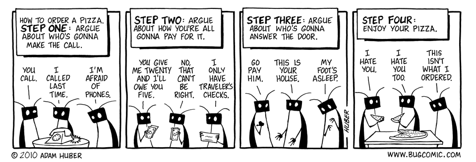
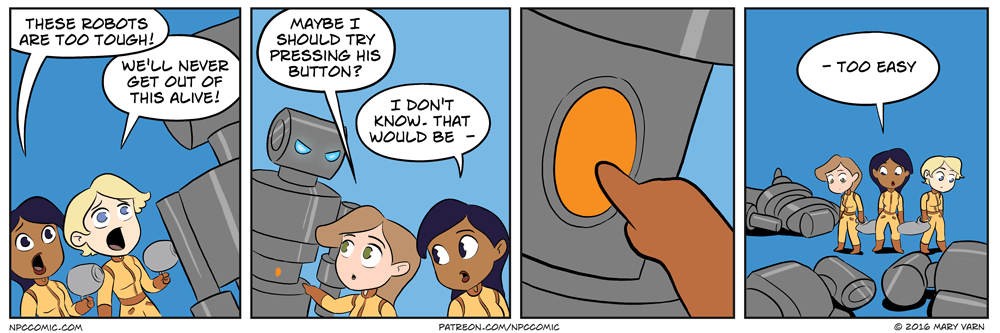

# OOP Relationships

<iframe src="https://adaacademy.hosted.panopto.com/Panopto/Pages/Embed.aspx?pid=4071a1e2-f991-48c4-9344-ace00057ed4c&autoplay=false&offerviewer=true&showtitle=true&showbrand=false&start=0&interactivity=all" height="405" width="720" style="border: 1px solid #464646;" allowfullscreen allow="autoplay"></iframe>

## Learning Goals

- Define Inheritance in OOP as an "is a" relationship: superclass, subclass
- Define Composition in OOP as a "has a" relationship

## Introduction

When multiple objects interact with each other, they form a relationship. Like any relationship, two classes having a relationship should spark many questions for us: What do the classes do together? How do they communicate with each other? What's the nature of their relationship? Is one class in charge? Are the two classes changing and modifying each other, or is it one-way? What happens if one class changes, and the other remains as it is?

Because OOP is a programming paradigm that approaches problem-solving by forming relationships between objects, it provides ways to describe these relationships. The two most fundamental class relationships in OOP are _inheritance_ and _composition_.

These relationships will affect _how_ we solve problems that involve more than one class.

Class relationships also form the basis for building up a set of general software design techniques known as software design patterns. There are many software design patterns and only a few will be touched on over the course of this curriculum, but there are many resources available online. Follow your curiosity!

## Vocabulary and Synonyms

| Vocab       | Definition                                                                                                                          | Synonyms           | How to Use in a Sentence                                                                                                                                                                                                                                                       |
| ----------- | ----------------------------------------------------------------------------------------------------------------------------------- | ------------------ | ------------------------------------------------------------------------------------------------------------------------------------------------------------------------------------------------------------------------------------------------------------------------------ |
| Inheritance | A class relationship in which one class inherits attributes and behavior from another class.                                        | is-a relationship  | "My `Chocolate` class needs to act like my `Dessert` class in this dessert-processing part of the code, so I'll use inheritance so that `Chocolate` can inherit the `sugar_serving` and `eat_in_one_sitting` methods from `Dessert` so that I don't have to write them again." |
| Composition | A class relationship in which a class references other classes as instance variables and makes use of their methods and attributes. | has-a relationship | "The `Trip` class in my ride share app needs to have a driver and a passenger, so I'll use composition to include a `Driver` class instance and a `Passenger` class instance in the `Trip` class."                                                                             |

## Inheritance: Passing on Implementation

Sometimes, two classes are similar... but different. The two classes share the same attributes and the same methods... but one class has additional attributes, additional methods, and a different name. We can formalize a relationship between these two classes with inheritance.

Inheritance designates a **parent class** and a **child class**. Using inheritance, the _child class_ will "copy" the state and behavior defined in the _parent class_.

Imagine reading an attribute or calling a method from an instance of a child class.

If Python does not see a definition for that attribute or method in the _child class_, Python will try looking for it in the _parent class_. If the parent class has that attribute or method defined, the child class will be able to use that implementation.

Not only can child classes inherit state and behavior, they can also **override** them. A child class may need to have attributes or methods of the same name, but different implementation. When a child class re-defines an inherited property, the child class _overrides_ it. When overriding, the child class can optionally still look to the parent class's implementation.

### !callout-info

## Synonyms

We can refer to the parent class as a "super class." We can refer to the child class as a "sub class."

### !end-callout

### Example: Temmie, Karen, and Pizza

[(source)](https://cheezburger.com/8192876288/things-that-bug-everyone-about-ordering-pizza-with-friends)

Let's roleplay a non-programming example!

Imagine a 10-year-old, Temmie, and her caregiver, Karen. It's Friday night, and the two of them have invited us over for dinner.

We can ask Karen to make a call and order pizza on the phone. When we do that, Karen will go to her room, find her phone on the desk, and then call Dino's Pizza Palace.

If we try to ask Temmie to do the same, she won't know how to do that on her own. However, Temmie _inherits_ the properties and behaviors of her caregiver. Temmie has never bought her own phone, and she's never called a pizza place, but she can look up to how Karen does it. Temmie will then go to her own room, look for her own phone on the desk, and then call Dino's Pizza Palace.

A week has passed, and we're back for another pizza dinner with Karen and Temmie. Temmie has learned about all of the different pizza places in the world. We can ask Temmie to call and order pizza on the phone. Temmie can _override_ the behavior she's inherited. This time, Temmie will go to her own room, look for her own phone on the desk, and then call _Pizza Planet_ instead. Karen's own behavior (and preference for Dino's) does not change.

Another week has passed, and it's time for pizza #3. This time, Temmie has learned so much more, and she can completely override how she orders pizza. Temmie might go to her room, look for her own phone on the desk, and then open up a food delivery app. Or, Temmie could completely forego this whole process, and go outside, walk to the nearby pizza joint, and get pizza that way. However, the important thing is that Temmie _knows_ that she even has an "order pizza" behavior. It's important that Temmie _knows_ that she _does_ own a phone.

### Example: Form Buttons

[(source)](https://www.cartoonstock.com/directory/b/button_pushing.asp)

Let's consider a more realistic programming example.

Anders is developing a mobile app that lets him send money to the people around him. Anders found that the logic for making a button was complex. A button needs to be visible, it needs to be tappable. While the button is pressed, it should appear differently. After a button is tapped, it needs to kick off another event in the app. Anders took this behavior and created a `Button` class. He got to use this `Button` class to make dozens of buttons around his app.

However, when a user goes to send money, the button should only work if the user presses the button for longer than three seconds. Anders knows that this "send payment button" is a `Button`, but it operates just a _little_ differently than a regular `Button`. Anders doesn't want to make a `SendPaymentButton` class that duplicates the code from `Button`, because if `Button` changes, then he'd need to remember to update `SendPaymentButton`, too. Anders doesn't want to change the `Button` class for this very rare case.

Anders can create a `SendPaymentButton` class that _inherits_ `Button`. The `SendPaymentButton` class will inherit all of the state and behavior that a `Button` has, but it can _override_ the logic so that a user must hold the button.

### Inheritance is "Is-A" Relationship

We can often describe inheritance as an "is-a" relationship between two classes, where the child class "is a" parent class. This implies that inheritance affects how a class is defined.

### Everything Inherits From `object`

Python has a special class named `object`. `object` is a class that defines the methods `__init__`, `__str__`, and a dozen other things.

Python is designed so that every class and object eventually inherits from `object`. Following the rules of inheritance, we can see how every class has `__init__`, `__str__`, etc. defined—these are _inherited methods_!

For more details on `object`, run `help(object)` in a Python repl!

## Composition: Instances Holding Instances

Most classes have attributes. Those attributes are things like strings, numbers, lists, dictionaries, booleans, and so on. It's easy to overlook that those types are all classes, and that any time we make a string, number, or any of the rest, we are making instances of classes. And of course we can also make instances of our own classes. Any of these potential instances can be stored as the value of an attribute in an instance of another class.

This relationship is called composition. Composition means that one class is expected to have objects of another class stored or referenced inside of it.

Composition between two classes describes a **composite** class and a **component** class. The _composite class_ contains at least one object of type _component class_.

Composition is interesting, because the _composite class_ is made that much more complex and interesting with the addition of a _component class_.

When a _composite class_ **has a** _component class_, the composite class can use that component class. The _composite class_ could possibly read attributes, modify attributes, and invoke methods from the _component class_.

### Composition is a "Has-A" Relationship

We can describe composition as a **has-a** relationship, where the composite class "has a" component class. This is represented in the state of the composite class by attributes that hold the component class instances. So this is essentially a formal name for what we have already learned about Python class attributes!

### Example: The Good Book Club and Bus Fares

Brooklyn is the organizer of a book club. The book club itself has many things, such as a name ("The Good Book Club") and location. The book club itself can do many things, too, such as schedule meetings. Also, the book club _has_ many members.

For The Good Book Club, Brooklyn sometimes needs to go through the members and send them emails about the next meeting, so it's good that she has a reference to all the members, and their names and email addresses.

However, one day, Brooklyn realized she left her wallet at home. A member of the book club, Cody, lent her money for the bus. That's when Brooklyn realized that Cody _has the ability to give money to her_. In fact, Brooklyn realized that _all members_ of the book club have the ability to lend money to her.

With this knowledge, Brooklyn could go up to each member and ask them to lend money to her.

Regardless if Brooklyn actually does that, the fact that Brooklyn knows that it's possible to do that through The Good Book Club is very telling. There is trust needed between The Good Book Club and the members it has.

### Example: Shopping Cart and Product

[(source)](https://www.chron.com/entertainment/comics-games/slideshow/Tuesday-s-Top-Ten-Comics-on-Online-Shopping-167183.php)

Angela is making an e-commerce web app that will allow users to shop for items and make orders.

Angela wants to mimic other e-commerce sites. Each user should be able to add products to a shopping cart. Then, when the user is finished, the user should checkout the shopping cart, which should charge the user the total amount of money owed.

Angela's made a `ShoppingCart` class. As she builds the `checkout` method, she needs to calculate the total cost. To do that, she wants to iterate through a list of products, and add their prices together.

However, `Product`s are complex objects, and they have their own class! Angela then wants to set up _composition_ between these two classes. The `ShoppingCart` is the _composite class_, and it will have an attribute named `products`. `products` will be a list of `Product` instances, and `Product` is the _component class_.

Now, inside the `checkout` method, `ShoppingCart` can iterate through `products` and access the `price` attribute of each `Product`.

## Relationships, Design Patterns, and Better Code

Inheritance and composition are just two types of relationships in OOP. There are many more ways that classes can interact with each other.

As classes interact with each other, code becomes more complex. By nature, inheritance and composition increase code complexity, and make once-separate parts of code depend on each other. On the flip side, inheritance and composition are also the basis of a few different design patterns, and can help solve problems in creative ways.

## Check for Understanding

<!-- Question 1 -->
<!-- prettier-ignore-start -->
### !challenge
* type: checkbox
* id: 85c8a657-1907-418a-9020-7b7baf02b9d1
* title: Inheritance
##### !question

What is a key difference between inheritance and composition?

##### !end-question
##### !options

* Composition is an extension of a parent class, and inheritance is more of a distant cousin twice removed.
* Inheritance describes an **is-a** relationship. Composition describes a **has-a** relationship.
* Inheritance can be described as an extension of a parent class. Composition adds supportive logic to a class.

##### !end-options

##### !answer
* Inheritance describes an **is-a** relationship. Composition describes a **has-a** relationship.
* Inheritance can be described as an extension of a parent class. Composition adds supportive logic to a class.
##### !end-answer
### !end-challenge
<!-- prettier-ignore-end -->

<!-- Question 2 -->
<!-- prettier-ignore-start -->
### !challenge
* type: multiple-choice
* id: 6b0f49f3-853c-4158-a22f-af8a4818acc1
* title: OOP-Relationships
##### !question
Harley's HR Company is using OOP to build a dashboard to display the benefits plan for employees. Every employee has a type of benefits plan. Harley plans on segmenting all data about employees in the `Employee` class and all info about benefits in the `BenefitPlan` class. With this information in mind, select the option that best describes the classes and their relationship to each other.
##### !end-question
##### !options
* `BenefitPlan` is the child class. `Employee` is the parent class.
* `BenefitPlan` is the composite class. `Employee` is the component class.
* `BenefitPlan` is the component class. `Employee` is the composite class.
##### !end-options
##### !answer
* `BenefitPlan` is the component class. `Employee` is the composite class.
##### !end-answer
### !end-challenge
<!-- prettier-ignore-end -->

<!-- Question 3 -->
<!-- prettier-ignore-start -->
### !challenge
* type: multiple-choice
* id: m0s5n1
* title: OOP Relationships
##### !question
Val's Vehicles is a mobile app that sells boats, motorcycles and more. In the app, each sale item will be identified as an instance of a specific class such as `Vehicle`, `Boat`, and `Motorcycle`. `Boat` and `Motorcyle` use a lot of the same attributes and methods that `Vehicle` has.

Using what type of OOP relationship would best describe how the `Vehicle`, `Boat`, and `Motorcyle` classes interact with each other?
##### !end-question
##### !options
* Composition
* Inheritance
* Composite
##### !end-options
##### !answer
* Inheritance
##### !end-answer
### !end-challenge
<!--prettier-ignore-end -->

<!-- Question Takeaway -->
<!-- prettier-ignore-start -->
### !challenge
* type: paragraph
* id: 6UWHLc
* title: OOP Relationships
##### !question

What was your biggest takeaway from this lesson? Feel free to answer in 1-2 sentences, draw a picture and describe it, or write a poem, an analogy, or a story.

##### !end-question
##### !placeholder

My biggest takeaway from this lesson is...

##### !end-placeholder
### !end-challenge
<!-- prettier-ignore-end -->
