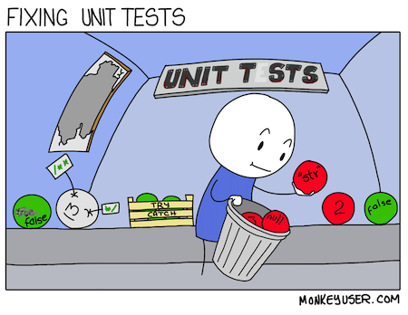

# Intro to Automated Tests

<iframe src="https://adaacademy.hosted.panopto.com/Panopto/Pages/Embed.aspx?id=0ba5a538-9021-401c-aeb6-acd2000a91d6&autoplay=false&offerviewer=true&showtitle=true&showbrand=false&start=0&interactivity=all" height="405" width="720" style="border: 1px solid #464646;" allowfullscreen allow="autoplay"></iframe>

## Learning Goals

- Define automated tests
- Define unit tests
- Explain how automated unit tests are used to verify code correctness

## Introduction

Have you ever worked on a function, and it runs, but you weren't sure if it was implemented correctly? Have you ever refactored code, but suddenly you lost confidence if the code still worked?

## Vocabulary and Synonyms

| Vocab          | Definition                                                    | Synonyms  | How to Use in a Sentence                                                      |
| -------------- | ------------------------------------------------------------- | --------- | ----------------------------------------------------------------------------- |
| Automated Test | Scripts that test specific code for correct functionality     | Test      | "As the application grows, we need to ensure the automated tests also scale." |
| Unit Test      | Scripts designed to test the performance of a single function | Test Case | "Did the new feature pass the unit tests?"                                    |

## Automated Tests Verify Code Correctness

Automated tests, often called "tests," are suites of code used to verify the correctness of another, separate suite of code.

Programmers write tests to communicate what needs to be proved in order for a feature to be complete.

Each test could follow this generic pattern:

1. Get a sample of at least one correct example: an input and and output
2. Use the inputs in the feature to test
3. Compare the actual result from the above step to the expected value

### Example: Astrology Software

### !callout-info

## Astrological Birth Chart
An Astrological Birth Chart is a visual map of what the sky looked like when you were born. It is determined using your exact birthdate and birthplace. It includes three signs, your **sun sign** (typically refered to as your Zodiac sign), your **moon sign**, and your **rising sign**. 
[source](https://www.shape.com/lifestyle/mind-and-body/sun-moon-rising-sign-meaning)

### !end-callout
<!-- available callout types: info, success, warning, danger, secondary  -->

  
[(source)](https://pixabay.com/photos/astrology-divination-chart-993127/)

Addison is writing software about astrology. They are working on a feature that, when a user provides a date, time, and location of their birth, will compute their astrological birth chart. They need to know if they've implemented the logic correctly; does the feature accurately compute the astrological birth chart? They can test their feature by finding the following information:

1. Get a sample of at least one correct example: an input and and output
   - This means, finding and using a real date, time, and location, and its real astrological birth chart
   - Addison can use January 1, 1980, Seattle, 12:00pm, and its real chart: Capricorn sun, Cancer moon, and Aries rising
2. Use the inputs in the feature to test
   - This means Addison should use this date, time, and location, and pass it into the feature
   - Addison will use January 1, 1980, Seattle, 12:00pm and pass it into the feature
3. Compare the actual result from the above step to the expected value
   - Addison should get the result from their feature, and compare it to the real astrological birth chart. Is the actual birth chart from the feature identical to the expected birth chart? If not, why?
   - Did Addison get back Capricorn sun, Cancer moon, and Aries rising from their code? If they did, their feature is accurate! If they didn't, they have more work to do.

Programmers run tests to get test output. For each test, it will either pass, fail, or give an error. Programmers should use this feedback to make more changes to their code if necessary, or to confirm that the feature is complete.

**Example:** Addison could write a test suite of 20 tests. When they run the tests, they might get 15 passing tests, 4 failing tests, and 1 error. They should continue to work towards 0 failing tests.

### Unit Tests Are for Small Units

  
[(source)](https://www.monkeyuser.com/2018/fixing-unit-tests/)

Because there are a lot of different kinds of code, there are a lot of different kinds of tests. One kind is unit testing. Unit tests are automated tests that focus on a unit, which is commonly a single function. They're used to check that given some specific arguments, the function returns some expected value.

**Example:** Addison has a function called `calculate_chart`, which takes in 3 parameters: `date`, `location`, and `time`. They can write unit tests for this function.

### Test Cases and Scenarios

Testing a single function will generally have many unit tests to ensure the code works correctly. Why? Based on the context, a single function could potentially have different arguments that give back different return values. Different scenarios in development can imply different arguments, which would produce different logic. All scenarios and possible outcomes of a function should be tested, as thoroughly as possible.

Addison could come up with the following scenarios:

| Question to Ask                                                             | Specific Arguments                          | Expected Return Value       |
| --------------------------------------------------------------------------- | ------------------------------------------- | --------------------------- |
| 1. Do we get an accurate birth chart if we pass in a date, location, and time? | `"January 1, 1980"`, `"Seattle"`, `"12:00"` | `{"Sun": "Capricorn", ...}` |
| 2. What happens if the function receives `None` for time?                      | `"January 1, 1980"`, `"Seattle"`, `None`    | `None`                      |
| 3. What happens if the `date` argument comes as a different format?            | `"1980-01-01"`, `"Seattle"`, `"12:00"`      | `{"Sun": "Capricorn", ...}` |
| 4. What happens if the function receives an invalid place for `location`?       | `"January 1, 1980"`, `"xyz"`, `"12:00"` | should raise an exception   |

To ensure that our test cases cover all scenarios, it can be helpful to categorize tests using the following two categories:
- **Nominal** and **Edge** Test Cases

#### Nominal Test Cases

A nominal test case is a type of test case that describes a piece of core functionality needed for the success of this method. This is the test case that verifies that the method does its primary responsibility. Nominal test cases are the obvious test cases and often referred to as "happy path" test cases.

In the case of Addison's astrological software, the first test case listed above is a nominal **nominal** test case. It checks that given the correct, expected input (the `date`, `location`, and `time`), the functions returns the correct output (a dictionary with the sun, rising, and moon signs). 

#### Edge Test Cases

An edge test case is a type of test case that verifies that the function can work successfully, even given non-obvious input. This is the test case that verifies that the function works, even with very unexpected input.

A **positive edge** test case is a test case that describes a set of inputs and expectations that are on the limits of the method's most obvious, most typical way of working successfully. In the test cases listed above, the third test case is a positive edge case. The function returns the correct birth chart even when the input is in an unexpected format.

A **negative edge** test case is a test case that tests that this function can handle the most non-obvious, most atypical unexpected input gracefully. Again, let's consider our test cases outlined above. The second test case falls under this category. If we pass in `None` for time, the function does not have enough information to determine the astrological birth chart, and as such, it returns `None`. The fourth example is also a negative edge case. The function receives an invalid place for `location` and raises an exception. We will learn more about raising, handling, and testing exceptions in [Exception Handling](../exception-handling/raising-and-handling-exceptions.md)

### !callout-info

## Testing Scenarios

How we categorize test cases isn't that important. What's important is being able to consider all of the possible test cases.

There are countless more scenarios to anticipate! How many scenarios do we need to anticipate? In general, the answer to this question depends on the code you're testing. If there are a lot of conditions in the function, with a lot of different kinds of `return` values, we may have a test for one or two examples each of those `return` values.

### !end-callout

## When We Have Trustworthy Tests, Everyone Wins

Tests can be written poorly! Just like other code, test code could have varying code styles and approaches, and even be wrong. Sometimes, tests are missing, and there are more scenarios that need to be tested.

Qualities of a trustworthy test suite include:

- large test coverage
- readable
- covers many scenarios

When a codebase has a suite of trustworthy tests, everyone wins. Benefits of a good test suite include:

- ease of collaboration
- ease of refactoring
- ease of finishing features more quickly

When a whole team collaborates using the same test suite, the whole team has visibility into how the code tests as the code changes over time.

## Adjusted Workflow

To incorporate testing into our development workflow, our workflow may adjust to this:

1. Read the feature requirements
1. Think of scenarios relevant to the feature, and what their expected values would be
1. Write a test for that scenario
1. Implement the code to make that test pass
1. Create `git` commits when appropriate (at least one)
1. Refactor
1. Repeat!

We will go into more depth on this workflow in the [Test Driven Development lesson](./test-driven-development.md).

## Check for Understanding

<!-- Question 1 -->

<!-- prettier-ignore-start -->
### !challenge

* type: checkbox
* id: 96e36e16-4354-449b-b99b-5d9737766507
* title: Testing

##### !question
Why are automated tests beneficial?
##### !end-question

##### !options
* Improves quality of code 
* Catches potential logical errors within functions
* Improves team collaboration 
##### !end-options

##### !answer
* 
##### !end-answer

##### !explanation 
Tests and these benefits are reasons to follow a practice called test-driven development.
##### !end-explanation 

### !end-challenge
<!-- prettier-ignore-end -->

<!-- Question Takeaway -->
<!-- prettier-ignore-start -->
### !challenge
* type: paragraph
* id: md5YxG
* title: Automated Tests
##### !question

What was your biggest takeaway from this lesson? Feel free to answer in 1-2 sentences, draw a picture and describe it, or write a poem, an analogy, or a story.

##### !end-question
##### !placeholder

My biggest takeaway from this lesson is...

##### !end-placeholder
### !end-challenge
<!-- prettier-ignore-end -->
