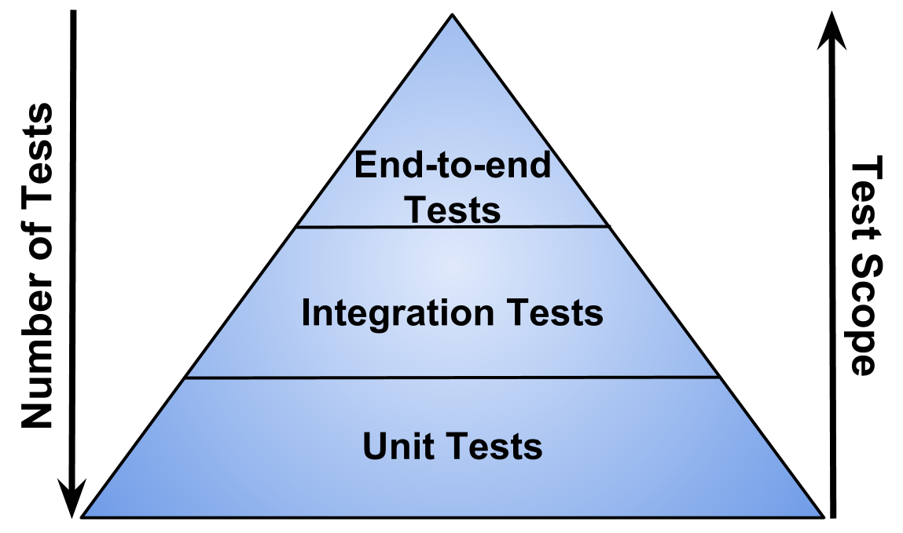

# Test Driven Development

## Learning Goals
- Define Test Driven Development (TDD)
- Explain how TDD augments our programming workflow

## Introduction

**Test-Driven Development (TDD)** is a programming workflow technique where we write unit tests **before** and **to drive** writing our source code (solution code/implementation code).

When we use this programming technique, programmers get to use _automated tests_ as a way to explore, build, and test our code as a repeated workflow loop.

### Development Workflow

Test-Driven-Development follows this process and order. Note that writing the test comes before writing the implementation code. That's the "test-driven" part!

1. Write a test
1. Watch it fail
1. Make it pass
1. Refactor
1. Repeat!

#### "Red, Green, Refactor"

[(source)](http://luizricardo.org/2014/05/is-tdd-dead/)

We'll often hear this cycle shorthanded as __Red, Green, Refactor__.

1. Write a test that describes a feature of the software.
1. Run the test, and watch it fail. Watching it fail is crucial! This helps us confirm that the test is working as expected: we **should** get a test failure (or reasonable error) before the implementation code is written. This is watching a test result in **red** (or not passing the test).
1. Write code that makes all the tests pass. This makes the test **green.**
1. Look for opportunities to improve our code. This is most appropriate time to **refactor**-- after we have a messy working solution. This step does not add functionality.

We should not forget to make sure that our tests are still passing after the refactor!

<!-- available callout types: info, success, warning, danger, secondary  -->
### !callout-info

## Development Workflow
The steps above augment our current workflow, which include reading feature requirements and making regular git commits. 

### !end-callout

## Keep in Mind

We should run our **entire** automated unit test suite often. When our requirements change, we can feel secure in changing our code because we have some _tests_ to let us know if we've broken something.

__Tests are transient.__ As we work on a project, our understanding of the problems at hand will change. As they do, your tests will change.

Keep in mind the balance between evolving requirements, evolving tests, and tests that should stay the same. This balance will change with every task.

### !callout-info

## Integration Tests
The tests we write as part of the TDD programming workflow described here are are *Unit Tests*, tests that to check a single function. There are other types of test. One other type of test we'll see in this curriculum are *Integration Tests*, tests that determine if software works when multiple parts are connected together. We will learn more about Integration Tests later in the curriculum. 

 [(source)](https://testerstories.com/2020/09/test-shapes/)

### !end-callout

## Resources
-  [TDD Definition from the Agile Alliance](https://www.agilealliance.org/glossary/tdd/#q=~(filters~(postType~(~'page~'post~'aa_book~'aa_event_session~'aa_experience_report~'aa_glossary~'aa_research_paper~'aa_video)~tags~(~'tdd))~searchTerm~'~sort~false~sortDirection~'asc~page~1))
-  [Medium Article:  "TDD Changed My Life"](https://medium.com/javascript-scene/tdd-changed-my-life-5af0ce099f80)

## Check for Understanding

<!-- Question Takeaway -->
<!-- prettier-ignore-start -->
### !challenge
* type: paragraph
* id: d0f49285
* title: TDD
##### !question

Describe the Red-Green-Refactor cycle.

##### !end-question
##### !placeholder

The Red-Green-Refactor cycle...

##### !end-placeholder
### !end-challenge
<!-- prettier-ignore-end -->

<!-- prettier-ignore-start -->
### !challenge
* type: paragraph
* id: 7ec32957
* title: TDD
##### !question

What was your biggest takeaway from this lesson? Feel free to answer in 1-2 sentences, draw a picture and describe it, or write a poem, an analogy, or a story.

##### !end-question
##### !placeholder

My biggest takeaway from this lesson is...

##### !end-placeholder
### !end-challenge
<!-- prettier-ignore-end -->

