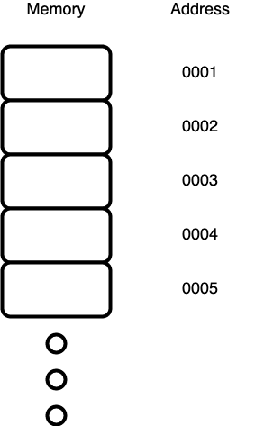
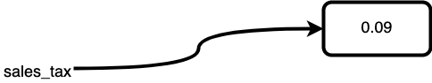
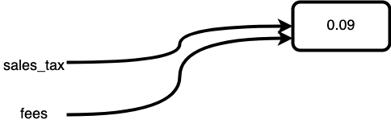
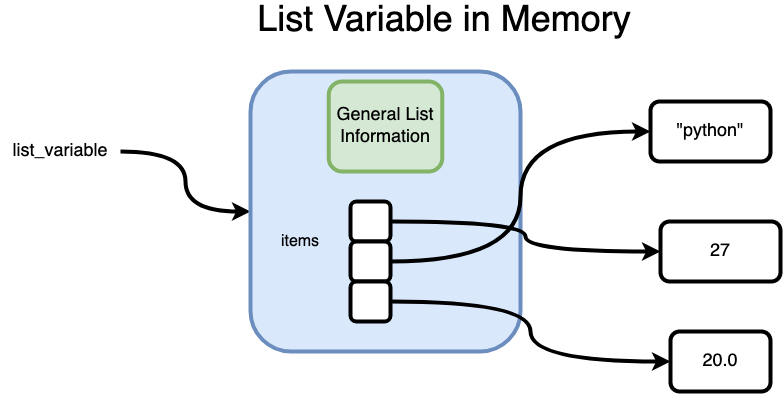
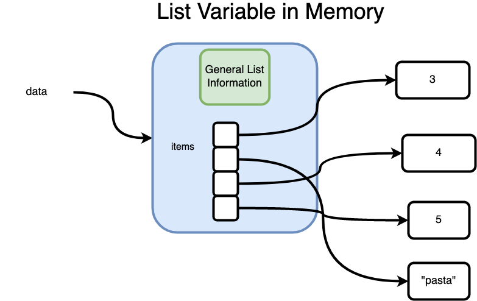

# Lists and Memory

## Goal

- Explain how Python structures data into lists

## Introduction

For most of us Lists were our first _data structure_, that is, rather than a variable holding a single value, Lists hold an arbitrary set of data and provide a structure to organize, access and modify the information.  In this lesson we will examine how lists work behind the scences.  


## Vocabulary and Synonyms

| Vocab | Definition | Synonyms | How to Use in a Sentence
| --- | --- | --- | ---
|  List | An ordered list of values. Items in the list are sometimes called elements. Can get the value of an item by using square brackets and the index of the item. | Array | I needed an ordered collection of student names, so I used a list. |
| Memory | Information and the medium on which it is stored for immediate use by a computing system.  Memory can also refer to the device which stores the information. | RAM (Random Access Memory) | There was too much data to load at once so we ran out of memory. |
| Reference | A value which enables a program to directly access a datum (a piece of data). | Handle | I passed a reference to the student records into the function |
| Contiguous | Things that are directly next to one another.  In many languages data in an array is stored in contiguous chunks. | adjacent | It's easier to write a collection of data to media when it is contiguous or adjacent to one another. |

## Memory

Every time your program stores a value in a variable, it is using _memory_.  Memory or RAM is a part of the computer which functions kind of like a series of post-it-notes on a fridge.  The information is quick to retrieve, and intended to be temporary.  When the program ends or the computer shuts down, information stored in RAM is erased.  Computer programs use memory to store information like variables they need while the program is executing.

You can think of RAM as a series of blocks of memory, each with their own address, very much like the index in a list.



<figcaption>Each location in memory is addressed by a unique id number, like an index in a list.</figcaption>

Different types of data can take up different amounts of memory and the size of each unit of memory can depend on the type of computer system.

In the version of Python we are using CPython, you can see the memory address for data referenced by any variable with the `id` function.

```python
>>> name = "Aubrey"
>>> id(name)
4305075184
```

## Variables & References

In python, if you make a variable like:

```python
sales_tax = 0.09
```

Python connects with the operating system (macOS in our case) and allocates an unused block of memory to store the information.  Then the variable is given a _reference_ to where that variable is stored in memory.



<figcaption>A variable in Python stores the location in memory, represented by the arrow, of the actual data.</figcaption>

Further when you use the equal sign (`=`) assign another variable to `sales_tax` Python simply has the new variable use the same reference and it "refers" to the same value in memory.

```python
fees = sales_tax
```



<figcaption>Multiple variables can reference the same data in memory</figcaption>

You can see the identify that both refer to the same value in memory using our friend the `id` function and see that both variables refer to the same memory address.

```python
>>> sales_tax = 0.09
>>> fees = sales_tax
>>> id(sales_tax)
4304253904
>>> id(fees)
4304253904 
```

Lists are no different except that instead of a variable containing a reference to the entire data set, it contains a reference to an object which contains metadata (information about the object like it's length etc) and an _array of references_, where each element in the list refers to a different object in memory, just like a normal variable.



<figcaption>Lists reference their elements, indirectly.</figcaption>

Notice that the section of the List in memory with the small set of blocks next to each other.  Each of those represent a reference.  In Python, a List maintains metadata about the list (Type, length etc) and contiguous chunks of memory which contain _references_ to where the actual data is stored.  So you can think of the data as twice removed from the actual array variable.  A primitive variable like an `int` is like a friend who can show you where their things are, while a list is like a person who can show you to a collection of people, each of whom can direct you to their belongings. 

### Indexing

Notice the references in the `items` section of a list are _contiguous_.  Further each reference is the same size, so Python only needs to know where the collection of `items` begins and then it can use the following formula to quickly retrieve a specific list element.

`reference_address = start_of_items_collection + size_of_reference * index_number`

So if:

- The `items` collection started at the memory address 100
- Each reference is 8 units in size

We could find a reference to index 3 of a list with:

`reference_address = 100 + 8 * 3`

Python can then use the following steps to find any element a list of an arbitrary size. 

1.  Find the starting address of the items collection
1.  Use `start_of_items_collection + size_of_reference * index_number` to find the reference to the given item
1.  Use the reference to find the given item

Each step is an O(1) operation in time/space complexity and nothing in this algorithm changes as the list gets bigger.  Therefore retrieving an element from a list by it's index number is a very efficient operation.

<!-- available callout types: info, success, warning, danger, secondary  -->
### !callout-warning

## Caveat

Like many general rules, this is an oversimplification.  Things can get more complicated than we will go into here for huge datasets or environments with limited memory.  As an application developer in Python however, you can assume that looking up an element within a list by an index number is a fast and efficient O(1) operation.

### !end-callout

## Summary

In memory Python variables contain references to where the actual data is stored.  A list variable refers to a memory location that contains metadata and a collection of references to where the actual data is stored, like a link to an addressbook.  This collection of references are contiguous in memory and that makes it very quick for Python to look up an element by it's index number, with some arithmetic.

## Check for Understanding

<!-- >>>>>>>>>>>>>>>>>>>>>> BEGIN CHALLENGE >>>>>>>>>>>>>>>>>>>>>> -->
<!-- Replace everything in square brackets [] and remove brackets  -->

### !challenge

* type: multiple-choice
* id: 7e08e867-3d1e-4ea4-9465-c6a4f38d0ef0
* title: In Python how are variables stored?
* points: 1
* topics: python, references

##### !question

In Python variables store...

##### !end-question

##### !options

* values directly
* references to where data is stored
* values directly, except for lists which contain a reference

##### !end-options

##### !answer

* references to where data is stored

##### !end-answer

<!-- other optional sections -->
<!-- !hint - !end-hint (markdown, hidden, students click to view) -->
<!-- !rubric - !end-rubric (markdown, instructors can see while scoring a checkpoint) -->
##### !explanation

All variables contain a reference to the location where data is stored.  Lists variables simply contain a reference which then contains references to the elements of the list.

##### !end-explanation

### !end-challenge

<!-- ======================= END CHALLENGE ======================= -->

<!-- >>>>>>>>>>>>>>>>>>>>>> BEGIN CHALLENGE >>>>>>>>>>>>>>>>>>>>>> -->
<!-- Replace everything in square brackets [] and remove brackets  -->

### !challenge

* type: short-answer
* id: a25e5d9f-13d4-438a-a256-21f4ae2f0835
* title: Big O:  List elements by Index
* points: 1
* topics: Big O, python-lists

##### !question

What is the Big O of for changing an element by it's index number like `students[n] = "Ceicil"`?

##### !end-question

##### !placeholder

O(...)

##### !end-placeholder

##### !answer

/([oO]\(1\))|1/

##### !end-answer

<!-- other optional sections -->
<!-- !hint - !end-hint (markdown, hidden, students click to view) -->
<!-- !rubric - !end-rubric (markdown, instructors can see while scoring a checkpoint) -->
##### !explanation

Since looking up an element by it's index just involves some arithmetic and does **not** depend on the size of the given array, the time/space complexity are both O(1) 
##### !end-explanation

### !end-challenge

<!-- ======================= END CHALLENGE ======================= -->

<!-- >>>>>>>>>>>>>>>>>>>>>> BEGIN CHALLENGE >>>>>>>>>>>>>>>>>>>>>> -->
<!-- Replace everything in square brackets [] and remove brackets  -->

### !challenge

* type: short-answer
* id: 34ea7bcc-c959-4f61-830f-7bf835726f65
* title: How does an array look like in memory
* points: 1
* topics: python, python-lists

##### !question

Describe how the following array `data` would look like in memory.  Draw a picture for yourself if it helps.

```python
data = [
  3,
  "pasta",
  4,
  5,
]
```

##### !end-question

##### !placeholder

Describe how data is organized in memory.

##### !end-placeholder

##### !answer

/.+/

##### !end-answer

<!-- other optional sections -->
<!-- !hint - !end-hint (markdown, hidden, students click to view) -->
<!-- !rubric - !end-rubric (markdown, instructors can see while scoring a checkpoint) -->
##### !explanation

`data` would refer to a location in memory which stores metadata and a collection of references to the values.



<figcaption>A list references the elements indirectly through a collection of references.</figcaption>

##### !end-explanation

### !end-challenge

<!-- ======================= END CHALLENGE ======================= -->