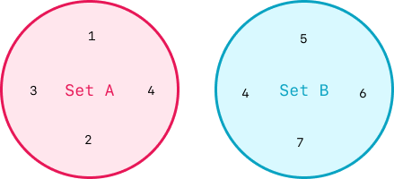
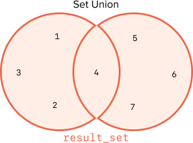
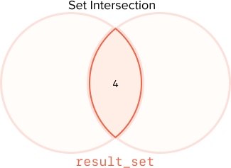
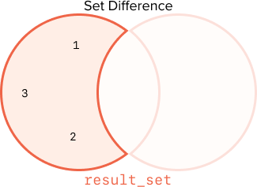

# Sets 

## Introduction 

Sets are a unique data structure in Python.  Sets can be used to store data like lists and dictionaries, but sets also have a wide array of built in functionality based on the concept of sets in mathematics, and this is where sets really shine!  In this lesson we will explore the basics of sets and look at the ways we can take advantage of the features of sets in algorithms and problem solving.

## Vocabulary and Synonyms 

| Vocab | Definition | Synonyms | How to Use in a Sentence |
| ----------------- | ----------------------------------------------------------------------------------------------------- | -------- | --------------------------------------------------------------------------------------------------------------------------------------------------- |
| Set |  |  |
| Union |  |  |
| Intersection |  |  |
| Difference |  |  |
| Disjoint |  |  |

## Set Fundamentals

A "set" is an unordered collection of unique elements.  Similar to a list, a set can store several values, but unlike a list, a set does not maintain any particular order and cannot contain duplicates.  Like lists and dictionaries, we can add things to a set, remove things from a set, and dump everything out.  In addition, we can do many interesting things around comparing the contents of one set to another and combining the contents of sets in specific ways.

 There are a few rules that govern sets:

1. Each element of a set is unique.
1. Each element of a set must be immutable.
1. Elements in a set are unordered.

What does it mean that each element is unique?  If you add an element to a set, for example `5` and then try to add another `5` to the set, the number of items in the collection does not increase.

What does it mean that each element of a set must be immutable?  This means that we can only add unchangable elements to a set.  We can add `5` or `3` or `"pizza"` to the set because the values of 5, 3, or "pizza" cannot be modified.  However we cannot add a list or dictionary to a set because we can modify a list by appending new elements, overwriting existing elements and we can add and remove new key-value pairs to a dictionary.  If you do attempt to add a mutable value to a set you will get a `TypeError` with the message `unhashable type`.

What is meant by the statement that, "Elements in a set are unordered."?  A set does not maintain it's elements in any order.  

For example the following code.

```python
example_set = set()
example_set.add(5)
example_set.add(6)
example_set.add('pizza')
print(example_set)
```

Will print `{'pizza', 5, 6}`.  The set does not maintain order by insertion or 

### Set Operations and Syntax

**Create a new set:**

```python
new_set = set() 
set_with_contents = {1, 2, 3, 'a', 'b'} 
```

Notice that creating a new, empty, set instance can be accomplished with `set()` and you can create a new set with values using the curly braces (`{}`).  The syntax for creating a new set with values differs from creating a dictionary in that there are no key-value pairs, only a list of values separated by commas.

**Add an element to a set:**

```python
set_a = {1, 2, 3}
set_a.add(4) 
```

The `add` method can be used to add a value to a set.

**Remove an element from a set:**

```python
set_a = {1, 2, 3}
set_a.remove(1) # set_a now equals {2, 3}
set_a.remove(4) # Raises a KeyError

set_a.discard(2) # set_a now equals {3}
set_a.discard(4) # does nothing
```

There are two ways to remove an element, `remove()` which raises a `KeyError` if the element is not present, and `discard()` which does not.


**Remove and return a random element from a set:**
```python
set_a = {1, 2, 3}
random_element = set_a.pop()

set_b = set()
random_element = set_b.pop() # Throws a KeyError
```

The `pop` method removes and returns one element from a set.  If the set is empty, `pop()` will throw a `KeyError`.


**Remove all elements from a set:**

```python
set_a = {1, 2, 3}
set_a.clear() # set_a is now an empty set
```

The `clear()` method removes all elements from a set leaving the set empty.

### Set Interactions

Now that we are familiar with the basic set operations, we can get into the exiting world of set to set interactions!  Let's start with two basic sets:

  
*Fig. Set A {1, 2, 3, 4} and Set B {4, 5, 6, 7}.*

#### Union

The union of two sets combines the sets into a new set that includes all of the elements of the original sets.  Any overlapping elements are included only once in the result set.

  
*Fig. Result Set {1, 2, 3, 4, 5, 6, 7}.*

```python
set_a = {1, 2, 3, 4}
set_b = {4, 5, 6, 7}

# Two syntax methods to create a set union:
# union() function:
result_set1 = set_a.union(set_b) # {1, 2, 3, 4, 5, 6, 7}

# | operator:
result_set2 = set_a | set_b # {1, 2, 3, 4, 5, 6, 7}
```

In the code above the union of `set_a` and `set_b` results in `{1, 2, 3, 4, 5, 6, 7}` consisting of all the elements in both sets.  However values, like `4` are included only once.  Overlapping elements are included once in the resulting set.

We can perform Union operations either by using the `union()` method, or the `|` operator.  Both the method and operator result in a new set consisting of the union of the given sets.

#### Intersection

The intersection of two sets is a new set composed of all of the elements that were present in both sets.  The overlapping elements are included only once in the result set.

  
*Fig. Result Set {4}.*

```python

set_a = {1, 2, 3, 4}
set_b = {4, 5, 6, 7}

# Two syntax methods to create a set intersection:
# intersection() function:
result_set1 = set_a.intersection(set_b) # {4}

# & operator:
result_set2 = set_a & set_b # {4}
```

Much like with union, we can perform set intersection using either the `intersection` method or the `&` operator.  When we perform the intersection of two sets a new set is returned consisting of *only* the values contained in both of the given sets.

#### Difference

The difference of two sets is a new set composed of all of the elements of the first set _except_ for any elements that overlap with the second set.  

  
*Fig. Result Set {1, 2, 3}.*

```python

set_a = {1, 2, 3, 4}
set_b = {4, 5, 6, 7}

# Two syntax methods to create a set difference:
# difference() function:
result_set1 = set_a.difference(set_b) # {1, 2, 3}

# - operator:
result_set2 = set_a - set_b # {1, 2, 3}
```

#### And More!


<!-- available callout types: info, success, warning, danger, secondary, star  -->
### !callout-info

## There is more!

There are more set interactions in Python that we will not cover in this curriculum.  [Follow your curiosity!](https://www.programiz.com/python-programming/set)

### !end-callout

### Set Comparisons

In addition to the interactions between sets, Python has built in ways to compare sets.

#### Subset

A set is a subset of another set if the other set contains all of the elements from the first set.  A set can be a subset of another set if the two sets are equal.

```python

set_a = {1, 2, 3}
set_b = {1, 2, 3, 4, 5}

# Two syntax methods to test if a set is a subset of another set
# issubset() function
set_a.issubset(set_b) # evaluates to True

# <= operator
set_a <= set_b # evaluates to True

# A set is also a subset of another set if they are equal
set_c = {1, 2, 3}

set_a <= set_c # evaluates to True
```

#### Proper Subset

A set is a subset of another set if the other set contains all of the elements from the first set.  A set is not a proper subset of another set if the two sets are equal.

```python

set_a = {1, 2, 3}
set_b = {1, 2, 3, 4, 5}

# Only one syntax methods to test if a set is a subset of another set
# < operator
set_a < set_b # evaluates to True

# A set is not a proper subset of another set if they are equal
set_c = {1, 2, 3}

set_a < set_c # evaluates to False
```

#### Disjoint

Two sets are disjoint if they have no overlapping elements.

```python

set_a = {1, 2, 3}
set_b = {4, 5, 6}
set_c = {3, 4, 5}

# Only one syntax method to test if a set is disjoint with another set
# disjoint() function
set_a.disjoint(set_b) # evaluates to True
set_a.disjoint(set_c) # evaluates to False
```

## Sets and Problem Solving

Now that we know set basics, let's take a look at how we can use sets to solve problems!  

Lets say we are working on an algorithm to compare two lists and find the elements that are common to both.  If we decided to approach this with a brute force solution, we might start by looping over all of the elements in the first list.  Then, for each element in the first list we would search inside the second list and see if we can find that element from the first list in the second list.  If we do find the element in the second list, we would add it to a result list.  Here's the code for this type of approach:

```python

list_a = [1, 2, 3, 4, 5, 6, 7, 8, 9]
list_b = [6, 7, 8, 9, 10, 11, 12, 13, 14]

result_list = []
for element_a in list_a:
    if element_a in list_b:
        result_list.append(element_a)

return result_list
```

This solution will get the job done, but it's not very efficient or elegant!  We can use sets to simplify this code by converting our lists into sets and then using set functionality to solve the problem.

### Creating Sets From Other Data Structures

First we need to turn our lists into sets.  The syntax for this is:

```python

list_a = [1, 2, 3, 4, 5, 6, 7, 8, 9]
list_b = [6, 7, 8, 9, 10, 11, 12, 13, 14]

set_a = set(list_a) # converts the list into a set!
set_b = set(list_a) 

```

Next, we can use set intersection to generate a set of all of the elements that are contained in both sets:

```python

result_set = set_a & set b

```

If we want the results in a list we can convert a set into a list in a similar way to how we converted the list into a set:

```python

result_list = list(result_set)

```

Here's the final version of the code:

```python

list_a = [1, 2, 3, 4, 5, 6, 7, 8, 9]
list_b = [6, 7, 8, 9, 10, 11, 12, 13, 14]

set_a = set(list_a) # converts the list into a set!
set_b = set(list_a) 

result_set = set_a & set b

return list(result_set)

```

### Iterating Through Sets

Let's say we have a string of letters and we want to find all of the unique characters in the string.  Here's a brute force solution that we could use:

```python

s = "she sells sea shells by the sea shore"
result = []

for char in s:  # loop over each character in the string
    if char not in result: # if the character is not in the result set:
        result.append(char) # add the character to the result set

for char in result: #print out the results
    print(char)

```

Just like our other brute force solution, this will get the job done, but we can use sets to come up with a more streamlined solution!

```python

s = "she sells sea shells by the sea shore"
result_set = set(s) # that's it!  the set now contains {'o', 'a', 'b', 'y', 'r', 't', 'l', 's', 'e', 'h', ' '}

```

If we want to print out the set, we can use a for loop just like the for loop we used for the list above:

```python

for char in result_set:
    print(char)

```

Here's our final solution:

```python

s = "she sells sea shells by the sea shore"
result_set = set(s)
for char in result_set:
    print(char)

```

<!-- Question Takeaway -->
<!-- prettier-ignore-start -->
### !challenge
* type: paragraph
* id: 9Nqz2c
* title: Variables Are References
##### !question

What was your biggest takeaway from this lesson? Feel free to answer in 1-2 sentences, draw a picture and describe it, or write a poem, an analogy, or a story.

##### !end-question
##### !placeholder

My biggest takeaway from this lesson is...

##### !end-placeholder
### !end-challenge
<!-- prettier-ignore-end -->