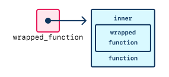
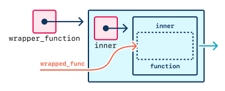
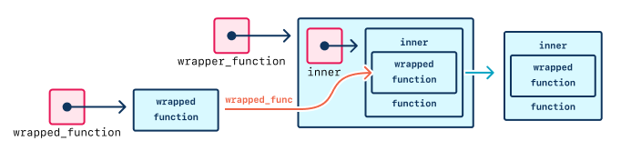
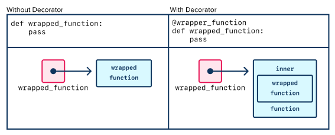
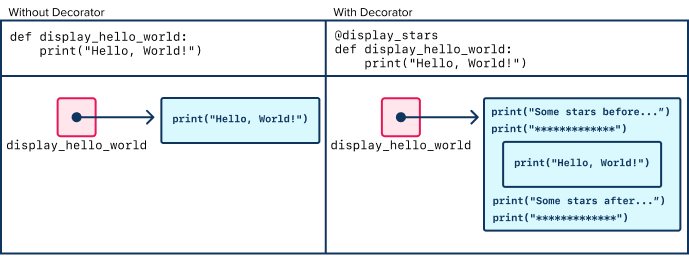

# Intro to Decorators

## Introduction

Python decorators, an example of the decorator pattern, solve problems where we would like a common set of operations performed before, after, or around the logic of an existing function or method. In this lesson, we will make a brief exploration of the concepts and syntax of Python decorators.

Our goal is to get _just_ familiar enough with the decorator pattern so we can recognize it when we encounter or apply it.

### !callout-info

## Our Goal

A variety of Python language and library features are exposed using a concise syntax that lets us apply additional pre-built behaviors to our own custom code. A general awareness of the concepts behind decorators can help us understand how they work. And a basic familiarity of the syntax will allow us to read through existing code and apply these useful features to our own code, even if we don't necessarily _write_ many decorators ourselves.

<br />

During this lesson, our energy is best used to focus on concepts, vocabulary, and reading the code, rather than coding exercises.

<br />

The content of this lesson, namely functions being passed around as objects, will help us solve problems beyond OOP, too!

### !end-callout

## Vocabulary and Synonyms

| Vocab             | Definition                                                                                            | Synonyms | How to Use in a Sentence                                                                                                                            |
| ----------------- | ----------------------------------------------------------------------------------------------------- | -------- | --------------------------------------------------------------------------------------------------------------------------------------------------- |
| Decorator pattern | A design pattern that dynamically adds behavior to be added to an individual object, as needed        | -        | "Adding a decorator to my function dynamically extends additional behavior to my function, following the decorator pattern"                         |
| Wrapper function  | A function whose responsibility is to "wrap" another function, or call another function within itself | Wrapper  | "There are a lot of design patterns that encourage using wrappers, which lets me easily augment my own function's logic with additional behaviors." |
| Decorator         | In Python, a wrapper function applied using decorator syntax                                          | -        | "I will decorate my `print_summary` function with the `pretty_format` decorator"                                                                    |
| Wrapped function  | In the context of a wrapper function, the function that is being extended                             | -        | -                                                                                                                                                   |

## The Decorator Pattern

Sometimes we have multiple functions that have different behavior, but it would be nice if all of these functions were _extended_ in the same ways.

The decorator pattern observes that we can _extend_ multiple functions on-demand by using one wrapper function that performs additional operations before, after, or around any existing logic.

A **wrapper function** (often just "wrapper") is one function that is used to "wrap" a second function; when the wrapper function is called, it does some logic that "surrounds" and "wraps" the **wrapped function**. A wrapper function is a generic term; when a wrapper function is used in the decorator pattern, we call it the **decorator**. We can call the wrapped function a **decorated** function.

To summarize, to implement the decorator pattern, we will:

1. Define the necessary functions
   1. The decorator (the wrapper), which will extend behavior
      - This will include an inner function; details below
   2. The wrapped function(s), which will be extended
1. Use decorator syntax to designate the wrapper function and the wrapped function

### A Small Abstract Example

Ryanne is creating a calculator program. She's made:

- a function that adds two numbers
- a function that subtracts two numbers
- a function that multiplies two numbers

However, besides calculating, their program has these additional requirements:

1. Before doing any calculations, check that the two numbers are valid (they aren't imaginary numbers, invalid strings, `"hotdog"`, etc.)
1. After doing calculations, print the result

Ryanne can ponder different ways to solve this problem, such as including that logic in each one of their calculation functions. However, if she applies the decorator pattern, then:

1. She can define the necessary functions
   1. A function that checks the numbers are valid, then does the calculations, then prints the result
   2. The multiple calculation functions:
      1. add function
      1. subtract function
      1. multiply function
1. Use decorator syntax to designate the wrapper function and the wrapped function
   1. The _decorator (wrapper function)_ is the function that checks validity, calculates, then prints the results
   1. The wrapped functions are the calculation functions:
      1. add function
      1. subtract function
      1. multiply function

Now, those three functions are decorated! Whenever Ryanne's program runs the add, subtract, or multiply functions, their behavior is _extended_, and automatically always checks validity, calculates, and then prints the result.

### How is This Different Than Making and Invoking Helper Functions?

We may have read through Ryanne's problem and imagined creating helper functions to put inside the calculation functions. That absolutely would have worked; there are multiple ways to solve this problem!

The wisdom of when to use the decorator pattern and when it gives clear benefits comes with experience. However, to name some benefits of the decorator pattern:

- The decorator syntax may be more readable in this situation. It calls attention to itself that something interesting is happening.
- The decorator syntax can enforce consistency
- Depending on how often we imagine the decorator logic changing vs. the calculation logic changing, decorators may be easier to use, refactor, update, and maintain, compared to helper functions

## How We May See it in Python

The decorator pattern, again, only describes a strategy to solve a problem. Design patterns don't always specify what the code looks like.

However, [the Python language created specific syntax to support this interpretation of the decorator pattern](https://www.python.org/dev/peps/pep-0318/).

### Syntax

The usual way to decorate functions or methods in Python is with this syntax:

```python

def wrapper_function(wrapped_func):
    def inner():
        # some wrapper logic
        wrapped_func()
        # some wrapper logic
    return inner

@wrapper_function
def wrapped_function():
    pass

```

### !callout-info

## Functions in Functions Calling Functions: Oh My!

At the end of the day, __`wrapped_function`__ will hold a new function that uses the original version, potentially with additional logic around it. For an illustrated exploration of how this happens, expand the following subsection.

  
*Fig. __`wrapped_function`__ after the execution of the previous code.*

### !end-callout

<details style="max-width: 700px; margin: auto;">
    <summary>
      Click for a visual presentation of how `wrapped_function` is created.
    </summary>

  
*Fig. In a previous lesson, we represented functions as a box of logic with a name. Behind the scenes, Python functions are really objects containing a list of instructions. A function name is essentially a variable referring to that object. We can more accurately represent the implementation of a function and its name using this box and arrow style.*

  
*Fig. __`wrapper_function`__ is a function accepting a single parameter, __`wrapped_func`__. __`wrapped_func`__ is expected to be a function that __`wrapper_function`__ will use inside its internal function, __`inner`__. This customized __`inner`__, which embeds a call to __`wrapped_func`__, is returned as a new function object. In effect, __`wrapper_function`__ is a machine that builds new functions!*

  
*Fig. By passing __`wrapped_function`__ as the argument to __`wrapper_function`__, __`inner`__ can be customized to use __`wrapped_function`__ when it gets called. This custom __`inner`__ is returned as the result of __`wrapper_function`__. The function __`wrapper_function`__, returns a new function as its return value!*

  
*Fig. The self-assignment behavior of the __`@`__ decorator syntax (discussed in __Decorators Are Syntactic Sugar__ below) automatically assigns the result of calling the decorator method back to the name of the function object that was passed in. __`wrapped_function`__ now refers to the customized version of __`inner`__ that was created inside __`wrapper_function`__.*

  
*Fig. The version of __`wrapped_function`__ on the left has no decorator. It refers to the plain function object. The version on the right has the __`@wrapper_function`__ decorator. It refers to the custom-made version of the __`inner`__ function returned from the call to __`wrapper_function`__.*

</details>

| <div style="min-width: 180px;">Piece of code</div>                    | <div style="min-width: 400px;">Notes</div>     |
| -------------------------------- | --------------------------------------------------------------------------------------------------------------------------------------------------------------------------------------------------------------------------------------------------------------------------------------------------------------------------------------- |
| Definition of `wrapper_function` | The definition of the decorator. This needs to be defined before it's used as a decorator. The wrapper function should always take in at least one parameter, which will receive the function being wrapped. The function body should define an inner function (see notes for `inner`). The decorator must return the `inner` function. |
| Definition of `inner`            | An inner function defined in the decorator used for the decorator pattern. **Replace this** name with any valid function name (`inner` is fine!). This function body should include all logic that extends the wrapped function. The function body should invoke the wrapped function at least once.                                    |
| `wrapped_func`                   | **Replace this** name with any valid variable name (`wrapper_func` or `func` is fine!). The wrapper function should always define at least one parameter. This parameter will receive the wrapped function so that it can be called inside the new `inner` function.                                                                    |
| Definition of `wrapped_function` | The definition of the function being wrapped. It will be called within the newly created wrapped function, where it will be available as the first parameter to `wrapper_function`                                                                                                                                                      |
| `@wrapper_function`              | **Replace this** with the name of the decorator (wrapper). This line should always start with `@` and be the line above the wrapped function signature.                                                                                                                                                                                 |

### !callout-info

## Decorators Are Syntactic Sugar

The `@wrapper_function` notation above is referred to as a kind of _syntactic sugar_. It doesn't do anything we couldn't already do in Python, but it does it a little more neatly. So what does the above expression translate to in more plain Python?

```python
def wrapped_function():
    pass

wrapped_function = wrapper_function(wrapped_function)
```

Before decorator syntax, this wrapping was a manual two-step process. Now Python takes care of that for us. So even though the `@` syntax may look strange, this is really all it means!

### !end-callout

### A Medium Example With Syntax

Let's dive into an example!

Read through the example and identify the following in the code:

- `display_stars` is the decorator
  - `wrapped_func` is the parameter that represents the wrapped function
  - In the function body, it:
    - prints some stars
    - invokes the wrapped function
    - then prints more stars
- `display_hello_world` is a wrapped function
  - It is decorated with `display_stars` with the line `@display_stars`
  - It prints "Hello, World!"

```python
def display_stars(wrapped_func):
    def inner():
        print("Some stars before we call the wrapped function...")
        print("*************")
        wrapped_func()
        print("Some stars after we call the wrapped function!")
        print("*************")
    return inner

@display_stars
def display_hello_world():
    print("Hello, World!")
```

Invoking `display_hello_world()` will produce this output:

```
Some stars before we call the wrapped function...
*************
Hello, World!
Some stars after we call the wrapped function!
*************
```

Read through the above output and see if you can trace it. Find the lines of code that were the cause of printing...

1. `Some stars before we call the wrapped function...`
1. `Hello, World!`
1. `Some stars after we call the wrapped function!`

  
*Fig. The version of __`display_hello_world`__ on the left has no decorator. It refers to the plain function object. The version on the right has the __`@display_stars`__ decorator. It refers to the custom-made version of the __`inner`__ function returned from the call to __`display_stars`__.*

Our answers should help us see that the `display_stars` wrapper function does indeed "wrap" around `display_hello_world`.

### !callout-info

## Decorators Can Do More

We can do more with decorators beyond the scope of this lesson, such as chain multiple decorators, or access the arguments and keyword arguments of the wrapped function. Follow your curiosity!

### !end-callout

## An Introduction: Higher-Order Functions

While the goal of this lesson is to gain familiarity with the decorator pattern, we can take this opportunity to muse on _functions being passed around like objects_.

Although we primarily use functions by _invoking them to do actions_, sometimes we may also use functions _as objects_.

Let's revisit the decorator syntax. When we define our decorator, the decorator function must take in one argument: an argument that represents the _wrapped function._ We're passing the wrapped function into the wrapper function just like an object, String, list, number, etc.

Therefore, whenever a decorated function is invoked, we can imagine that the following steps happen:

1. The decorator is invoked
   - The argument for this function call _is_ the decorated function
   - It creates an inner function
1. The decorator returns the inner function
1. The inner function is invoked
   - The logic for the inner function will eventually call the original decorated function

### A Large In-Depth Example

This concept is much clearer to see when looking at concrete code.

The code below has:

- One decorator, `display_stars`, which takes in a `wrapped_func`
- Three functions that are decorated with `@display_stars`:
  - `display_hello_world`
  - `display_english_alphabet`
  - `add_two_random_numbers`

To gain familiarity with higher-order functions, follow these steps:

1. Read through the code below
1. Read through the example program that runs, and its example output
1. Trace through the code to observe:
   - When `display_hello_world` is called, it gets passed in as `wrapped_func` into the `display_stars` decorator
   - When `add_two_random_numbers` is called, it similarly gets passed in as `wrapped_func` into the `display_stars` decorator

```python
import random

def display_stars(wrapped_func):
    def inner():
        print("Some stars before we call the wrapped function...")
        print("*************")
        wrapped_func()
        print("Some stars after we call the wrapped function!")
        print("*************")
        print("")
    return inner

@display_stars
def display_hello_world():
    print("Hello, World!")

@display_stars
def display_english_alphabet():
    print("abcdefghijklmnopqrstuvwxyz")

@display_stars
def add_two_random_numbers():
    a = random.randint(0, 100)
    b = random.randint(0, 100)
    sum = a + b
    print(f"{a} + {b} = {sum}")
    return sum
```

Invoke these functions with these lines:

```python
display_hello_world()
display_english_alphabet()
add_two_random_numbers()
```

Example output:

```
Some stars before we call the wrapped function...
*************
Hello, World!
Some stars after we call the wrapped function!
*************

Some stars before we call the wrapped function...
*************
abcdefghijklmnopqrstuvwxyz
Some stars after we call the wrapped function!
*************

Some stars before we call the wrapped function...
*************
6 + 64 = 70
Some stars after we call the wrapped function!
*************

```

## Check for Understanding

<!-- Question 1: question about vocab -->

<!-- Question 2: question about identifying the decorator in a code sample (the @ part. This is the part most relevant to the OOP lessons) -->

<!-- Question 3: question about identifying the decorator in a code sample (could be similar to Q2, could be different) -->

<!-- Problem 1 (Intro Decorators II) (what happened to I)?

the line numbers mess with the python indentation
"Select the line that contains a decorator." is a little vague. Fortunately, the choices make the answer unambiguous, but how about "Select the line that applies a decorator."
Problem 2 (Intro Decorators III)

the line numbers mess with the python indentation (less severe on this one, but still...)
"Select the line that contains a decorator." is a little vague. On this one, the choices are more ambiguous, so how about "Select the line that applies a decorator." -->

<!-- Question 1 -->
<!--prettier-ignore-start -->
### !challenge
* type: multiple-choice
* id: 2f98105e-287d-464d-9429-9f015ba2b249
* title: Intro to Decorators
##### !question

Select the line that applies a decorator.

```python
1   def prechorus(func):
2       def lyrics():
3           print("So when the night falls, my lonely heart calls...")
4           func()
5       return lyrics
6
7
8   @prechorus
9   def chorus():
10      print("Oh, I wanna dance with somebody, I wanna feel the HEAT with somebody..")
11      print("Yeah, I wanna dance with somebody... with somebody who loves me!")
12
13
14  chorus()
```
##### !end-question
##### !options
* 2
* 8
* 9
* 14
##### !end-options
##### !answer
* 8
##### !end-answer
### !end-challenge
<!--prettier-ignore-end -->

<!-- Question 2 -->
<!-- prettier-ignore-start -->
### !challenge
* type: multiple-choice
* id: ad99bf78-de0d-43a8-a054-5843c210cbdd
* title: Intro to Decorators
##### !question
Select the line that applies a decorator.

```python
1    def concatenate_words(format_str_func):
2        def inner(values):
3            return ''.join(format_str_func(values))
4        return inner
5
6
7    @concatenate_words
8    def make_camel_case(string):
9        return [word.capitalize() for word in string.split(' ')]
10
11
12   print(make_camel_case("hello world"))
```
##### !end-question

##### !options
* 1
* 2
* 7
* 12
##### !end-options
##### !answer
* 7
##### !end-answer
### !end-challenge
<!-- prettier-ignore-end -->
