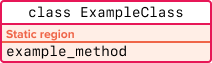
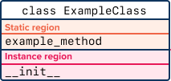
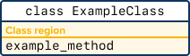

# Static Methods and Class Methods

<iframe src="https://adaacademy.hosted.panopto.com/Panopto/Pages/Embed.aspx?pid=38935567-38d4-48f3-84bc-acfe00f38451&autoplay=false&offerviewer=true&showtitle=true&showbrand=false&start=0&interactivity=all" height="405" width="720" style="border: 1px solid #464646;" allowfullscreen allow="autoplay"></iframe>

## Learning Goals

- Define static methods
- Recognize the syntax to build static methods
- Define class methods
- Recognize the syntax to build class methods

## Introduction

The most common kind of methods defined in OOP are instance methods. These methods can only be called from an instance. Instance methods typically are used to describe behaviors that instances can do, and to update the state associated with a particular instance.

There are other kinds of methods that we can define within a class. These methods are not called using an object instance, and don't intrinsically have access to the state of any instances.

### !callout-info

## Class Variables? Instance Variables?

This lesson talks about instance variables and class variables. Instance variables are variables associated with an instance. In Python terms, they are variables stored on a `self` instance. We also call them attributes. Class variables are variables that are defined inside the class definition, outside any instance method. We can access them with dot notation off the class: `ExampleClass.example_class_var`

```python
class ExampleClass:
    example_class_var = "This is an example class variable!"


print(ExampleClass.example_class_var)

ExampleClass.example_class_var = "I've successfully re-assigned the example class var!"

print(ExampleClass.example_class_var)
```

Class variables hold _class state_. Every individual class variable gets shared and applied among all instances of the class.

### !end-callout

## Vocabulary and Synonyms

| Vocab         | Definition                                                                                                                                                                                           | How to Use in a Sentence                                                                                                                                    |
| ------------- | ---------------------------------------------------------------------------------------------------------------------------------------------------------------------------------------------------- | ----------------------------------------------------------------------------------------------------------------------------------------------------------- |
| Static method | A method that does not depend on an instance, and does not access instance or class variables. Essentially a regular function that happens to be stored in a class primarily for namespace purposes. | "The method `meets_age_requirement(age)` will always do the same behavior, regardless of instance or class state, so we can make it a static method."       |
| Class method  | A method that receives a reference to the class itself. This method does not depend on an instance, and cannot access instance variables or methods.                                                 | "All `MovieTheater`s share the class state `is_open`. Our method `reopen_all_theaters` can be a class method that depends on the `is_open` class variable." |

  
*Fig. A class with static methods, class attributes, class methods and an instance of the class.*


## Static Methods are Stateless Methods from a Class

Static methods are methods that are typically called from a class, not an instance.

Additionally, static methods don't have access to instance variables (attributes) or class variables.

They often provide helper behaviors related to the class, but without specifically depending on any particular instance or class state.

## Static Methods: Syntax

To define a static method, we:

- use the `@staticmethod` decorator that the Python library provides
- do not pass in `self` as a parameter

```python
class ExampleClass:

    @staticmethod
    def example_method():
        print("I'm inside the static method, example_method!")
```

  
*Fig. Diagram of a class with a static method.*

Once a static method is defined, we can invoke it using dot notation, typically from the class itself.

```python
ExampleClass.example_method()
```

This code produces the console output:

```
I'm inside the static method, example_method!
```

Any code that can reference the class can call any of its static methods. This means that we can call a static method from another static method, class method, instance method, or even from inside another class. From anywhere, as long as the class is visible.

### Static Methods: Syntax Details

In Python, we actually _can_ call static methods using an object instance, not just a class. However, static methods don't automatically get `self` _even if we try adding a parameter to receive it_.

Observe this slightly strange code, which shows that we _can_ call static methods from an object instance, but we don't automatically receive a reference to a `self` instance.

```python
class ExampleClass:

    def __init__(self, name):
        self.name = name

    @staticmethod
    def example_method():
        print("I'm inside the static method, example_method!")
        print(f"I'm accessing an instance variable, {self.name}")
```

  
*Fig. Diagram of a class with a static method and an instance method.*

```python
example_instance = ExampleClass("Hello, World!")

example_instance.example_method()
```

This code produces the console output:

```
I'm inside the static method, example_method!
Traceback (most recent call last):
  File "main.py", line 13, in <module>
    example_instance.example_method()
  File "main.py", line 9, in example_method
    print(f"I'm accessing an instance variable, {self.name}")
NameError: name 'self' is not defined
```

We should observe from the output that:

- The code _did_ successfully begin the static method, and it _did_ print `I'm inside the static method, example_method!`
- The code threw a runtime error `NameError`, because we are unable to access `self`

## Static Methods: Application

Static methods are often utility functions. "Utility functions" is an informal term to describe a function responsible for doing common, routine tasks.

Static methods are great for:

- returning fixed values not associated with an instance
- doing operations that aren't associated with an instance

## Class Methods are Methods with Class State

Class methods are methods that are only called from a class, not an instance.

Class methods have access to class variables. However, they do _not_ have access to any instance variables.

## Class Methods: Syntax

To define a class method, we:

- use the `@classmethod` decorator that the Python library provides
- do not pass in `self` as a parameter
- pass in `cls` as a parameter

Instead of passing in `self`, the variable that represents an instance itself, in class methods, we pass in `cls`, a variable that represents the class itself.

`cls` is the conventional name for this parameter.

```python
class ExampleClass:

    @classmethod
    def example_method(cls):
        print("I'm inside the class method, example_method!")
        print("In a class method, cls will be the class itself", cls)
```

  
*Fig. Diagram of a class with a class method.*

Once a class method is defined, we can invoke it using dot notation, typically from the class itself.

```python
ExampleClass.example_method()
```

This code produces the console output:

```
I'm inside the class method, example_method!
In a class method, cls will be the class itself <class '__main__.ExampleClass'>
```

Any code that can reference the class can call a class method. Similar to static methods, we can call a class method from other static, class, or instance methods, or even from inside another class.

### Class Methods: Syntax Details

We actually _can_ call class methods from an object instance, too. However, the `@classmethod` decorator will specify that the first parameter, `cls`, will _always_ have the value of the class itself.

Even if we call a class method from an instance, we will not have access to the instance it`self`.

Observe this code, which shows that `cls` is still the value of the class, no matter what invokes the class method.

```python
class ExampleClass:

    @classmethod
    def example_method(cls):
        print("I'm inside the class method, example_method!")
        print("In a class method, cls will be the class itself", cls)
```

```python
example_instance = ExampleClass()
example_instance.example_method()
```

Output:

```
I'm inside the class method, example_method!
In a class method, cls will be the class itself <class '__main__.ExampleClass'>
```

We should observe from the output that:

- The code successfully ran the class method, even though it was invoked with `example_instance.example_method()`
- When we printed `cls`, it continued to be `<class '__main__.ExampleClass'>`

### Using `cls` to Access Class Variables

As mentioned above, class methods can access any class variables that are defined, using the `cls` variable:

```python
class ExampleClass:
    example_class_var = "This is an example class variable!"

    @classmethod
    def example_method(cls):
        print("I'm inside the class method, example_method!")
        print("I can access class variables using the cls parameter:", cls.example_class_var)
```

  
*Fig. Diagram of a class with a class and a class variable.*


```
ExampleClass.example_method()
```

This code produces the console output:

```
I'm inside the class method, example_method!
I can access class variables using the cls parameter: This is an example class variable!
```

Of course, class variables can be accessed without the `cls` parameter, as long as there's access to the class itself. The following version of `ExampleClass` produces the same output as the previous version:

```python
class ExampleClass:
    example_class_var = "This is an example class variable!"

    @classmethod
    def example_method(cls):
        print("I'm inside the class method, example_method!")
        print("I can access class variables using the cls parameter:", ExampleClass.example_class_var)
```

The difference is that `cls` will _always_ represent the current class itself; specifying `ExampleClass` could have consequences if class definitions change, or when inheritance is involved.

## Class Methods: Application

Class methods are special because they have access to class variables, and class state.

Class methods are great for:

- modifying class state that applies across all instances of the class
- doing operations that aren't associated with an instance
- doing operations that rely on the class itself, such as making instances of that class

## Check for Understanding

<!-- Use the static method decorator to create a static method that... -->
<!-- Use the class method decorator to create a static method that... -->

<!-- Problem 2 (Static Methods and Class Methods II):

includes "has access to instance variables (attributes) or class variables." but it does not have access to instance variables. This should just be "has access to class variables, but not instance variables."
Problem 4 (Static Methods and Class Methods IV):

has a typo in the answer output "You"
has weird stuff going on with an extra print in the classmethod
the "wrong" answer prints the same correct answer string -->

<!-- Question 1 -->
<!-- prettier-ignore-start -->
### !challenge
* type: checkbox
* id: 6d4dab23-bc9d-45fa-a4d8-07689ecf84c7
* title: Static Methods and Class Methods
##### !question
Select the options that complete this sentence:

> A static method ...
##### !end-question
##### !options
* is bound to a class
* does not have access to instance variables (attributes) or class variables
* can access or modify class state
* requires `cls` as first argument
##### !end-options
##### !answer
* is bound to a class
* does not have access to instance variables (attributes) or class variables
##### !end-answer
### !end-challenge
<!-- prettier-ignore-end -->

<!-- Question 2 -->
<!-- prettier-ignore-start -->
### !challenge
* type: checkbox
* id: qt76TH
* title: Static Methods and Class Methods
##### !question
Select the options that complete this sentence:

> A class method ...
##### !end-question
##### !options
* is bound to a class
* has access to class variables, but not instance variables
* can access or modify class state
* requires `cls` as first argument
##### !end-options
##### !answer
* is bound to a class
* has access to class variables, but not instance variables
* can access or modify class state
* requires `cls` as first argument
##### !end-answer
### !end-challenge
<!-- prettier-ignore-end -->

<!-- Question 3 -->
<!-- prettier-ignore-start -->
### !challenge
* type: multiple-choice
* id: 3c69fae9-f63c-42f4-915a-9fca215bc374
* title: Static Methods and Class Methods
##### !question
Select the best decorator to decorate the `subtract_numbers` method.

```python
class Calculator:
    def subtract_numbers(x, y):
        return x - y
```
##### !end-question
##### !options
* `@staticmethod`
* `@classmethod`
##### !end-options
##### !answer
* `@staticmethod`
##### !end-answer
### !end-challenge
<!-- prettier-ignore-end -->

<!-- Question 4 -->
<!-- prettier-ignore-start -->
### !challenge
* type: checkbox
* id: 1d5979f7-0617-4a16-88f7-2da87c6c5a75
* title: Static Methods and Class Methods
##### !question
Select the option that will print the following output after invoking `display_total(20)`:

```
Your total will be $20.
Ask about our membership program to receive a 10% discount today!
```
##### !end-question
##### !options
* 
```python
class CalculateTotal:
    summer_discount = 10
    winter_discount = 15

    @classmethod
    def promote_membership(cls):
        return(f"Ask about our membership program to receive a {cls.summer_discount}% discount today!")

def display_total(amount):
    print(f"Your total will be ${amount}")
    print(CalculateTotal.promote_membership())
```

* 
```python
class CalculateTotal:
    summer_discount = 10
    winter_discount = 15

    @staticmethod
    def promote_membership(cls):
        return(f"Ask about our membership program to receive a {cls.summer_discount}% discount today!")


def display_total(amount):
    print(f"Your total will be ${amount}")
    print(CalculateTotal.promote_membership())
```

##### !end-options
##### !answer
* 
```python
class CalculateTotal:
    summer_discount = 10
    winter_discount = 15

    @classmethod
    def promote_membership(cls):
        return(f"Ask about our membership program to receive a {cls.summer_discount}% discount today!")

def display_total(amount):
    print(f"Your total will be ${amount}")
    print(CalculateTotal.promote_membership())
```
##### !end-answer
### !end-challenge
<!-- prettier-ignore-end -->
