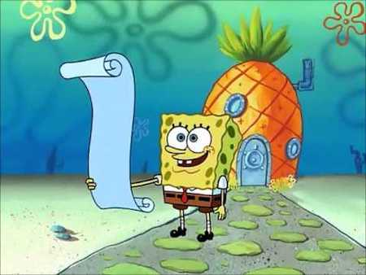
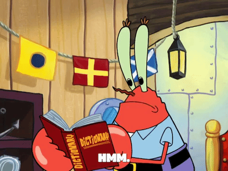

# Representing Data in Lists and Dictionaries

## Learning Goals

- Practice representing ordered data as a list
- Practice representing related data as a list

## Introduction

As we see more and more problems in programming, we'll be faced with a lot of ambiguous direction. Exciting computer science problems will often have no obvious place to start. Should you make a function? How many variables? Do we need iteration?

As part of _breaking down a problem_, one step we should consider, take, and practice, is representing data we see as data structures. To give ourselves a starting point in problem-solving, we can practice:

- Observing the problem and data given to us
- Turn these observations into data structures like strings, lists, dictionaries, and more

## Recognizing Lists When Reading Problem Statements

  
[(source)](https://www.youtube.com/watch?v=HwwGPOhF4CI)

To practice representing data as lists, we will...

1. Consider the strengths of lists
1. Read an example problem statement
1. Write our own observations
1. Make conclusions

### The Strengths of Lists

Lists are great at...

| <div style="min-width:205px;">Strength</div>                                  | <div style="min-width:210px;">Notes</div>  | <div style="min-width:210px;">How it's represented in code</div>                                                                                         |
| ----------------------------------------- | ----------------------------------------------------------------------------------------------------------------------------------- | -------------------------------------------------------------------------------------------------------------------- |
| Lists contain 0+ elements                 | Lists contain multiple elements in a specific order. The elements don't need to be of the same type.                                | The syntax of a list literal is comma-separated elements. Lists could possibly be indicated by plural variable name. |
| Lists contain elements in an order        | Elements in a list are always in an order. This order could have zero significance, or it could have meaning based on how it's used | - |
| Lists have a property of length/size      | A frequently used property for lists is its length. An empty list has a length of zero.                                             | We can use the `len` function and pass in a list to get its length.                                                  |
| We can access elements in a list by index | If we know the index of an element in a list, we can get the element                                                                | We index with square brackets, `my_list[0]`                                                                          |
| We can add things to lists                | We can add elements to lists                                                                                                        | `my_list.append(new_element)` will add this element to the end of the list                                           |
| We can remove things to lists             | We can remove elements from lists                                                                                                   | `my_list.remove(value_to_remove)` will find the first instance of this value and remove it                   |

### An Example Problem Statement

Compare these two sequences of DNA, which contain many pieces of DNA. They are similar, but not the same, based on the order and value of each piece. These two sequences are the same length.

| No. | Sequence          |
| --- | ----------------- |
| 1   | GAGCCTACTAACGGGAT |
| 2   | CATCGTAATGACGGCCT |

We can visualize the differences between the two sequences like so:

```bash
GAGCCTACTAACGGGAT
CATCGTAATGACGGCCT
^ ^ ^  ^ ^    ^^
```

Create a function. In this function:

- Make a list that contains all the differences between the two sequences.
- Find the differences between the two sequences.
  - Add each difference to the list of differences.

### Make Your Own Conclusions About Lists in Problem Statements

The ideal solution for the problem statement above uses lists. Did you come to the same conclusion? If so, how?

<!-- prettier-ignore-start -->
### !challenge
* type: short-answer
* id: OQhdum
* title: Did you come to the same conclusion? If so, how? 

##### !question
Share your notes about what you observed in the above problem statement. **What pieces of the problem statement** directly helped you make those conclusions?
##### !end-question

##### !placeholder
Enter notes here
##### !end-placeholder

##### !answer
/.*/
##### !end-answer
### !end-challenge
<!-- prettier-ignore-end -->

### Our Conclusions About Lists in Problem Statements

| Observation                                                    | When it's related to lists                                                                                                                                                                                                           | Examples                                                                                                                                                               |
| -------------------------------------------------------------- | ------------------------------------------------------------------------------------------------------------------------------------------------------------------------------------------------------------------------------------ | ---------------------------------------------------------------------------------------------------------------------------------------------------------------------- |
| Using the word "list" or "array"                               | Literally using the word "list" is a good indicator that a list could be involved                                                                                                                                                    |
| Mentions of multiple "things" that are similar                 | A list usually groups similar things. Except for order (or depending on context), lists don't really have a way to represent one element being "more special" than another. Lists are great for lists of things of equal importance. | A list of groceries with no specific order, a list of letters in the alphabet, a list of books that are unavailable at the library                                     |
| Mentions of an order, sequence, or sorting to multiple things  | A list keeps its elements in an order, so any mention of "order," "sequence," or "sorting." being important might be a sign of a list.                                                                                               | A priority list of groceries, where the highest priority is first. The alphabet song, in order. A list of unavailable books sorted by their due date.                  |
| Mentions getting, using, comparing "one" element out of "many" | A problem that focuses comparing "one" (or a few) item to many others is a problem that lists can solve well.                                                                                                                        | Finding the highest priority grocery item. Counting how many letters in the alphabet are vowels. Finding all books with a due date of Sunday.                          |
| Mentions referencing an element by position                    | A problem that mentions an element by its position (index) is a clue that a list is a good idea.                                                                                                                                     | "The second item to buy is always coffee." "The alphabet should be replaced with `*` every fifth letter." "The `checkin` function should always grab the first book"   |
| Mentions adding or removing an element to a list               | Lists are really great at growing and shrinking.                                                                                                                                                                                     | "The user should be able to add or remove any number of shopping items" "Remove any letter that isn't uppercase." "Add a book every time someone checks out a book."   |
| Mentions the length of a list                                  | Lists can easily calculate its own length, and clues around constraints or freedoms around a list's length is a clue to use a list.                                                                                                  | "The grocery list should never be over 15 items." "An alphabet can have an infinite number of characters," "Check the number of books every time we check out a book." |

## Recognizing Dictionaries When Reading Problem Statements

To practice representing data as dictionaries, we will...

1. Consider the strengths of dictionaries
1. Read an example problem statement
1. Write our own observations
1. Make conclusions

### The Strengths of Dictionaries

Dictionaries are great at...

| <div style="min-width:130px;">Strength</div>                                  | <div style="min-width:280px">Notes</div>                                                                                                                                                                                               | <div style="min-width:250px;">How it's represented in code</div> |
| ----------------------------------------- | --------------------------------------------------------------------------------------------------------------------------------------------------------------------------------------------------- | ---------------------------- |
| Data must be organized in key-value pairs | All data in dictionaries _must_ be in key-value pairs; there is no way to add a value without specifying a key                                                                                      |  ``` {"key_name": "value", "another_key": 100} ```                            |
| Data is unordered*                         | Dictionaries may sometimes appear to have an order, but there is no consistent ordering of key-value pairs. This is helpful to express that there isn't necessarily priority or importance to order | ``` {"key_123": 10,    "key_200": 0.34,   "key_2": 1}``` Notice how despite there being a numbering convention in these key-value pairs that they are not in a specific order.  |
| Accessing values by using keys            | All values can be accessed by a key; this might have more meaning than accessing values by index, especially when keys are named intentionally                                                      | We can access values by using square brackets, ```dict_name["key_name"]```    |

<!-- available callout types: info, success, warning, danger, secondary, star  -->
### !callout-star

## *Dictionaries & Ordering Data
In recent versions of Python, key-value pairs in dictionaries are maintained in insertion order meaning that key-value pairs are organized in the order that they were added to the dictionary. Ordered dictionaries were first introduced as an implementation detail in version [Python 3.6](https://docs.python.org/3/whatsnew/3.6.html#new-dict-implementation) and became an official language feature beginning with [version 3.7](https://docs.python.org/3.7/library/stdtypes.html#mapping-types-dict).

Despite these changes, we recommend still treating dictionaries as unordered. Because dictionaries are not ordered alphabetically or numerically, treating dictionaries as ordered may not be useful or reliable unless we know how items were added to the dictionary. Additionally, similar data types in other programming languages are often unordered. 

### !end-callout

### An Example Problem Statement

Imagine we are working on a research study that studies what color t-shirts people wear on Tuesdays. We've collected data on people passing by through the market, and the t-shirts we see per hour.

Given this data, create two data structures.

The first data structure should represent the data in the table below. The second data structure should represent the frequency of the color t-shirts at the end of Tuesday.

| Time Of Day | T-shirts colors seen          |
| ----------- | ----------------------------- |
| 08:00       | red, orange, green            |
| 09:00       | red, orange                   |
| 10:00       | blue                          |
| 11:00       | blue, green                   |
| 12:00       | blue, gray                    |
| 13:00       | red, blue                     |
| 14:00       | white                         |
| 15:00       | green, white                  |
| 16:00       | white, black                  |
| 17:00       | yellow, black                 |
| 18:00       | white, green, gray, red, blue |

### Make Your Own Conclusions About Dictionaries in Problem Statements

For this problem statement, the ideal solution is to create two dictionaries.

The first dictionary should have the time as the key, and the t-shirt colors seen in a list as the value.

The second dictionary should have a t-shirt color as the key, and the frequency of that t-shirt color as the value.

Did you come to the same conclusion? If so, how?

<!-- prettier-ignore-start -->
### !challenge
* type: short-answer
* id: 9523c54f-fd25-4dcf-be14-4d5a9ff33d43
* title: Did you come to the same conclusion? If so, how? 

##### !question
Share your notes about what you observed in the above problem statement. **What pieces of the problem statement** directly helped you make those conclusions?
##### !end-question

##### !placeholder
Enter notes here
##### !end-placeholder

##### !answer
/.*/
##### !end-answer
### !end-challenge
<!-- prettier-ignore-end -->

### Our Conclusions About Dictionaries in Problem Statements

  
[(source)](https://giphy.com/gifs/3oKHWxnWCaVZPR8Y6I/html5)

| <div style="min-width: 100px;">Observation</div>                                      | <div style="min-width: 250px;">When it's related to dictionaries</div>                                                                                                                                                                                                                                    | <div style="min-width: 280px;">Examples</div> |
| ---------------------------------------------------------------- | -------------------------------------------------------------------------------------------------------------------------------------------------------------------------------------------------------------------------------------------------------------------- | -------- |
| A close relationship between an idea and details about that idea | Using dictionary's key-value pairs, contextually, if the problem associates one idea very closely with details about that idea, we can make the idea the key, and the details the value.                                                                             | -        |
| Using the word "table"                                           | Dictionaries are great at representing tabular data, especially if there is one column that can represent a key, and one column that represents its corresponding value                                                                                              | Storing name, brand, and description for grocery items. Tallying the amount of times a letter appears in a word. Keeping track of how many available copies of a book are available to borrow at the library.   |
| Using the word "map" or "translate"                              | Dictionaries can represent a mapping relationship. If there is some data that should be "mapped" or "translated" to another value, we can use a dictionary to represent that                                                                                         | The "item_name" key can map to the value "Froot Loops", the "item_description" key can map to "fruity cereal", and the "item_brand" key can map to a value of "Kellog"    |
| Mentions of frequency                                            | Dictionaries are great structures to map some data to its frequency. In this situation, the data would be the key, and its frequency (as an integer that starts at `0`) is the value                                                                                 | Counting the amount of times the letter A appears to in a word. Keeping track of how many copies of "The Great Gatsby" are available to be borrowed.              |
| Accessing values by key            | Dictionaries allow us to use keys as the primary way of accessing data. If two pieces of data have a close relationship, and contextually we may have more exposure to the key, we might want to use a dictionary. (Accessing data by value is a trickier operation) |  ```shopping_cart["item_name"]``` would access an item's name in a shopping cart. ```library_catalog["The Great Gatsby"]``` would access the amount of available copies of this book.   |
| Modifying values                                                 | Dictionaries allow us to modify the values to key-value pairs easily. If two pieces of data have a close relationship, and contextually we are modifying the value often, we might want to use a dictionary.                                                         | As more copies of The Great Gatsby become available, we may want to increase the count in the library_catalog dictionary, to do so, we can use a key to access and reassign the value. ```library_catalog["The Great Gatsby] = 30```       |

## Check for Understanding

<!-- Question Takeaway -->
<!-- prettier-ignore-start -->
### !challenge
* type: paragraph
* id: u6kzil
* title: Representing Data in Lists and Dictionaries
##### !question

What was your biggest takeaway from this lesson? Feel free to answer in 1-2 sentences, draw a picture and describe it, or write a poem, an analogy, or a story.

##### !end-question
##### !placeholder

My biggest takeaway from this lesson is...

##### !end-placeholder
### !end-challenge
<!-- prettier-ignore-end -->
