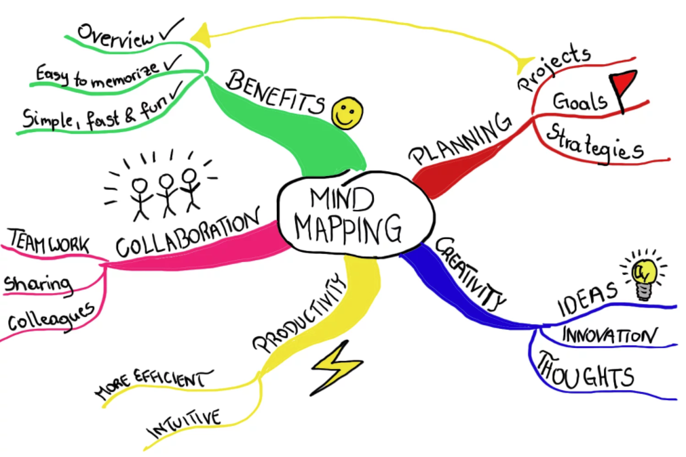
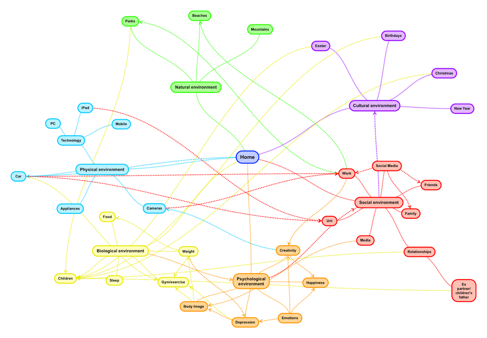

# Activity: Mind Map

## Goals
- Reflect on our learning this Unit
- Make connections between different concepts.

## Introduction

Wow! We've learned so much in this unit. Let's take time to reflect on our learning and make connections.

We will use a technique called a mind map. A mind map is a diagram that can represent tasks, ideas, concepts, etc. and the connections between them. 

## Examples

To learn more about the benefits of mind mapping, read this mind map!

*Fig: Mind-map map [(source).](https://www.mindmeister.com/blog/wp-content/uploads/2015/01/MindMapping_mindmap_handdrawn.png)*

Here's a mind map an individual shared of their life which demonstrates the power of making connections across different areas.

*Fig: Life mind-map [(source).](http://emmacookbehaviourandenvironment.blogspot.com/)*

## Activity Instructions

Let's create a mind map. A mind map is a diagram that can represent tasks, ideas, and concepts, and the connections between them.

In our case, let's include any topic from our learnings from this unit. We should consider:
- Python programming concepts
- Study skills
- Learnings about how to be in community
- Anything else!

We can make our mind map using any of these tools:
- [Google Slide](https://www.google.com/slides/about/)
- [Mind Meister](https://www.mindmeister.com/)
- [Software from this list of mind mapping software](https://zapier.com/blog/best-mind-mapping-software/)

Spend approximately 40 minutes in small groups to work together and include all the wisdom from our classmates. 

Then, come back together as a large group to share insights.
