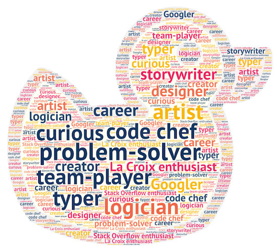
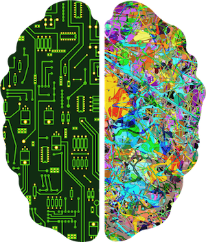

# How to Study like a Programmer

<iframe src="https://adaacademy.hosted.panopto.com/Panopto/Pages/Embed.aspx?pid=c777056e-412b-40f6-999b-ac2501267610&autoplay=false&offerviewer=true&showtitle=true&showbrand=false&start=0&interactivity=all" height="405" width="720" style="border: 1px solid #464646;" allowfullscreen allow="autoplay"></iframe>

## Introduction: Humans vs. Computers

What is the difference between a computer and a programmer?

Computers are strong at

- handling large amounts of data
- doing large calculations
- executing algorithms at scale
- generating things that follow specific rules

Human brains, on the other hand, are strong at

- pattern-finding
- decision-making
- designing
- interpreting
- jumping between messy layers of abstraction
- creating from nothing

A key element to thriving as a programmer will be to leverage computers for their strengths, so that you have the resources to work on your own problem-solving skills.

Today, we should learn about what it means to **be** a programmer and **study** like a programmer.

## Learning Goals

- Interpret the role of "software developer" as a creative, human, artistic role
- Explain that studying as a software developer requires self-care
- Use these studying tools and techniques to improve question-asking skills
- Use these studying tools and techniques to improve studying skills

## Consider the Role

There are so many ways to define the role of a software developer and programmer. We're sure you all spent a lot of time considering what it means to you.

Some words that might describe a software developer role are:

  
[(source)](https://wordart.com/create)

### !challenge

* type: short-answer
* id: 9138ecae-fd7b-4685-9bf6-eb882ad43edf
* title: What do you want from being a software developer?

##### !question

**Why did you want to become a software developer?**

**What is something you want to do as a software developer?**

Write a short answer (less than 2 paragraphs) to share.

##### !end-question

##### !placeholder

Write a short answer (less than 2 paragraphs) to share.

##### !end-placeholder

##### !answer

/.*/

##### !end-answer

### !end-challenge

Take the time to write down a personal answer for yourself, and put the note in a journal, book, envelope, sticky note. Return to this note when you feel lost in the future.

### Learn to Learn

One of the biggest goals of the Ada program is to foster the skill of **learning to learn.**

As a programmer in a field that changes so quickly, your most valuable asset will be how you manage your own individual learning.

### Creative Writer
  
*Programming is science and art* [(source)](https://www.nicepng.com/ourpic/u2t4u2r5w7e6r5o0_creative-brain-png-two-sides-brain-png/)

Writing software is a creative process. Us programmers work with abstract data and concepts. We organize, arrange, transform, and orchestrate data. We take input, and use creativity and logic with the constraints we're given, and make beautiful output.

A maybe-helpful analogy: If our jobs were to paint color-by-numbers, we could probably maximize productivity and output by working long hours day after day. If our jobs are to create inspiring artwork, **practicing self-care (rest, etc.) is an essential part of our work.**

### Take Care of Your Brain
  
[(source)](https://pixabay.com/illustrations/brain-binary-silhouette-head-5930645/)

Visualize your brain as a tool that needs care and maintenance to be most effective. That means when something in your program isn't working and your brain is experiencing stress, your brain is probably not going to be very productive until you've given it a break and taken care to restore your brain to a less heightened state. 

### !challenge

* type: multiple-choice
* id: a7753324-aa1f-4858-85d4-a0d1956fb36b
* title: Programming is Creative Work

##### !question

Based on the information above, which of the following is **_not_** an appropriate metaphor?

Programmers are like...

##### !end-question

##### !options

* Painters who are given materials and constraints, and must use creativity to make something
* Computers who must get the right answer every time
* Athletes who must practice and take care of themselves in order to improve
* Managers who must keep track of projects and health at the same time

##### !end-options

##### !answer

* Computers who must get the right answer every time

##### !end-answer

### !end-challenge

## Studying Like a Programmer

Studying programming, especially if you have not been in the classroom in a while, is really challenging! If you don't have a grasp on what study habits work best for you, it will take time and experimentation to find out what's most effective.

The best programmers improve by focusing on these study skills:

1. Question-Asking Skills
1. Review Skills
1. Perserverence & Self-Care Skills

### Your Question-Asking Skills

#### What You Know

First, let's convince ourselves that there are different levels of knowledge and learning. Knowing and understanding something has more nuance than "I get it" or "I don't get it."

Here's a common model of "knowing things" that we can reference:

Level | Depth of knowledge | Description
--- | --- | ---
1 | I know what I know | I know what I've been taught
2 | I don't know what I don't know | I'm learning enough to know there's more to learn
3 | I know what I don't know | I've learned enough to know what I've learned vs. what more to learn
4 | I don't know what I know | I don't even realize how much I've learned

Levels 1 and 2 should describe where everyone is right now with programming. In fact, we should spend most of our times as learners in level 1 and 2.

Level 3 is the destination that we want all of our careers to point to.

Level 4 describes an experienced programmer. It is _not_ our destination.

**We understand that it takes practice and time to figure out "what you know" vs. "what you don't know."** Follow below to find practical ways to help you figure that out.

#### How to Ask Questions

The primary way to level up in knowledge is to get _better_ at asking questions and seek answers. **How well you can solve a problem is directly related to how practiced you are at asking questions.**

**The kinds of questions that you can form will help you figure out what answers you need.** Here is one flowchart that can help you.

Level of Understanding | What kinds of Questions You Have | Action
--- | --- | ---
Knowledge | What does ... mean? What is the standard syntax for ...? Where can I find the definition for ...? | Use flashcards for specific vocabulary, concepts, and syntax
Understanding | What are some examples about ...? When is ... relevant and not relevant? What are variations of this syntax? | [Create a crib sheet/cheat sheet](https://en.wikipedia.org/wiki/Cheat_sheet). Try explaining the concept to someone else
Application | Can I create examples of ...? Can I repeat and modify examples of ...? If someone says that this concept is relevant, can you find a way to apply this concept and fit it into the bigger picture? | Take time to create your own working examples, and check them. Make diagrams, skits, songs, etc. and share them.
Analysis | On a bigger scale of systems... What factors impact this? What consequences are there? What are the technical trade-offs? | Research relevant examples. Compare and contrast similar examples. Make tables and lists to compare.
Evaluate | On a bigger scale of systems... When should I use, defend, or critique this? | Research. Hypothesize, then make short experiments. Read various sources.
Create | On a bigger scale of systems... How do I orchestrate this with a system of other concepts? Can I create something that uses this? | Research. Planning. Hypothesizing, then make short experiements. Read various sources.

If this looks a lot like a programmer-specific version of the [general Bloom's Taxonomy model](https://en.wikipedia.org/wiki/Bloom%27s_taxonomy), then you're totally spot on :)

### !challenge

* type: multiple-choice
* id: 50db94eb-cb6a-4565-afde-fcd0d237f56c
* title: Bloom's Taxonomy

##### !question

What level of understanding does the question "What does ... mean?" belong to?

##### !end-question

##### !options

* Knowledge
* Understanding
* Application

##### !end-options

##### !answer

* Knowledge

##### !end-answer

### !end-challenge

### !challenge

* type: multiple-choice
* id: 0caf3fa7-7ba4-4768-8979-9d8c796d8bde
* title: Bloom's Taxonomy

##### !question

What level of understanding does the question "Can I repeat and modify examples of ...?" belong to?

##### !end-question

##### !options

* Knowledge
* Understanding
* Application

##### !end-options

##### !answer

* Application

##### !end-answer

### !end-challenge

### Your Review Skills

It's good to know things for one day. However, true learning comes from reviewing and revisiting subjects over time.

We recommend starting to review material by starting with...

- Review questions that you came up with or heard over the week
- Review questions from roundtable guides
- Review summaries at the end of lessons
- Review vocabulary
- Creating a new list of questions for yourself

Set up a cadence for yourself to review material. This is where your present-self should look out for your future self: reviewing material is much easier, more fun, and more effective if you take notes in the beginning.

We recommend trying to review material...

- At the end of every week for 30 minutes
- At the end of every project for 15 minutes

At the end of every day, try writing down...

- **What did you learn today that stood out to you?**
- Write down everything you know about the concepts covered today
- Questions about the concepts you can come up with

#### A note about "knowing things" as programmers

You can't know everything. But, there is something beautiful about our jobs: **We can always look things up.** It's best to get your understanding to a "good enough" place so you can look it up more easily later.  The important thing is that you be able to formulate helpful questions, not know all the answers.

What is "good enough"? Figuring out what "good enough" is will be something we learn over time.

### Your Perseverence & Self-Care Skills

#### We Need Little Breaks to Stay Focused

Feeling like you lose focus over time? Our brains have evolved to focus on things for relatively short periods of time. We need little breaks to stay focused.

Consider using our favorite time management technique, [Pomodoro Technique](https://en.wikipedia.org/wiki/Pomodoro_Technique), to help enable frequent breaks and frequent periods of flow!

Encourage yourself and others to take breaks often.

#### Sleep

Your brain is probably going to be much less productive at fixing a bug on the 11th hour of work today than you will be if you get good sleep and tackle the same bug first thing in the morning. In fact, taking care of yourself as a software engineer usually leads to higher overall productivity than overworking! Also, don't be afraid to take naps!

#### Feel Like a Programmer!

Sometimes the struggle comes from not solidifying your identity as a programmer. **You are a software developer!** Tell this to yourself out loud every day, if it helps.

### !challenge

* type: multiple-choice
* id: 777d35be-f76c-442e-8b75-33499b5dbc87
* title: Study Skills

##### !question

Which of the following is _not_ a category of studying skills that was covered above?

##### !end-question

##### !options

* Question-Asking Skills
* Review Skills
* Perseverence & Self-Care Skills
* Bottling-It-Up Skills

##### !end-options

##### !answer

* Bottling-It-Up Skills

##### !end-answer

### !end-challenge

## Activities and Techniques that are Tried and True

 
Are you feeling like... 
 | 
Consider
 |
 ---- | ---- 
| ...classroom time is overwhelming? | Look at the calendar and the lessons the night before, and pre-read the lectures
| ...reading material on programming is unnatural? | Read this resource on [how to read programming books](http://www.pathsensitive.com/2018/01/the-benjamin-franklin-method-of-reading.html)
|  ...you lose focus on the task at hand? | Using physical paper and sticky notes to write down the specific task you are trying to accomplish| ...you lose focus over time? | Using a time management method like  [Pomodoro Technique](https://en.wikipedia.org/wiki/Pomodoro_Technique) to help enable frequent breaks and frequent periods of flow
| ...your knowledge and understanding level of vocabulary is lacking? | Utilize flashcards for specific vocabulary, concepts, and syntax
| ...you are craving more review in your own words? | Making crib sheets (1-page review notes of the crucial knowledge) at the end of the week
| ... you're isolated? | Please consider having proactive communication with other students and staff! Staff is on your side for your success, and your proactive communication with staff can lead to opportunities and resources

Want a video series we recommend? Consider: ["Crash Course" on study skills](https://www.youtube.com/playlist?list=PL8dPuuaLjXtNcAJRf3bE1IJU6nMfHj86W)

## Past Adie Study-Skills Testimonials

Every now and then we collect testimonials from graduated Adies who reflected on transitioning from having zero study skills to forging their study patterns. They are collectively located in the ["Student Testimonials" folder](https://drive.google.com/drive/folders/16TXs8qJ61KaNs8AmAdrQb8t4uX4OPnf5).

## Conclusion

Finding your own study style is challenging, but necessary. Luckily, there are a lot of existing resources and ideas, as well as your own understanding of yourself and your own creativity!

Finding your own study style will take a lot of time, a lot of experimentation, and a lot of feedback from yourself to figure out what works.

Your peers, your instructors, and the Ada staff are all prepared and excited to help you find your best study style!

When you find your best way of how you like to study, those skills will carry over into internships and jobs, so you can confidently say that you have learned how to learn effectively.
