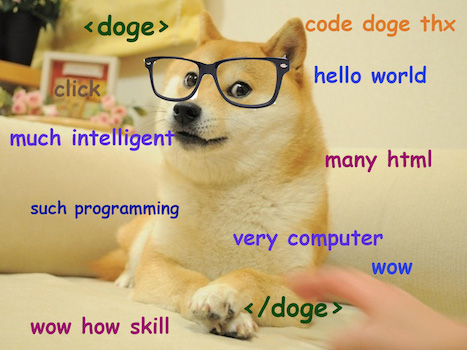
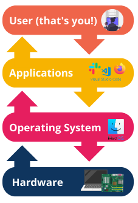

# What is Software?

## Vocabulary and Synonyms

| Vocab           | Definition                                                                                              | Synonyms                  | How to Use in a Sentence                                                                                                                                |
| --------------- | ------------------------------------------------------------------------------------------------------- | ------------------------- | ------------------------------------------------------------------------------------------------------------------------------------------------------- |
| Software        | Software is a collection of instructions for a computer to execute                                      | Program, app, application | "We build robust, flexible, clean software," "If it's not working, we should check for a software update," "I'm a software dev!"                        |
| Application     | Software designed for an end-user                                                                       | app                       | "Flickr is a web app because it has photo management features, and I access it through the web"                                                         |
| Source Code     | Code that builds software and is readable to a human                                                    | source, src               | "If we want to see how that's implemented, we could look at the source code," "The source code gets obfuscated after the software is built"             |
| Open Source     | Source code that is available to view and use                                                           | OSS                       | "Sometimes I like to contribute to this open source project," "Since it's open source, we can probably check what the dev discussion was on this issue" |
| Hello, World!   | A program that prints "Hello, World!"                                                                   | -                         | "I want to learn TypeScript so I just did a Hello, World," "The hardest part of the Hello, World to me was figuring out how to run it"                  |
| Local Machine   | Your very own computer in front of you                                                                  | local                     | "I don't know why it was broken for you, it was working on my local machine"                                                                            |
| Code of Conduct | A written set of norms for a community, typically outlining rules, responsibilities, and accountability | -                         | "That harrasser was banned because they violated the code of conduct," "The code of conduct meant nothing if it wasn't enforced"                        |

## Software is a Set of Instructions


As we jump into programming, it's good to know what it means to be a **_software developer_**. What is software? And what are we making and doing?

Software is a collection of instructions for a computer to execute. Each line of code in a program or piece of software is a single instruction to the computer. In other words, software is a collection of code that tells computers what to do, when to do it, and how to do it. It turns out computers aren't very useful without being told what to do.

The category of software is broad. It includes system software, which tells a computer how to run; how does a computer get keyboard input? How does it display videos? How does a computer save data? What happens when a computer starts up?

Software also includes creating services that most people will never see, or can't be seen, even though it's moving and changing data. When we use an app to transfer money to a fund, software from one bank sends a message to software from another bank. When we use a third-party aggregator for flight tickets, that system has to reach out to a different software program for each airline.

<!-- available callout types: info, success, warning, danger, secondary, star  -->
### !callout-info

## Program v Software

The terms _program_ and _software_ are largely interchangeable, and throughout this course we will use both to refer to a set of code that provides instructions to a computer. Technically, software is a broader term that can refer to a collection of multiple programs bundled together.

### !end-callout

## Applications Are For Users

  
[(source)](https://knowyourmeme.com/photos/582577-doge)

Software also includes application software. **_Application software_** is software built to have an _end user,_ or a human/consumer/customer who ultimately uses it. By definition, all the software that likely we've encountered is application software!

Application software tends to have:

- Code to determine what data is there, and how it moves
- Code to determine what's displayed to the end user
- Code to determine how the end user is interacting with it, and what should happen

Applications are often called apps, or web apps if they're on the web.

## Source Code

  
[(source)](https://unsplash.com/photos/iar-afB0QQw)

Source code is code that builds software and is readable to a human.

Computers don't speak in human; they speak in machine code! Computers ultimately operate on 1s and 0s. Our source code gets translated several times until it becomes 1s and 0s.

Source code is the kind of code that we'll write in this curriculum!

### !callout-info

## What does "Open Source" mean?

Open Source Software (OSS) means software that was intentionally built with an open development process -- the development and its source code is available for the public to look at, and to use! (within its licenses). OSS encourages collaboration, lower barriers to entry, and accountability.

### !end-callout

## Code is as Big or Small as You Want

  
[(source)](https://dogemuchwow.com/web-developer-doge/)

Software can be as big or small as we want. Software can be as creative and weird and messy as we want, too!

Before we think that all software is the apps we see every day, keep in mind that software can...

- use light and proximity sensors to check if two objects are close to each other
- be a Twitter bot that posts a poem every day
- process large amounts of data, like the bus schedule for the past 40 years
- connect to different devices, through Bluetooth
- do things on certain events, like email me whenever a meeting on my calendar comes up

### Oh, the Things You Can Build!

Here are some categories of different software to spend a career and a half exploring:

- Web apps
- Phone/tablet apps
- Desktop apps
- Simulation software
- System architecture and software
- Artificial Intelligence software
- Hardware programming
- Other programming languages


<!-- available callout types: info, success, warning, danger, secondary, star  -->
### !callout-info

## Operating Systems are Software!
An **operating system** is software itself! Operating systems such as MacOS, Microsoft Windows, etc. are sets of programs which act as an _interface_ or translator between the applications you use and other parts of the computer including its hardware. For example, if we wanted to print a document we had open in a text editor, our text editor application would relay that task to the operating system, and the operating system would translate the task into commands the printer can understand. The operating system also acts as the computer's manager, allocating resources like computer memory to different applications.


### !end-callout

## Software Has Impact

Software has impact and technology is political. Software affects the world in positive and negative ways. Software can build community, and software can influence people.

- What is the context of this software?
- What kind of communication is this facilitating?
- What benefits do the users get?
- What is being amplified?
- What are the resources needed for this software?
- How does this software impact the users?
- How does this software impact the developers?
- Who can't access the software?
- Who can't navigate the software?

As of 2020, there are no absolute answers to how to build "perfect" software. However, the tech industry is attempting to have these conversations. Being informed on how software has impact on people and the world is crucial to advance these conversations.

### !callout-info

## Code of Conduct

It's valuable to know that a lot of software and developer communities have adopted a code of conduct, or an agreement and commitment to community health. A popular code of conduct for software is based on [Contributor Covenant](https://www.contributor-covenant.org/). Python's code of conduct is also [available online](https://www.python.org/psf/conduct/).

### !end-callout


## Hello, World!

A "Hello, World!" program is the name of a program whose responsibility is to print `Hello, World!`.

The program is small and simple on purpose. "Hello, World!" programs are a common way to introduce a programming language. A "Hello, World!" program should prove to the programmer that the program runs, and they understand some basic syntax.

It's tradition to write a "Hello, World!" program when starting to learn new language!

In Python, we could open up a Python REPL on our local machine, and execute

```python
print("Hello, World!")
```

### !callout-info

## You are the Local Machine

What does "local machine" mean? The phrase "local machine" will be used to mean your very own computer that you're writing code on. "Local" refers to a computer close to you, the user. We say "machine" to not assume that the users of code are laptops or desktop computers!

### !end-callout

## Check for Understanding

<!-- Question 1 -->

<!-- prettier-ignore-start -->
### !challenge

* type: multiple-choice
* id: 84072fe1-1d71-4ca6-b2b5-e602cee63d2d
* title: What is Software?

##### !question

Application software is...

##### !end-question

##### !options

* Software that builds computer system functionality
* Software that users apply to make their lives better
* Software that typically gets distributed online, such as the App Store
* Software built for an end user

##### !end-options

##### !answer

* Software built for an end user

##### !end-answer

### !end-challenge
<!-- prettier-ignore-end -->

<!-- Question 2 -->

<!-- prettier-ignore-start -->
### !challenge

* type: multiple-choice
* id: 88476d2f-e03f-4be4-a15c-631a9f9f2a21
* title: What is Software?

##### !question

Open Source Software means...

##### !end-question

##### !options

* the source code is available to look at and use
* the source code is built only by volunteers
* the source code must only be used to build free software
* the source code is available through the Open Source Foundation

##### !end-options

##### !answer

* the source code is available to look at and use

##### !end-answer

### !end-challenge
<!-- prettier-ignore-end -->

<!-- Question Takeaway -->
<!-- prettier-ignore-start -->
### !challenge
* type: paragraph
* id: itJ225
* title: What is Software?
##### !question

What was your biggest takeaway from this lesson? Feel free to answer in 1-2 sentences, draw a picture and describe it, or write a poem, an analogy, or a story.

##### !end-question
##### !placeholder

My biggest takeaway from this lesson is...

##### !end-placeholder
### !end-challenge
<!-- prettier-ignore-end -->
