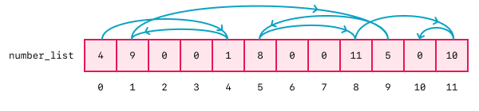

# Problem Set: While Loops

## Directions

Complete all questions below.

## Practice

<!-- prettier-ignore-start -->
<!-- >>>>>>>>>>>>>>>>>>>>>> BEGIN CHALLENGE >>>>>>>>>>>>>>>>>>>>>> -->
### !challenge

* type: multiple-choice
* id: 31402b5a-5d5a-409f-b5cd-a5c1a7f845d7
* title: While Loops

##### !question

How many times will the body of this `while` loop run?

```python
counter = 0
while counter < 5:
    print('in the loop body')
    counter += 1
```

##### !end-question

##### !options

* 0
* 4
* 5
* 6
* it runs forever
* impossible to predict

##### !end-options

##### !answer

* 5

##### !end-answer

### !end-challenge
<!-- ======================= END CHALLENGE ======================= -->
<!-- prettier-ignore-end -->

<!-- prettier-ignore-start -->
<!-- >>>>>>>>>>>>>>>>>>>>>> BEGIN CHALLENGE >>>>>>>>>>>>>>>>>>>>>> -->
### !challenge

* type: multiple-choice
* id: ce90bffc-5966-4486-8c2f-4d1d10ca58d3
* title: While Loops

##### !question

How many times will the body of this `while` loop run?

```python
counter = 4
while counter >= 0:
    print('in the loop body')
    counter -= 1
```

##### !end-question

##### !options

* 0
* 4
* 5
* 6
* it runs forever
* impossible to predict

##### !end-options

##### !answer

* 5

##### !end-answer

##### !explanation

A loop like this, running from some value all the way down to 0, might be used to access the entries in a list in reverse order. This loop iterates from 4 down to 0, which are the indices of a list with 5 items.

<br />

Because this "off by one" can be confusing, we often prefer `for` loops in a situation like this rather than a `while` loop.

##### !end-explanation

### !end-challenge
<!-- ======================= END CHALLENGE ======================= -->
<!-- prettier-ignore-end -->

<!-- prettier-ignore-start -->
<!-- >>>>>>>>>>>>>>>>>>>>>> BEGIN CHALLENGE >>>>>>>>>>>>>>>>>>>>>> -->
### !challenge

* type: multiple-choice
* id: 5fa25950-37c3-48d9-ae6c-81d41d85e85a
* title: While Loops

##### !question

How many times will the body of this `while` loop run?

```python
counter = 0
while counter < 10:
    print('in the loop body')

    if counter < 5:
        continue

    counter += 1
```

##### !end-question

##### !options

* 0
* 1
* 5
* 10
* it runs forever
* impossible to predict

##### !end-options

##### !answer

* it runs forever

##### !end-answer

##### !explanation

Even though this loop has a statement to increment `counter`, it also has a condition in the loop body that skips it! Imagine how hard this might be to spot if it were buried in very complicated logic!

<br />

Infinite `while` loops don't always happen from forgetting to write a line that updates the loop control variable. Sometimes our own code gets in the way. This is why we often prefer `for` loops if we know how many times we want a loop to run ahead of time!

##### !end-explanation

### !end-challenge
<!-- ======================= END CHALLENGE ======================= -->
<!-- prettier-ignore-end -->

<!-- prettier-ignore-start -->
<!-- >>>>>>>>>>>>>>>>>>>>>> BEGIN CHALLENGE >>>>>>>>>>>>>>>>>>>>>> -->
### !challenge

* type: multiple-choice
* id: 9401f1e3-778d-4559-a1ef-dee071d4db90
* title: While Loops

##### !question

How many times will the body of this `while` loop run?

```python
import random

num = random.randint(1, 10)
while num <= 5:
    print('in the loop body')
    num = random.randint(1, 10)
```

##### !end-question

##### !options

* 0
* 1
* 5
* 10
* it runs forever
* impossible to predict

##### !end-options

##### !answer

* impossible to predict

##### !end-answer

##### !explanation

This loop has a 50/50 chance of executing the loop body each time the condition is checked. We don't know for certain how many times it will run! Now, this isn't really a very useful loop, but image instead of a random number, we ask for user input. If some value of that input lets us decide to terminate the loop, then we also can't say for certain how many times _that_ loop will run. This is the most typical use for a `while` loop: loops that run an indeterminate number of times.

##### !end-explanation

### !end-challenge
<!-- ======================= END CHALLENGE ======================= -->
<!-- prettier-ignore-end -->

<!-- prettier-ignore-start -->
<!-- >>>>>>>>>>>>>>>>>>>>>> BEGIN CHALLENGE >>>>>>>>>>>>>>>>>>>>>> -->
### !challenge

* type: multiple-choice
* id: 9016d79a-4d74-459f-a714-ca38bf9a176c
* title: While Loops

##### !question

How many times will the body of this `while` loop run?

```python
while counter < 5:
    print('in the loop body')
    counter += 1
```

##### !end-question

##### !options

* 0
* 4
* 5
* 6
* it runs forever
* impossible to predict

##### !end-options

##### !answer

* 0

##### !end-answer

##### !explanation

We forgot to initialize `counter`! This causes a `NameError` in the loop condition, so we don't run the loop body. In fact, this code will crash!

<br />

There are many things we have to remember when setting up `while` loops: initializing loop control variables, getting the loop condition right, properly updating the loop control variable, and that doesn't even consider the actual _logic_ we want to do in our loop! For these reasons, when possible, we often try to replace `while` loops with `for` loops. The next few questions explore this.

##### !end-explanation

### !end-challenge
<!-- ======================= END CHALLENGE ======================= -->
<!-- prettier-ignore-end -->

<!-- prettier-ignore-start -->
<!-- >>>>>>>>>>>>>>>>>>>>>> BEGIN CHALLENGE >>>>>>>>>>>>>>>>>>>>>> -->
### !challenge

* type: multiple-choice
* id: 0a8cfa41-b770-4e80-8af0-f4d5127c8424
* title: While Loops

##### !question

Which of the `for` loops below is equivalent to this `while` loop?

```python
counter = 0
while counter < 5:
    print(counter)
    counter += 1
```

##### !end-question

##### !options

* ```python
for counter in range(4):
    print(counter)
```

* ```python
for counter in range(5):
    print(counter)
```

* ```python
for counter in range(5, 0):
    print(counter)
```

* ```python
for counter in range(5, 0, -1):
    print(counter)
```

##### !end-options

##### !answer

* ```python
for counter in range(5):
    print(counter)
```

##### !end-answer

##### !explanation

The `while` loop runs from 0 to 4 (less than 5), printing each value. Recall that when we use the `range` function with one argument, it produces a sequence of numbers from 0 to one less than the argument (it is exclusive). So `range(5)` produces the sequence 0, 1, 2, 3, 4, which is exactly what we want!

<br />

For a review of `range`, refer to the Iterating Over Data, Iterating and Special Cases lesson, or check the [official Python documentation](https://docs.python.org/3/library/stdtypes.html#range).

##### !end-explanation

### !end-challenge
<!-- ======================= END CHALLENGE ======================= -->
<!-- prettier-ignore-end -->

<!-- prettier-ignore-start -->
<!-- >>>>>>>>>>>>>>>>>>>>>> BEGIN CHALLENGE >>>>>>>>>>>>>>>>>>>>>> -->
### !challenge

* type: multiple-choice
* id: c90cd73b-bb1d-4f6c-9027-c9db928c199e
* title: While Loops

##### !question

Which of the `for` loops below is equivalent to this `while` loop?

```python
counter = 4
while counter >= 0:
    print(counter)
    counter -= 1
```

##### !end-question

##### !options

* ```python
for counter in range(4):
    print(counter)
```

* ```python
for counter in range(0, 4):
    print(counter)
```

* ```python
for counter in range(4, 0):
    print(counter)
```

* ```python
for counter in range(4, 0, -1):
    print(counter)
```

* ```python
for counter in range(4, -1):
    print(counter)
```

* ```python
for counter in range(4, -1, -1):
    print(counter)
```

##### !end-options

##### !answer

* ```python
for counter in range(4, -1, -1):
    print(counter)
```

##### !end-answer

##### !explanation

The `while` loop runs from 4 to 0 (greater than or equal to 0), printing each value. When counting up from zero, we can use the short form of `range` with one argument, but to count down, we must use the long form of `range(start, stop, step)`. The stop is exclusive, so we must list one below the final value we want (so -1), and we must explicitly tell `range` to count _down_ (again -1), for a complete call of `range(4, -1, -1)`. Note that if you try out the answers that count down (`start` is bigger than `stop`) without the final -1, they produce _no output_!  Think about why that is.

<br />

For a review of `range`, refer to the Iterating Over Data, Iterating and Special Cases lesson, or check the [official Python documentation](https://docs.python.org/3/library/stdtypes.html#range).

##### !end-explanation

### !end-challenge
<!-- ======================= END CHALLENGE ======================= -->
<!-- prettier-ignore-end -->

<!-- prettier-ignore-start -->
<!-- >>>>>>>>>>>>>>>>>>>>>> BEGIN CHALLENGE >>>>>>>>>>>>>>>>>>>>>> -->
### !challenge

* type: multiple-choice
* id: 74aac94d-ae5d-40f3-ba50-b8e4c0c2d255
* title: While Loops

##### !question

Which of the `for` loops below is equivalent to this `while` loop?

```python
counter = 0
cats = ['Grumpy Cat', 'Garfield', 'Lil Bub', 'Maru', 'Keyboard Cat', 'Hello Kitty']
while counter < len(cats):
    print(cats[counter])
    counter += 1
```

##### !end-question

##### !options

* ```python
cats = ['Grumpy Cat', 'Garfield', 'Lil Bub', 'Maru', 'Keyboard Cat', 'Hello Kitty']
for counter in cats:
    print(cats[counter])
```

* ```python
cats = ['Grumpy Cat', 'Garfield', 'Lil Bub', 'Maru', 'Keyboard Cat', 'Hello Kitty']
for counter in len(cats):
    print(cats[counter])
```

* ```python
cats = ['Grumpy Cat', 'Garfield', 'Lil Bub', 'Maru', 'Keyboard Cat', 'Hello Kitty']
for cat in cats:
    print(cat)
```

* ```python
cats = ['Grumpy Cat', 'Garfield', 'Lil Bub', 'Maru', 'Keyboard Cat', 'Hello Kitty']
for cat in cats.items():
    print(cat)
```

##### !end-options

##### !answer

* ```python
cats = ['Grumpy Cat', 'Garfield', 'Lil Bub', 'Maru', 'Keyboard Cat', 'Hello Kitty']
for cat in cats:
    print(cat)
```

##### !end-answer

##### !explanation

The `while` loop iterates over the contents of the list of famous cats in order, printing each out, one by one. The correct `for` loop does the same thing, but notice how much clearer it is. We don't have to set up the counter. We don't have to compare it to the length of the list. We don't have to index into the list values. And we don't have to advance the counter. `while` loops are very flexible, but for some tasks, like iterating over lists and dictionaries in order, a `for` loop is usually more appropriate.

<br />

Compare the correct `for` loop to the other answers and try explaining why they don't work. Try running them in the Python interpreter and notice the errors it reports for each.

##### !end-explanation

### !end-challenge
<!-- ======================= END CHALLENGE ======================= -->
<!-- prettier-ignore-end -->

<!-- prettier-ignore-start -->
<!-- >>>>>>>>>>>>>>>>>>>>>> BEGIN CHALLENGE >>>>>>>>>>>>>>>>>>>>>> -->

### !challenge

* type: ordering
* id: 879e5790-de4c-4a51-ac38-0330ffb98a67
* title: While Loops

##### !question

Reorder the lines of code below to produce a `while` loop with the following behavior:

- Prompt the user for input.
- Ignore the input if the user enters 'skip.'
- End the loop if the user enters 'done.'
- Otherwise, print a message telling the user what they input.

Assume that each line would be indented correctly.

##### !end-question

##### !answer

1. while True:
1.     user_input = input('enter input: ')
1.     if user_input == 'done':
1.         break
1.     elif user_input == 'skip':
1.         continue
1.     print(f'you entered {user_input}')

##### !end-answer

##### !explanation

This implementation uses `while True: ...` to run the loop forever. It exits the loop by using the `break` keyword. And it skips the `print` by using the `continue` keyword. There are other many approaches that are just as valid. For an extra challenge, try implementing this loop yourself without using `break` or `continue`!

##### !end-explanation

### !end-challenge

<!-- ======================= END CHALLENGE ======================= -->
<!-- prettier-ignore-end -->


<!-- prettier-ignore-start -->
<!-- >>>>>>>>>>>>>>>>>>>>>> BEGIN CHALLENGE >>>>>>>>>>>>>>>>>>>>>> -->
<!-- Replace everything in square brackets [] and remove brackets  -->

### !challenge

* type: code-snippet
* language: python3.6
* id: 85dffbd3-2030-44b4-8b9f-cc86f0c7e9d1
* title: While Loops

##### !question

Let's implement a function called `sidewinder`. It will take a parameter `number_list` which contains a list of _next indices_ to visit. Starting from position `0`, we will look in the current position, get the value stored there, and use it as the _next_ position to visit. We will continue doing this until we find a value of `0`, which means we have found the end of the index chain. Then we'll return the position where we found the `0`.

For example, if we received `[2, 0, 1]` as our `number_list`, starting from position `0` we find a `2`. We look in position `2` and find a `1`. So we look in position `1` and find `0`. `0` marks the end of the chain, so we return `1`, the position we just looked in.

The diagram below shows a longer example. Notice that there are _multiple_ zeros in the list, so we _cannot_ iterate through in order and return the position of the first zero that we find.

<div style="max-width: 700px; margin: 0 auto -28px auto; text-align: center;">

</div>
*Fig. Given the list `[4, 9, 0, 0, 1, 8, 0, 0, 11, 5, 0, 10]` for `number_list`, this diagram shows how to move through the list values to find the 'end.' Starting from index `0`, we find the value `4`. We go to index `4` where we find the value `1`. We go to index `1` where we find the value `9`, and so on. Eventually we reach index `10` where we find the value `0`, so this is the end and the result is `10`.*

Provide an implementation for `sidewinder` so that it
- follows the chain of indices to the end, and
- returns the position of the end of the chain

You may assume that `number_list` will never be an empty list, and that all of the values in the list are valid indices (none will be below zero, or be beyond the end of the list).

##### !end-question

##### !placeholder

```python
def sidewinder(number_list):
    pass
```

##### !end-placeholder

##### !tests

```py
import unittest
import main

class TestPython1(unittest.TestCase):
  def test_one(self):
    self.assertEqual(0, main.sidewinder([0]))

  def test_two(self):
    self.assertEqual(1, main.sidewinder([2, 0, 1]))

  def test_three(self):
    self.assertEqual(10, main.sidewinder([4, 9, 0, 0, 1, 8, 0, 0, 11, 5, 0, 10]))
```

##### !end-tests

##### !hint

It may be useful to print out the positions you visit and the final position where the end of the list is to help think about this problem. Any print statements you add will not affect the test results. Even if you _do_ print the final position, be sure to also _return_ it!

##### !end-hint

##### !explanation

An example of a working implementation:

```python
def sidewinder(number_list):
    # set our starting position
    next_position = 0

    # iterate as long as the next position value is not 0
    while number_list[next_position] != 0:
        # update the next position value
        next_position = number_list[next_position]

    # return the position of the end of the chain
    return next_position
```

Read through this version and compare to yours. What's the same? What's different? Are there even more ways to approach this problem?

<br />

For extra challenge, consider how we might handle bad inputs, like a missing or empty list. What if the list _does_ contain values that aren't valid indices? Or what if there's a loop in the indices like in `[1, 2, 1]`. Can you write a version of `sidewinder` which instead of returning the end of the chain, returns `True` if it visits _every_ position in the list, and `False` otherwise?

<br />

Be creative!

##### !end-explanation

### !end-challenge

<!-- ======================= END CHALLENGE ======================= -->
<!-- prettier-ignore-end -->

### A Little Helper for the Next Question

The following coding question uses a helper function called `input_int`.  It works just like the [`input`](https://docs.python.org/3/library/functions.html#input) function that we've seen before, except that instead of returning a string, we will assume that it returns an integer.

In the question block below, we don't need to define `input_int`. We can assume that it is available, the same way `input` is available.

To experiment with the coding question in VS Code or repl.it, we will need an implementation for `input_int`. In Python, safely converting from a string to an integer requires handling exceptions. For anyone who has read ahead, or who would like to do some extra research, we can try implementing it ourselves! Otherwise, here's a working implementation.

<details style="max-width: 700px; margin: auto;">
    <summary>A working implementation of `input_int`</summary>
```python
# accept a variable number of positional parameters
def input_int(*args):
    # loop forever (until we get valid input)
    while True:
        # get string input
        user_input = input(*args)
        try:
            # try converting to an int (will return if successful)
            return int(user_input)

            # if the conversion succeeded, we will have returned already
        except ValueError:
            # could not convert the input, so show an error message
            print('Try again.')
```
</details>


<!-- prettier-ignore-start -->
<!-- >>>>>>>>>>>>>>>>>>>>>> BEGIN CHALLENGE >>>>>>>>>>>>>>>>>>>>>> -->
### !challenge

* type: code-snippet
* language: python3.6
* id: 0fdaf2f7-0573-4e0a-8fd2-46f15076de24
* title: While Loops

##### !question

Let's sum some numbers! We would like to read a series of numbers from user input and return the sum. To keep things interesting, let's also decide that entering 0 means the user is done entering input, and that we'll also stop asking for input if the sum exceeds 1000.

Provide an implementation for `silly_sum` so that it
- reads numbers from the user (use `input_int`) summing as we do until either
    - the user enters 0, or
    - the sum exceeds 1000

##### !end-question

##### !placeholder

```python
def silly_sum():
    # be sure to call input_int when you need an integer from the user
    # a default implementation is provided above for experimenting in VS Code or repl.it
    pass
```

##### !end-placeholder

##### !tests

```py
import unittest
import main

num_src = None

def input_ints(nums):
    for num in nums:
        yield num

def input_int(_):
    return next(num_src)

# inject into main
main.input_int = input_int

class TestPython1(unittest.TestCase):

    def test_one(self):
        global num_src
        num_src = input_ints([1, 1, 2, 3, 5, 8, 0])
        self.assertEqual(20, main.silly_sum())

    def test_two(self):
        global num_src
        num_src = input_ints([400, 400, 400])
        self.assertEqual(1200, main.silly_sum())
```

##### !end-tests

#### !hint

A possible interaction with a user could look like this:
> Enter an integer (0 to stop): 999<br />
> Enter an integer (0 to stop): 1<br />
> Enter an integer (0 to stop): 1<br />
> The sum is: 1001

Note that printing the final sum line is not a listed requirement, but feel free to add additional output to your implementation to help think through the problem. It will not affect the results of the tests. Even if you _do_ print out the final sum, be sure to also _return_ it!

#### !end-hint

#### !explanation

An example of a working implementation:

```python
def silly_sum():
    # accumulate the sum
    my_sum = 0

    # stores the most recent user input
    # default to anything except 0 (think about why this is)
    num = 1

    # check our 2 conditions:
    #   user input must not be 0
    #   the sum must not exceed 1000
    while num != 0 and my_sum <= 1000:
        # prompt for input
        num = input_int('Enter an integer (0 to stop): ')

        # add the input to the sum
        my_sum += num

    # return the sum
    return my_sum
```

Read through this version and compare to yours. What's the same? What's different? Are there even more ways to approach this problem?

<br />

For some extra challenge, on your own, try modifying `silly_sum` so that you can pass in the stop value and maximum sum as parameters. This would allow us to say that 1 is the stop value instead of 0. How does this affect the code? Does anything else need to change? We could also say that the maximum sum is -1000! What changes does that cause?  

<br />

Simple changes can sometimes have complicated effects. Play around a bit and see what you can build!

#### !end-explanation

### !end-challenge
<!-- ======================= END CHALLENGE ======================= -->
<!-- prettier-ignore-end -->

<!-- prettier-ignore-start -->
<!-- >>>>>>>>>>>>>>>>>>>>>> BEGIN CHALLENGE >>>>>>>>>>>>>>>>>>>>>> -->
<!-- Replace everything in square brackets [] and remove brackets  -->

### !challenge

* type: checkbox
* id: f44b4f27-82e7-4545-a4d0-766e307971b1
* title: While Loops

##### !question

Combining what we've learned about `while` loops and `for` loops both from the previous lessons and the previous questions, which of the following situations are handled more appropriately with a `while` loop?

##### !end-question

##### !options

* Looping until a condition changes
* Iterating over the values in a list or dictionary in order
* Performing an action an indeterminate number of times
* Iterating over the values in a list or dictionary in an arbitrary order
* Looping until a user enters certain data
* Performing an action a known number of times

##### !end-options

##### !answer

* Iterating over the values in a list or dictionary in an arbitrary order
* Looping until a condition changes
* Looping until a user enters certain data
* Performing an action an indeterminate number of times

##### !end-answer

##### !hint

Think about which loop style can work directly with certain data types, which loop style makes it harder to leave out certain parts of syntax accidentally, and which loop style provides more flexibility when needed.

##### !end-hint

##### !explanation

`for` loops are great at iterating over collections in order, such as `for my_value in my_list: ...`, but not so great if you need to read the first value, then the fifth value, then the third value. `for` loops are also great if we need to perform an action a known number of times, such as `for counter in range(5): ...`. We don't need to remember to set up a loop control variable, and we don't need to update it ourselves!

<br />

But `for` loops are less useful if we don't know how many times we'll do an action from the start. If there's some specific condition we need to check, or maybe we want the user to enter a certain value before we continue, then a `while` loop might be more appropriate.

##### !end-explanation

### !end-challenge

<!-- ======================= END CHALLENGE ======================= -->
<!-- prettier-ignore-end -->
